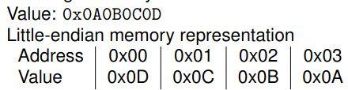

# Arrays in C
1. Basics
    - int my\_ints[16];
    - = array of 16 integers
    - = continuous memory region of 16x4 Bytes = 64 Bytes
    - access using my\_ints[i] where i in [0 - 15]
    - element is at memory address my\_ints + i \* sizeof(int)
    - **no length checks** => writing at indices below and above overwrites stuff

# Strings in C
1. Basics
    - String = array of type char
    - each char is 1 byte long (= 8 bits = ASCII)
    - each string ends with a NULL char (ASCII value 0)
1. Tips
    - puts = writes out a string from beginning til FIRST NULL char
    - strlen = length at runtime time (from beginning to first NULL char)
    - sizeof = length at compile time (char count at time of definition)
    - (void*)& = memory address of string
    - strcpy(a, b) = copy b to a

# Buffer overflows
1. Basics
    - = copying data past the end of an array (aka buffer)
    - overwrites the next memory addresses
1. Notes
    - Doing on user-controlled data = targeted memory corruption
    - Can overwrite almost anything: strings, pointers, ints, etc.
    - Caution for pointers/ints
        * x86 uses little Endian => least significant bit first!!!
        * 
