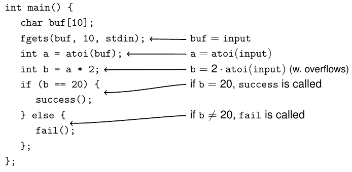

# Basics
1. x86 Assembler
    - Intel = left is target
    - sub eax, [rdx] // eax -= \<value at address = value of rdx)\>
1. Instructions
    - leave = mov rsp, rbp; pop rbp
    - call fgets = push rip; jmp fgets
    - ret = pop rip, function return
    - ret 8 = ret; add rsp, 8
    - cmp = set the e/rflags register
    - inc/dec = inc/decrement
    - lea = calculate an address given some registers
1. System V AMD64 ABI
    - Calling convention = communication between caller and callee
        * args = rdi, rsi, rdx, rcx, r8, r9, stack (reverse order)
        * callee = rbp, rbx, r12-r15
        * return = rax
    - Registers:
        * rbp = base pointer
        * rsp = stack pointer
        * rip = instruction pointer

# Potential vulnerabilities
1. Arrays
    - arr[i] = arr + i * sizeof(type)
    - String = array of char, ends with NULL byte
    - char = 1 byte = ASCII
    - sizeof = size at definition time
    - strlen = size at runtime (until first NULL)
1. Buffer overflows
    - arrays grow in reverse direction of stack (allows overwriting stack)
    - Can overwrite variables and return address
    - **gets** = reads until newline or EOF and writes
    - **puts** = writes until the first null character
    - **strcpy** = copies until null byte
    - Mitigation: canaries
1. Stack
    - Grows from high to low addresses
    - Random address at start (execve), preserved through fork
1. Stack canaries
    - What?
        * Random int, chosen at program start (execve), preserved through fork
        * Identical for all functions
    - Why?
        * Placed between variables and stack metadata
        * Prevents stack buffer overflows (protects base pointer and return address)
    - Bypass?
        * Need to overwrite with correct value
        * Brute force whole value (32bit = 2^24 tries, 64bit = impractical)
        * Brute force individual bytes (overwrite 1 by 1 and try, requires fork server)
        * Information leak
1. Shellcode injection
    - Write custom code to memory and overwrite return address to point to it
    - If no measures: static memory through analysis
    - If ASLR: Attacker requires leak to find buffer address
    - Mitigation: NX bit
1. NX (Non-eXecutable) Bit
    - Status bit for memory pages
    - CPU throws an exception
    - On by default (injected shellcode cannot be executed)
    - Bypassing
        * Cannot inject own code => use existing code in memory
        * Jump to function in binary (e.g. print\_flag)
        * ret2libc (Return to libc) = jump to libc function
1. ROP (Return Oriented Programming)
    - Assemble own code from existing code fragments
    - Remote call
        * Overwrite parameter registers (rdi, rsi, rdx, rcx, etc.)
        * Overwrite return address to jump
    - How to overwrite registers?
        * Use libc gadgets to write values from stack
        * pop rdi; ret = takes two 8-byte values from the stack (value for rdi & return address)
    - Notes
        * Must know victim's libc (not trivial, but possible)
        * Find gadgets with tools (e.g. ROPgadget)
        * ROP chain = sequence of addresses of gadgets and functions and parameters
    - Mitigation: ASLR
1. ASLR (Address Space Layout Randomization)
    - Randomizes loading addresses of libraries (including libc)
    - Prevents ret2libc and ROP
    - Also randomizes where the stack is
    - Retained through forks
    - Bypassing
        * Find out address of libc
        * Leak address of know function and calculate base address (using the function offset)
        * Where are libc addresses?
            + stack = main called from libc
            + Global Offset Table
            + Sometimes heap = dynamic memory management sometimes points to libc data segment
1. Race conditions
    - Multiple threads try to access the same resource
    - Avoiding requires locks or atomic operations
    - TOCTOU (Time of Check, Time of Use) errors
        * Attacker can mess with stuff between check and use
        * Look out for privilege boundaries
        * Also possible in single thread (side effects change variables)
1. Integer Bugs
    - Unsigned = [0000 - 1111]
    - Signed = [1000 - 0111]
    - Integer Overflow = wrapping around back to min\_value
    - Integer comparison
        * Different length? => convert shorter to signed longer
        * Same length, but un/signed? => convert to unsigned
1. Use after Free bugs
    - Malloc gives pointer to part of memory
    - free releases the memory
    - Pointer needs to be set to NULL
    - Allocating same size takes same spot in memory
    - Malloc and free don't initialize memory
1. GOT (Global Offset Table)
    - Stores runtime addresses of called functions
    - Dynamic linking = Fills in references to library functions
        * Initially points to entry in PLT (Procedure Linkage Table)
            + Contains code to find the address of the function
        * Subsequent calls jump straight to the address
    - Result: GOT is writable and contains code pointers
    - Attack: overwrite GOT entry to point to custom code
    - Defense: disable lazy binding (full RELRO, slower)
        * RELRO = RElocation Read Only
        * Partial = only parts which don't depend on PLT are read-only
        * Full = both are read-only
1. PIEs (Position Independent Executables)
    - Like ASLR, but for program base address
    - Does not randomize the stack itself?
    - Preserved through fork?

    - TODO: stack + canary (lab 3, page 5/12), draw ROP chain, etc.
1. Tips
    - Look at where things are declared and updated
    - How are variables ordered (in the stack?)
    - TODO: Look at some assembly code

# Symbolic Execution and angr
1. Symbolic execution
    - 
    - Intuition
        * Program = operations on data
        * Symbolic execution = apply to symbolic expressions
    - Symbolic expressions
        * A variable name (e.g. a, name, i)
        * A concrete value (e.g. 10, "blah")
        * Addition/Subtraction of 2 expressions
        * etc.
    - Idea
        * Store expressions in variables
        * Track changes as abstract formulae
        * Execute without concrete values
    - Goal (Constraint solving)
        * Collect equations/formulae
        * Automatically analyze/solve equations to learn about the program
        * Use the analysis to figure out required input to reach a point
    - Branching
        * Different paths lead to different expressions and constraints
        * Solution:
            + Create copies and applied different paths
            + Continue execution independently
    - Properties
        * Number of paths can grow exponentially (loops) = costly
        * Highly parallel
1. Angr
    - Framework for analyzing binaries
    - Variables = bit vectors (symbolic or concrete)
    - States = collection of variables and constraints
        * Variables for values and registers
        * Constraints from previous code (symbolically executed)
        * Also: files, network sockets, signal handling
    - State manager = set of states in stashes
    - Project = top level object (binary)
    - SimProcedures
        * Simulate library functions using python code
        * Reduces amount of assembler code needed to be analyzed
        * 
    - Program structure
        * Project = contains info about the binary
        * Initial state = State before execution (registers, memory, symbolic values)
        * Simulation manager = Manages paths simultaneously, keeps track of states
        * Explore function = Tells the program how to explore and follow paths (DFS, BFS, etc.)
        * Find criterion = tells the program what it's looking for
        * Simulation manager stashes = container for states
            + Found = all states which satisfy a criterion
