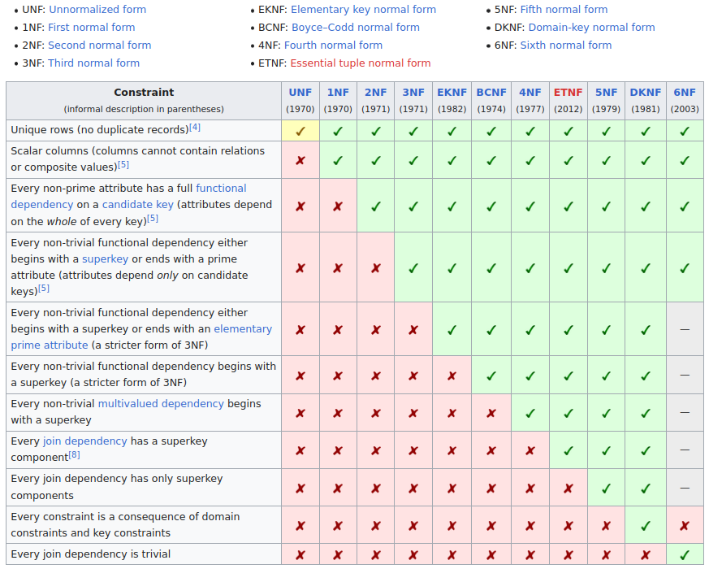
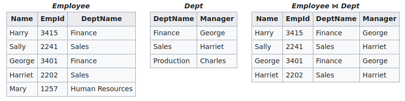
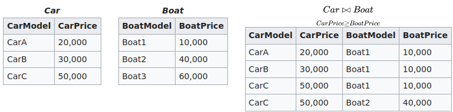
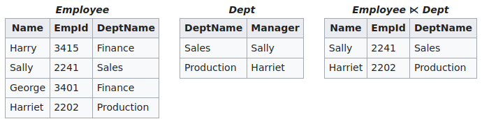
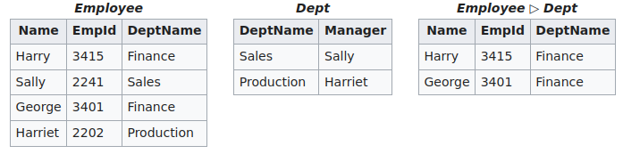
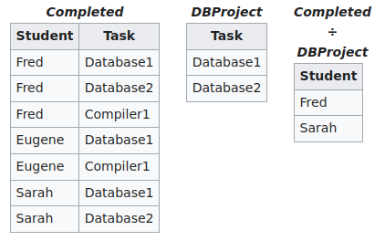
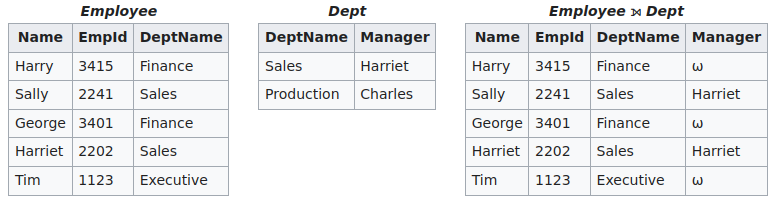
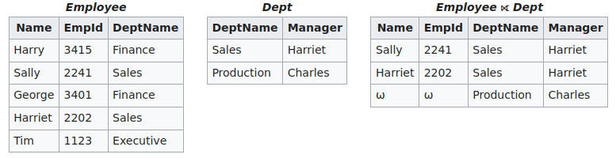
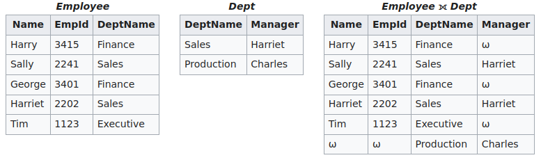

# Normalization
1. Motivation
    - reduces data redundancy
    - improves data integrity (accuracy and consistency)
1. Normal forms
    - 

# DataBase Management System (DBMS)
1. Blah

# Relational Algebra
1. Introduction
    - Uses algebraic structures to model data and queries on it
    - Defines operators which turn input relations in an output relation
    - Can be combined to create complex queries
    - m = \#rows, n = \#cols
1. Base Operators
    - Set operators
        * Binary operators
        * Set union and difference
            + The two sets must be union-compatible (have the same attributes)
        * Cartesian product
            + The two sets must have disjoint headers (no repeating attribute names)
            + Defined differently than set theory (returns set of flattened (n\+m)-Tuples)
    - Projection (pi)
        * Unary operator
        * Returns a subset of attributes from the Relation
        * Basically SQL SELECT statement
        * Properties
            + piA(piB(R)) = piA(R) where A in B
            + pi(R + P) = pi(R) + pi(P)
    - Selection (sigma)
        * Unary operator
        * Returns all tuples from the Relation which match phi
            + phi = propositional formula which consists of atoms and logical operators
        * Basically SQL WHERE statement
        * Properties
            + sigmaA(R) = sigmaA(sigmaA(R))
            + sigmaAsigmaB(R) = sigmaBsigmaA(R)
            + sigmaAandB(R) = sigmaA(sigmaB(R)) = sigmaB(sigmaA(R))
            + sigmaAorB(R) = sigmaA(R) + sigmaB(R)
    - Rename (rho)
        * Unary operator
        * Returns R, but renames the attributes
        * Basically SQL AS statement
        * Properties
            + rhoA/B(rhoB/C(R)) = rhoA/C(R)
            + rhoA/B(rhoC/D(R)) = rhoC/D(rhoA/B(R))
            + rhoA/B(R \ P) = rhoA/B(R) \ rhoA/B(P)
            + rhoA/B(R + P) = rhoA/B(R) + rhoA/B(P) (+ = set union)
            + rhoA/B(R x P) = rhoA/B(R) x rhoA/B(P) (x = set intersect)
1. Join Operators
    - Natural Join (|><|)
        * 
        * Binary operation
        * Returns the combinations of all tuples where the common attributes are equal
    - Theta-Join and Equijoin
        * 
        * Binary operation
        * Returns the flattened tuples which satisfy a condition
        * Defined only if the headers of the Relations are disjoint (why?)
        * Equijoin when the operator is =
    - Semijoin (|>< and ><|)
        * 
        * Binary operator
        * Returns all tuples from R for which a tuple in S which is equal in their common attributes
        * Note: only returns attributes from R, no other ones
    - Antijoin (|>)
        * 
        * Same as semijoin, but where attributes are NOT equal
    - Division (/)
        * 
        * Returns all tuples of attributes R-S from R which occur in all combinations with values from S
1. Common extensions
    - Outer Joins
        * Inner joins = combinations of matching tuples from both relations
        * Outer joins = inner join + some unmatched tuples from one of the relations
        * Unknown values are filled with NULLs
    - Left Outer Join
        * 
        * Returns all combinations of tuples witch matching common attributes + all unmatched tuples from R
    - Right Outer Join
        * 
        * Returns all combinations of tuples witch matching common attributes + all unmatched tuples from S
        * The opposite of the left outer join
    - Full Outer Join
        * 
        * Returns all combinations of tuples witch matching common attributes + all unmatched tuples
        * Basically left + right outer join
1. Operations for domain computation
    - Aggregation
        * Apply a function to all values of a column
        * Sum, Count, Average, Maximum, Minimum
    - Transitive Closure
