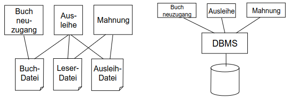
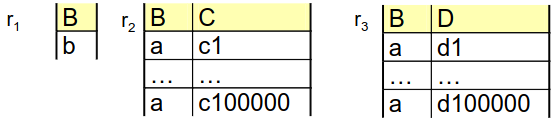
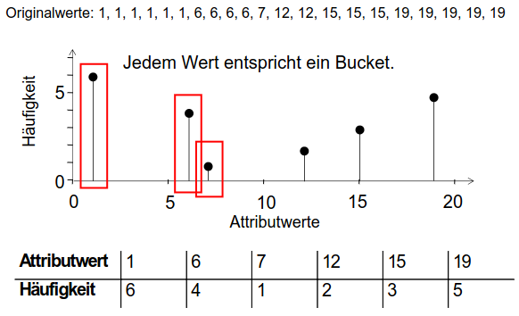
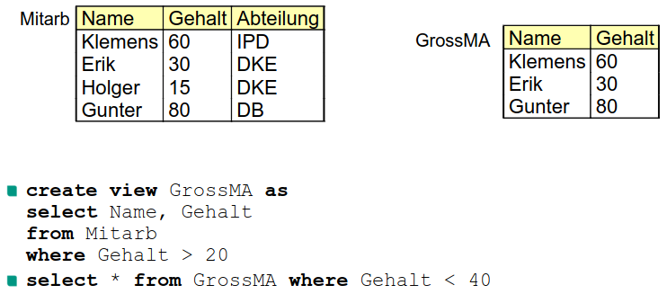
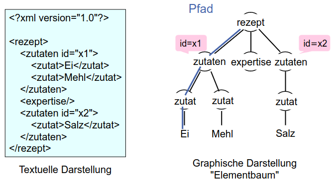

# Organisatorisch
1. Voraussetzungen
    - Datenbankentwurf
    - Terminologie aus Datenbanksysteme

# Motivation
1. **Reduzieren die Komplexität der Anwendungsentwicklung**
1. Allgemeine Trends in Informatik:
    - Ausfaktorisieren (extraction) wiederholender Funktionalität
    - Entwicklung generischer Software/Systeme -> Diese werden dann allgemein verfügbar gemacht
    - Beispiele:
        * Grafikpakete
        * Kommunikation, Middleware
        * Wissenschaftliches Rechnen
        * SAP (d.h. generische kaufmännische Funktionalität)
1. Idee: Zugriff auf Daten in Dateien
    - Funktionalität wird Teil der Anwendung (physikalische Ebene, Datenschutz, usw.)
    - Datenbanken faktorisieren diese Funktionalität aus
    - 
1. Datenbanken geben uns Physische Datenunabhängigkeit

# Physische Datenunabhängigkeit
1. Was?
    - Verstecken physischer Eigenschaften vor dem Entwickler
    - SQL = deklarativ (keine Aussage über JOIN-Reihenfolge)
    - DBMS findet gute Reihenfolge abhängig vom aktuellen Datenzustand
    - Erkennt über z.B. Histograme
1. Beispiel: Verbund (JOIN)
    - Eigenschaften
        * Kommutativ: r1 JOIN r2 = r2 JOIN r1
        * Assoziativ: (r1 JOIN r2) JOIN r3 = r1 JOIN (r2 JOIN r3)
        * => allows JOIN ri, where i in [1, n]
    - JOIN-order matters
    - 
        * Ineffizient, da in r2 & r3, B = a
1. Histogramme
    - 
    - Mappen Werte zu Häufigkeit
        * Können auch Ranges
    - Kompaktere Darstellung der Daten
    - Wird automatisch von Datenbanken gemacht
    - Entscheiden der Reihenfolge von Tabellen in Joins  (Result Size berechnen)
1. DBMS Aufgaben
    - Ermöglicht Abfragen auf unterschiedliche Datenbanken
        * unterschiedlich = gleiches Schema, aber unterschiedliche Häufigkeit der Daten
    - Stellt sicher, dass Abfragen funktionieren wenn sich die physische Darstellung der Daten geändert hat
        * d.h. Index kommt hinzu oder wird gelöscht
    - Erlaubt höhere Komplexität der Entwicklung

# Sichten in SQL
1. Was?
    - Create a name for a given query (can be used in other queries)
    - Databases combine conditions and stuff when using views in queries
1. Motivation
    - Wie bei Programmierung: Übersichtlichkeit und Wiederverwendbarkeit
1. Beispiel
    - 

# Begriffe
1. 3-Ebenen-Architektur
    - Konzeptuelles Schema = Tabellen, Spalten, usw
    - Internes Schema = Indizes
    - Externes Schemata = Sichten auf Konzeptuellen Schema
        * mehrere, weil verschiedene Benutzergruppen
1. Data Dictionary
    - Tabelle, die andere Tabellen und Attribute beschreiben
1. Relationenmodell
    - Datenbank = Menge von Tabellen
    - Schema sagt welche Relationen es gibt und mit welche Attributen
    - Gegenbeispiel: xml Datei mit Taxonomie Daten
        * Die Inhalte sind zu flexibel für eine rigide DB Schema
        * Daten enthalten: Markup, Elemente, Attribute
        * Eine Textsuche nach "Brown" ist nicht, gut (Farbe? Autor? Was?)
1. Entwicklung von Datenbankanwendungen
    - Idealerweise **physische Datenunabhängigkeit**, aber nicht immer realistisch
    - Finden einer guten Modellierung nur auf einfache Fälle automatisierbar
        * Beispiele: XML-Daten, (große) Graphen
        * XML lässt sich schon in Relationale DB materialisieren, ABER
            + ist nicht normalisiert
            + ineffizient, da braucht viele Joins
    - Relationale Darstellung ist dokumententypunabhängig

# NoSQL (Not only SQL) Datenbanken
1. XML Datenbanken
    - 
    - Pfadausdruck
        * Ermöglicht es Daten anhand der Struktur des Dokumenten abzufragen
        * aka: Welche Pfade gehören zu einer Abfrage
        * Wichtiger Teil von Querysprachen für dokumenten-basierte DBs (wie XML)
    - Grammatik = Schema
        * gibt an welche Markup zugelassen ist und auch die Reihenfolge
    - Als Semistrukturiertes Datenmodell
        * Teilweise stark strukturiert, teilweise nicht
        * Schema ist optional
1. NoSQL
    - Breiter Begriff, schließt nichts aus
        * key-value
        * document
        * wide column
        * graph
        * hybrid
    - Vergleich zu SQL
        * Nicht immer besser
        * Hat mehr Features als relationale DBMS, fehlen aber andere
            + Unterstützen nicht immer Joins
            + Es gibt aber Anwendungsfälle, die keine Joins brauchen (Social Media Posts)
        * Manchmal will man nicht mit einem Panzer zu Arbeit gehen
            + Panzer = DBMS
1. XML-Datenbanken / Document Databases
    - Variante von NoSQL
    - Beispiele: MongoDB, CouchDB
    - Können sowohl Inhalte als auch Struktur referenzieren
        * give me all Eggs which are in Zutat -> Zutaten -> Rezept
    - Sind flexibler
        * give me all paths which contain a Zutat
    - Unterstützen insbesondere verteilte, gut skalierbare Datenhaltung

# Graph-Datenbanken
1. Motivation
    - Baum = Spezialfall von Graph (XML = Baum)
    - Pfadausdrücke sind wichtig
    - physische Repräsentation nicht offensichtlich
1. Anfragesprachen
    - Features
        * Gerichtete Kanten => Komplikationen und Chancen
        * Wiederholung von Muster
            + Eindimensional: Pfad-Labels (Gib mir alle Pfade mit Labels (ab)+)
            + Mehrdimensional: z.B. Dreiecke
    - Beispiel: kürzeste Wege
        * Primitiv "kürzester Weg"?
            + Wie ist es definiert? Anzahl Streckenabschnitte vs km?
    - Beispiel: Zentralität
        * foreach Knoten: Wichtigkeit im Graphen bestimmen
        * z.B. Soziales Netzwerk
        * Idee: Anzahl ausgehender Kanten?
