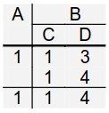

# Motivation
1. Notes
    - geschaltete = mehr Anschaulichkeit
    - 

# Formalisierung Relationenmodell
1. Definitionen
    - 
    - Universum = Mänge der möglichen Attribute
    - Schema = subset des Universums
    - Domain = set of all values of an Attribute
        * nicht leer, endlich
    - Tupel = Abbildung: Attribut -> Wert aus seiner Menge
1. NF^2-Modell
    - 
    - Attributwerte = atomar?
    - Belegschaft = Menge von {PANr, Nachname, ...}
    - Telefone = Menge von {Telefon}
    - Als flache Relation darstellen
        * Schlüssel = PANr, oder PANr + Telefon
        * Fremdschlüssel = PANr
    - Zusammenhänge kann man übersichtlicher anschauen
    - Strukturbaum des Schemas
        * 
1. Definition von Schema
    - Alternativ
        * foreach Attribut: Wert muss aus der Domäne sein
        * Instanz = kreuz Produkt der Attribute
    - Schema mit NF^2
        * 2^dom(R1) = Menge von Tupeln, die zu R1 konform ist
        * 
1. Algebra für NF^2
    - TODO: relationale Algebra
    - Projektion
        * 
        * Y = nur top level Attribute
        * Basically a select query
        * Duplikate = zusammengefasst (A=2, B=(C,D)=(2,3))
        * Um C oder D zu entfernen: über nest und unnest ändern
            + Sonst Definition zu umständlich
    - Selektion
        * 
        * B = subset von Tupeln: (C,D) in {(1,4), (2,3)}
        * Basically a where query
        * = select(AE from r1) DIFF select(AE from r1) where CD is not (1,4) AND CD is not (2,3)
    - Nesting
        * 
        * Zusammenfassen der Elemente bei denen die **nicht-geschachtelten Attribute** gleich sind (A,E)=(1,3)
        * Nested value = mini table, NOT just view of same rows!
    - Unnesting
        * TODO: figure out
        * Beispiel: Tabellen, die nicht aus flache Relation herleitbar
            + 
            + nicht herleitbar, da A in beide Tupel gleich
1. Funktionale Abhängigkeiten
    - Value of Attribute B is clear if value of A is given
1. Partitioned Normal Form (PNF)
    - = Relation durch folge von Nests konstruierbar
    - Definition (rekursiv)
        * Es gibt nicht-geschachtelte Attribute
        * Funktionale Abhängigkeit zwischen nicht-geschachtelte und geschachtelte Attribute
        * Alle geschachtelte Attribute sind in PNF
    - Flache Relation ist immer in PNF
1. Varianten von NF^2
