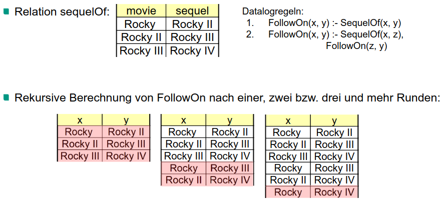
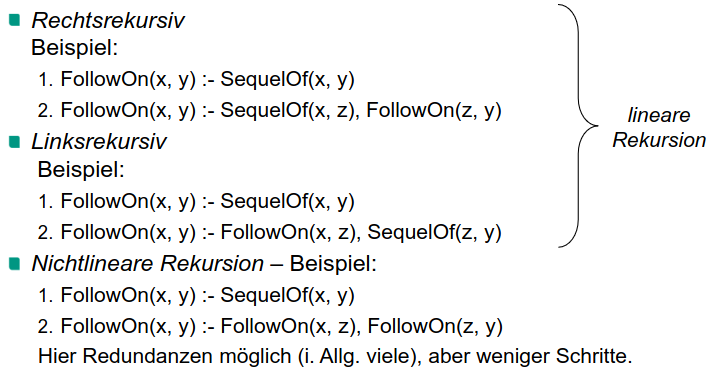

# Motivation
1. Weitere Anfragesprache für relationalle Datenmodelle
1. Datalog = logikbasierte Anfragesprache
1. Relationale Algebra und SQL - ähnlich, Datalog - Perspektive verbreitern

# Basics
1. Sichere Anfragen
    - Anfragen, die für jeden Datenbankzustand ein endliches Ergebnis liefern
    - Nicht speziell für Datalog
    - Beispiele
        * R = Relation
        * Sicher: {x, y | R(x, y)}
        * Nicht sicher: {x, y | -R(x, y)}
1. Transitive Hülle
    - Menge von Tupeln, mit A = Start, B = Ziel, B kann durch Folge von Tupeln erreicht werden
    - 
    - Formale Definition
        * Tupel t ist in die Transitive Hülle, wenn es in die originale Relation eine Folge von Tupeln gibt,
        * so dass [Tupel\_i].A = [Tupel\_i-1].B
        * t.A = [Tupel\_1].A, t.B = [Tupel\_n].B
    - Beispiele: Flugverbindungen -> Erreichbarkeit, Eltern -> Vorfahren
    - Es existiert KEIN RA-Ausdruck zur Berechnung der Transitive Hülle
1. Logik
    - Definitionen
        * Belegung = Zuordnung eines Werts zu einer Variablen
        * Interpretation = Ordnet jeder Konstanten, jedem Funktionssymbol, usw. eine Bedeutung zu
        * Modell = Belegung, die eine Aussage Wahr macht
    -  Erfüllbarkeitsproblem: Gibt es eine Belegung, die eine Formel wahr macht?
        * Aussagenlogik
            + Formel: A1 AND A2
            + Belegung: n(A1) = 1, n(A2) = 0
            + kein Modell für das Formel
        * Prädikatenlogik
            + istPrim(x) => istUngerade(x)
            + Zuweisung von Werten an freie Variablen
            + x = 2 => Belegung, aber kein Modell
            + x = 3 => Modell
1. Logik als Anfragesprache
    - Konzepte
        * Relation: Person mit Attributen: Name, Alter, Geschlecht = Dreistelliges Prädikat
        * Tupel mit Attributwerte: Person(Klemens, 45, m) = Grundklausel
            + Zuweisung von Konstanten an alle Variablen des Schemaprädikats
    - Visualisierung
        * 
        * Tupel = logische Fakten
        * Beispiel Anfrage:
            + Wer sind die Kinder von John?
            + ?- Elternschaft(John, x)
    - Extensionale vs Intentionale Datenbank
        * Extensionale Datenbank (EDB) = Basisdaten (Elternschaft, Person)
        * Intentionale Datenbank (IDB) = Sichten (mit (Deduktions-)Regeln abgeleitete Relationen)
            + Vater(X,Y)  :- Person(X, \_, m), Elternschaft(X, Y)
            + Mutter(X,Y) :- Person(X, \_, f), Elternschaft(X, Y)
    - Schwierigkeiten
        * Erfüllbarkeitsproblem ist NP-vollständig
        * Prädikatenlogik erster Stufe - Problem ist nicht entscheidbar
        * Braucht Rahmen, der effiziente Auswertbarkeit garantiert (Beschränkung auf Hornklauseln)

# Datalog
1. Definitionen
    - Datalog = Teilmenge von Prolog
    - Atom = P(X1,...,Xn)
        * Elternschaft(X, Y)
    - Literal = negiertes oder nicht-negiertes Atom
    - Klausel = Disjunktion von Literalen
        * -Elternschaft(X, Y) OR -Vorfahre(Z, Y)
    - Hornklausel = Klausel mit höchstens einem positiven Literal
        * Vorfahre(X, Y) OR -Elternschaft(X, Z) OR -Vorfahre(Z, Y)
    - Datalogprogramm = endliche Menge von Hornklauseln
        * -X OR Y = X => Y
        * -X OR -Y = -(X AND Y)
        * Vorfahre(X, Y) OR -Elternschaft(X, Z) OR -Vorfahre(Z, Y)
        * = (Elternschaft(X, Z) AND Vorfahre(Z, Y) => Vorfahre(X, Y)
    - Beispiele
        * Wer ist Großvater von Donovan?
            + Großvater(X, Y) := Person(X, \_, m), Elternschaft(X, Z), Elternschaft(Z, Y)
            + Großvater(X, Donovan)
        * Finde alle gleichgeschlechtlichen Elternpaare
            + GGE(X, Y) := Person(X, \_, G), Person(Y, \_, G), Elternschaft(X, Z), Elternschaft(Y, Z), X<>Y
1. Zusammenhänge: Datenbank -> Logik
    - )
1. Rekursion
    - IDB Prädikat sowohl im Kopf als auch im Rumpf
    - in RA nicht formulierbar
    - Mit Datalog:
        * Vorfahre(X, Y) :- Elternschaft(X, Y)
        * Vorfahre(X, Y) :- Elternschaft(X, Z), Vorfahre(Z, Y)
    - Zusammenhang mit Transitiver Hülle
        * Fixpunkt = Punkt, der bei Abbildung mit sich selbst zusammenfällt
            + Abbildung = Berechnung der Transitiven Hülle
        * Berechnung des kleinsten Fixpunkts = minimale Menge der Tupel, die vorhanden sein müssen
            + Erreichbarkeit: Sonst hätten wir Städte, die nicht erreichbar sind
    - Wechselseitige Rekursion (Mutual Recursion)
        * Zwei rekursive Definitionen, die voneinander abhängen
        * Erkennbar mit Hilfe eines Abhängigkeitsgraphen: Zykeln
            + Knoten = Relationen, Kanten = direkte Abhängigkeit
1. Auswertung rekursiver Regeln
    - Rundenweises Vorgehen
        * IDB-Prädikaten entsprechen leere Relationen.
        * Alle (Datalog-)Regeln anwenden auf Tupel, einer davon muss in vorangegangener Runde neu erzeugt worden sein.
    - Nächster Schritt findet statt, wenn vorangegangener das Ergebnis verändert hat
    - 
    - Varianten
        * 
        * nichtlinear nicht immer unterstützt
1. Abgrenzung zu Prolog
    - Anordnung spielt keine Rolle
    - NOT kommt nicht vor
    - Cut-Operator
    - green cut: Wenn erste Regel entfernt wird, ist Regel immer noch richtig
    - Gegenteil: red cut
    - Effizienter, aber Fehleranfälliger
1. Semantik von Datalogprogramm
    - Herangehensweisen
        * Modelltheoretisch
            + Berechnung der Menge aller Grundfakten, die logische Konsequenzen des Programms sind
            + Welches Modell macht die Anfrage Wahr?
            + Alle Belegungen (Kombinationen von Werten) anschauen und überprüfen, ob sie Modell sind
            + i.Allg. nicht praktikabel (zu viele (unendlich) Belegungen zu überprüfen)
        * Beweistheoretisch
            + Berechnung der Menge aller Grundfakten, die aus dem Programm (in endlich vielen Schritten) ableitbar sind
            + Syntaktisches Konzept
            + Siehe Rocky-Beispiel
            + eher Mittel der Wahl
        * Liefern für Hornklauseln das gleiche Ergebnis
1. Monotonieeigenschaft
    - Operator ist Monoton => vergrößerung des Inputs verkleinert nicht den Output
    - Datalog: keine Negation in Rümpfen der Regeln erlaubt
1. Ausdruckskraft
    - Datalog ohne Rekursion == Relationale Algebra ohne diff-Operator
1. Negation in rekursiven Regeln
    - Beispiel
        * Anfrage: „Alle Paare von Städten (x, y), so dass UA von x nach y fliegt, nicht aber AA.“
        * Prädikate:
            + UAreaches(x, y) :- Flights(UA, x, y, d, r)
            + UAreaches(x, y) :- UAreaches(x, z), UAreaches(z, y)
            + AAreaches(x, y) :- Flights(AA, x, y, d, r)
            + AAreaches(x, y) :- AAreaches(x, z), AAreaches(z, y)
            + UAonly(x, y) :- UAreaches(x, y), NOT AAreaches(x, y)
    - Würde Ausdrucksmächtigkeit erhöhen
    - Muss kontrolliert erfolgen
        * Wird negatives Literal der Form -P in Regel benutzt, muss P bis dahin vollständig berechnet sein
        * Heißt nicht, dass es in anderen Fällen nicht klappt!!!
1. Stratifikation
    - TODO: wtf is all of this sh\*t?
    - Stratifiziertes Programm
        * Programm in Ebenen zerlegbar, die der Reihe nach auswertbar sind
        * 
    - Strata
        * Ebenen des Programms, die nacheinander (beweistheoretisch) ausführbar sind, und Ergebnis ist korrekt
        * Jeder Prädikat in dem Stratum ist nicht-rekursiv ODER enthält Regeln aus ein tieferes Stratum
    - Strukturgraph
        * 
        * Stratum 0 = AAreaches & UAreaches
        * Stratum 1 = UAonly
        * Anzahl der Kanten mit Negation bestimmt die Abarbeitungsreihenfolge
        * Keine Zyklen

# Vergleich mit SQL
1. Rekursion in SQL
    - 
        * Aufbau Anfrage entspricht in struktureller Hinsicht Regeln
        * Rekursion nicht linear; manche Systeme unterstützen nur lineare Rekursion
        * Hier wird nur eine Relation berechnet
    - 
1. Monotonizität
    - TODO: WTF
1. Aggregation kann zu Nichtmonotonizität führen
    - TODO: WTF
