# Einleitung
1. Markup
    - Definition: Zusätzliche Information, die im Dokumenttext hinzugefügt wird
    - Jedes Textverarbeitungssystem generiert Markup (z.B. \\par (in RTF) = neuer Absatz)
    - Selten von Benutzer direkt eingegeben (z.B. Latex)
    - Generalized Markup: nicht Aussehen spezifizieren, sondern Struktur identifizieren
1. Logischer Markup mit XML
    - 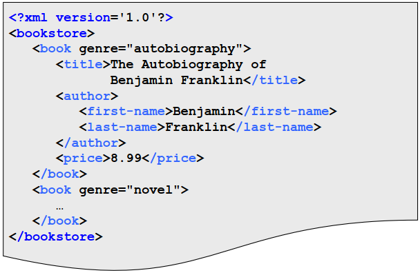
    - Deklarativer Zugriff sinnvoll
        * Alle Vorkommen des Wortes 'brown' in description-Elementen innerhalb von treatment-body Elementen.
        * Alle Vorkommen des Wortes 'brown' in author-Elementen.
    - 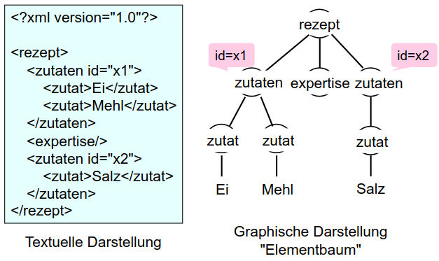
1. Warum will man mit Generalized Markup arbeiten?
    - 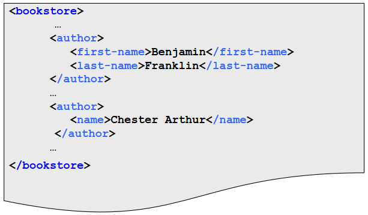
        * Trennung zwischen logischer und Layoutstruktur => höher Flexibilität
        * Erlaubt unterschiedliche Darstellungen
    - Weitere Beispiele
        * Arzneimitteldokumentation -> Lektor soll alle Eigennamen im Dokumentbestand überprüfen.
        * Verlag für fremdsprachliche Wörterbücher -> Erstellung eines kompakten Wörterbuchs mit nur einer Bedeutung.
    - Vorteile
        * Dokument mit logischem Markup enthält i. Allg. mehr Information
        * Leichteres kooperatives Arbeiten
        * Konsistenz der Dokumentation (intra- und inter-dokument)
1. Was leistet XML?
    - 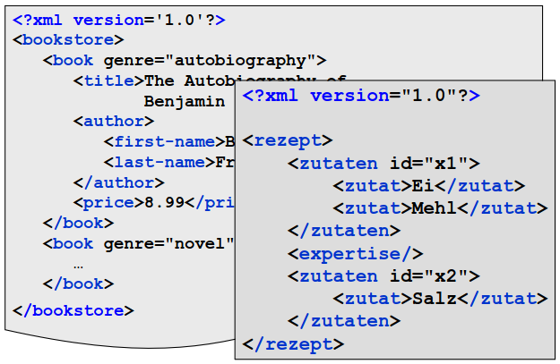
    - Zile: nicht Standardisierung des Generalized Markups.
    - Unterschiedliche Dokumenttypen haben, mit jeweils unterschiedlichem Markup.
    - Beispiele: Inventarliste Buchhandlung, Kochrezept
1. Zusammenhang zu andere Formate
    - Alternative: JSON -> hat andere Motivation
    - Für uns eigentlich egal welches Format
    - Anfragesprachen sind übertragbar (bzw. existieren in angepasster Form)
    - Datenbanktechnologie unabhängig vom Austauschformat
1. Laufendes Beispiel
    - Als DB
        * 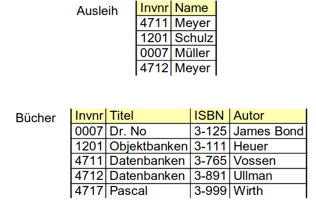
    - Als XML
        * 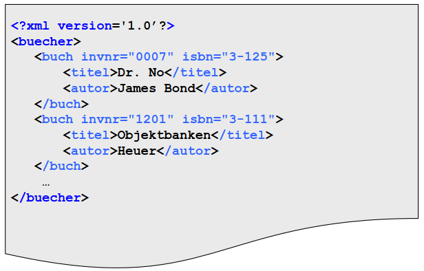
        * Die Schema
            + 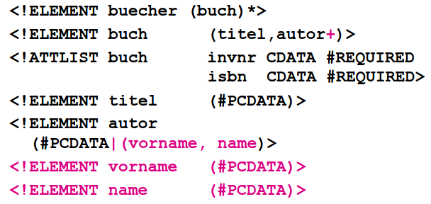
    - Erläuterungen
        * Ein Dokumenttyp für alle Relationen
        * Schemainformation im Dokument
        * Vergleichbar mit Data Dictionary
        * Vorteil: Flexibilität
            + Leichte Anpassbarkeit
            + Allgemeinere Anfragen
        * Nachteil: Keine Typisierung
1. Warum heißt es 'semistrukturiert'?
    - Schema ist nicht Pflicht
    - Abstufung (nuance) zwischen extrem und keine Strukturierung möglich
    - Abstufung zwischen 'starre relationenartige Struktur' und 'sehr flexible Auswahl und Anordnung der Dokumentbestandteile'


# Dokumenttypdefinitionen (DTDs)
1. Definition
    - = Menge von Regeln/Grammatik
    - Gibt an, was für Markup vorkommen kann
    - Elementdeklaration beinhaltet Inhaltsmodell.
    - Inhaltsmodell gibt Auskunft über Status und Abfolge der Elemente.
    - Varianten
        * Wohlgeformt (well-formed) = besitzt geordnete syntaktische Eigenschaften
            + aka. keine fehlende Klammer, Tags o.Ä.
        * Gülig (valid) = ist wohlgeformt und folgt einer Schema (a priori gegeben)
1. XML-Engine
    - Definition 1: Überprüft auf Wohlgeformtheit und Gültigkeit
1. XML-Schemata I: DTD
    - 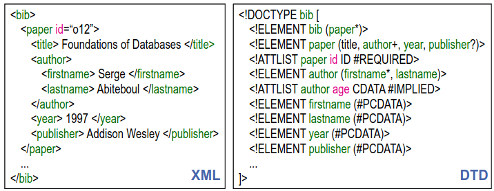
    - Definiert kontextfreie Grammatik für XML-Dokumente
    - Einschränkung von Elementen und Attributen auf definierte Auswahl und Struktur.
    - Deklaration von Elementen
        * Beschreibt die Einschränkungen des Inhalts eines Elements
        * Syntax: \<!ELEMENT Name (Definition)\>
        * #PCDATA (Parsed Character DATA) = einziger atomarer Typ
        * (a,b,c) = Liste von Unterelemente
        * (a|b|c) = Alternativen
        * Kardinalitäten
            + \* = 0+
            + + = 1+
            + ? = 0|1
            + (keine Angabe) = 1
        * EMPTY = muss leer sein
        * Beispiele
            + DOCTYPE bib = Einleitung und Festlegung des Wurzelelements
            + ELEMENT bib = kann beliebig viele Elemente vom Typ 'paper' haben
            + ELEMENT paper = besteht aus mindestens einem author, genau einem year und einem optionalen publisher in genau dieser Reihenfolge.
            + ELEMENT firstname = ist vom Typ Zeichenkette
    - Deklaration von Attributen
        * Paar: Name-Zeichenkette
        * Assoziiert mit einem Element
        * Syntax: \<!ATTLIST Element Attributname1 Typ1 Zusatz1 Attributname2 …\>
        * Typen
            + CDATA = Zeichenkette
            + ID = OID
            + IDREF = Referenz
            + IDREFS = Menge von Referenzen
        * Zusatz
            + REQUIRED = zwingend
            + IMPLIED = optional
            + (Initialwert)
        * Beispiele
            + paper id = typ OID, muss zwingend eindeutig sein
            + author age = optionale Zeichenkette
    - OIDs und Referenzen
        * 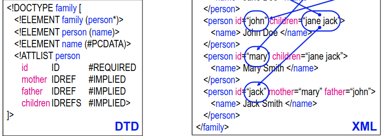
        * Referenzen auf IDs
        * Keine Konsistenzprüfung
            + Person kann gleichzeitig Vater und Mutter sein
            + father-Attribut kann auf Frauen verweisen
        * Eigenschaften
            + IDs sind innerhalb eines Elements eindeutig
            + IDREF = Referenz auf ID
            + Parser (XML-Engine) prüft referentielle Integrität
            + Keine Einschränkung des Typs
    - Rekursion
        * 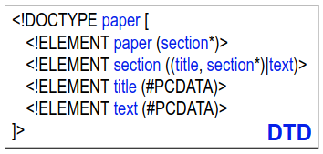
        * Kontextfreie Grammatik => Rekursion erlaubt
    - Schwächen
        * Referenzen können nicht eingeschränkt (typisiert) werden
        * Alle Elementnamen sind global in einem Namensraum
        * Ungewollte festlegung der Reihenfolge
            + Workaround: \<!ELEMENT person ((name, phone) | (phone, name)) \>
        * Kann teilweise zu vage werden: \<!ELEMENT person ((name|phone|email)*) \>


# XML Anwendungen, Anwendungsentwicklung
1. Einleitung
    - Es muss leicht möglich sein, XML-basierte Anwendungen zu entwickeln.
    - Typen von XML Wissen
        * Anwendungsunabhängig = man braucht nur XML-, keine Fachkenntnisse
        * Anwendungsspezifisch = man braucht XML und Anwendungswissen
    - Anwendungsentwicklung
        * Prozedurale Mechanismen, 2 Schnittstellen
            + Document Object Model (DOM) = objektorientierte Sicht auf XML Dokumente
            + Simple API for XML (SAX) = Callback-Mechanismus
        * Extensible Stylesheet Language (XSLT) = Query- und Transformationsmechanismen für XML Dokumente (deklarativ)
    - Zusammenspiel: XML-Engine und Anwendung
        * 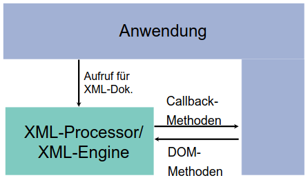
        * Engine validiert (prüft, ob konform zu Schema)
        * DOM: Anwendung hält Kontrolle über den Ablauf
        * Callback-Methoden: Engine hällt Kontrolle
1. Document Object Model (DOM)
    - Properties
        * Baumstruktur (alle Dokumentbestandteile, nicht nur Elemente)
        * Methoden erlauben Navigation und Manipulation des Baums
        * Keine Aussage zur Implementierung, nur Methodeninterfaces
        * Anwender muss sich Klassenbibliothek besorgen
    - Usage
        * 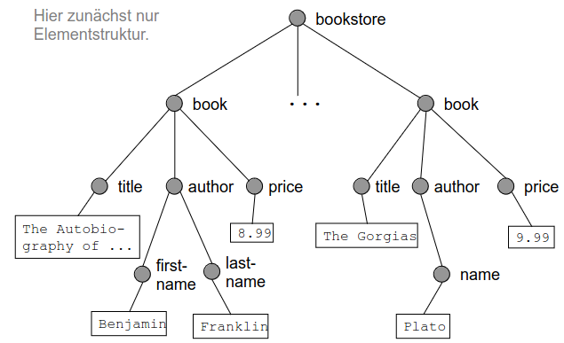
            + 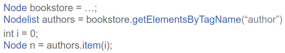
        * 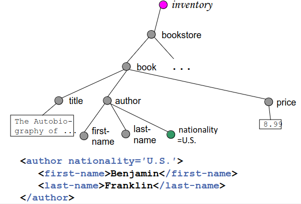
            + 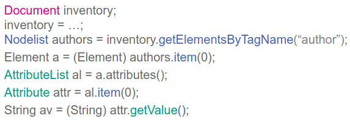
        * Attributen und Methoden von Node
            + 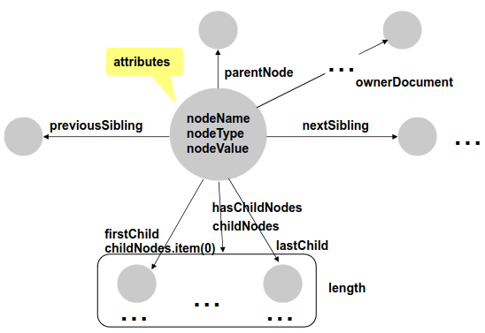
        * Manipulationsmethoden von Node
            + 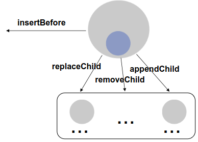
1. Simple API for XML (SAX)
    - 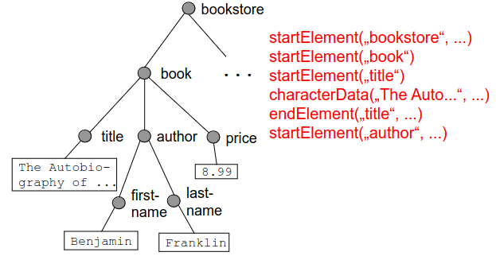
    - Event-basiertes Vorgehen
        * XML-Engine geht durch das Dokument
        * Ruft entsprechende Callback-Methode, wenn Ereignis auftritt (z.B. Anfang eines neuen Elements)
        * d.h. Engine hat Kontrolle über den Ablauf
        * Namen der Events ist nicht standardiesiert
        * \<item/\> = \<item\>\</item\>
    - Beispiel: Zählen der author-Elemente
    ```
        int count = 0;

        int main() {
            XML_SetElementHandler(parser, zaehlen, doNothing);
            if (!XML_Parse(parser, buf, len, done))
                cout << count;
        }

        void zaehlen(void *userData, const char *name, const char **atts) {
            if (strcmp(name, "author"))
                count++;
        }

        void doNothing(...) {
            return;
        }
    ```
    - Weitere Eigenschaften
        * Schnittstelle ist standardisiert, Implementierung uns Anwendungsspezifisch
        * Anwendungsentwickler registriert Callback-Method nur für relevante Events
        * Reihenfolge der Events ist fest vorgegeben


# XML Namespaces
1. Motivation
    - Markup Vokabular = Element- und Attributnamen
    - XML Dokument soll Markup Vokabular aus mehreren Verzeichnissen enthalten können
1. Einführung
    - Namespace = Festlegung, was bestimmte Namen bedeuten
    - Vermeidung von Namenskonflikten
    - 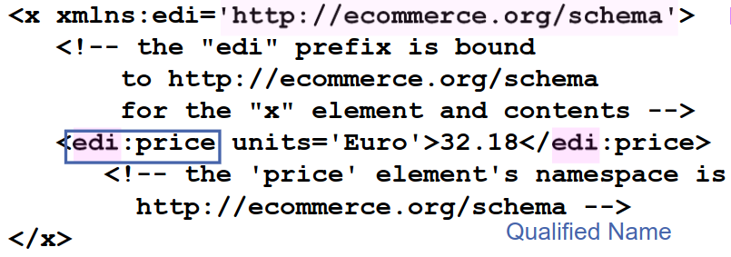
        * Prefix stellt Verbindung zum Namespace her
1. Erläuterung
    - Identifiziert durch URI
    - Namespace-Definition muss keine formale Schema sein
    - Kann sinnvoll sein Element aus Namespace und Attribute nicht aus Namespace zu benutzen
    - Festlegung = Namespace Definition
        * Keine konkrete Vorgaben
        * URL, die mit Namespace in Verbindung steht
    - Anwendung = Namespace-Deklaration in Dokumente
        * Welcher Namespace soll zur Anwendung kommen
        * Verwenden der Namen in Dokumenten
1. Terminologie
    - Defaulting
        * 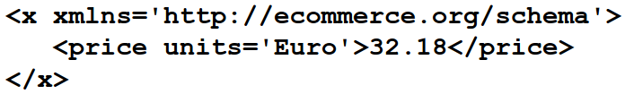
        * Default Namespace gilt für alle Elemente ohne Präfix
        * Default Namespace gilt für Element, das eine Deklaration enthält
    - Scoping
        * Definition kann überschrieben werden in 'innerem' Element
1. Example: Multiple Namespaces
    - 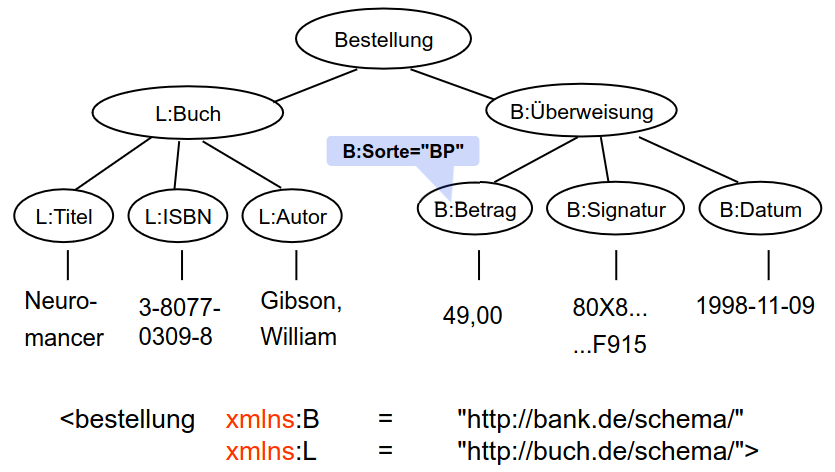


# XML Schema
1. Idee
    - Ist XML-Dokument
    - Vergleichbar mit Data Dictionary
1. Definitionen
    - Definition = Festlegung neuer Typen
    - Deklaration = Vorkommen von Elementen und Attributen spezifizieren
    - Elementname vs. Elementtypname
1. Motivation (Mängel von XML-DTD/Anforderungen an XML-Schema)
    - Trennung zwischen Definition und Deklaration ermöglichen
    - Validierung von
        * Datentypen und Wertebereiche
        * Integritätsbedingungen
        * Getypte Links
    - Erweiterbarkeit
        * Einschränkung des Inhaltsmodells
        * Erweiterbarkeit des Inhaltsmodells
    - Bessere Modularität (Scoping)
1. Inhaltsmodell
    - 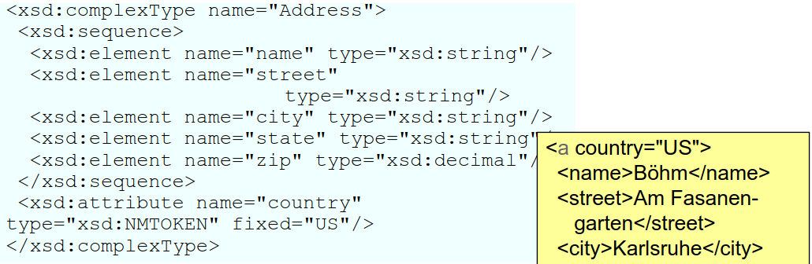
    - In etwa gleiche Konnektoren wie in DTD (andere Syntax)
        * Sequence, Choice
    - Typdefinition und Elementdeklaration sind getrennt
    - Anonymer Typ = Typ ohne Name
        * Muss da verwendet werden, wo er eingeführt wird
    - Default = Genau ein Vorkommen
    - Implizite Typdefinition
1. Basistypen in XML-Schema
    - String Types
        * normalizedString = string without LF, CR or tabs
        * token = string without LF, CR, tabs, leading/trailing spaces or multiple spaces
    - Numeric Types
        * decimal = java.math.BigDecimal
        * int, unsignedInt, integer, negativeInteger, nonNegativeInteger, positiveInteger, nonPositiveInteger
            + = java.math.BigInteger
        * byte, unsignedByte, short, unsignedShort, long, unsignedLong, double, float
            + = IEEE 754
        * Special values: INF, -INF, NaN
    - Time Types
        * date: ccyy-mm-dd (2003-11-21)
        * dateTime: ccyy-mm-ddThh:mm:ss (2003-
        * 11-21T21:20:00)
        * duration: PyYmMdDThHmMsS (P3Y,
        * P2DT3H)
        * gDay: dd
        * gMonth: mm
        * gMonthDay: mm-dd
        * gYear: ccyy
        * gYearMonth: ccyy-mm
        * time: hh:mm:ss
    - Others
        * boolean: true, false, 1, 0
        * anyURL
        * hexBinary, base64Binary
    - XML Data Types
        * ID
        * IDREF
        * ENTITY
        * NMTOKEN
        * NOTATION jpeg, pdf
        * IDREFS
        * ENTITIES
        * NMTOKENS
        * Name: XML name, possibly with colons
        * QName: prefixed name
        * NCName: local name without colons
        * language: A string that contains a valid language id
1. Basistypen ableiten
    - 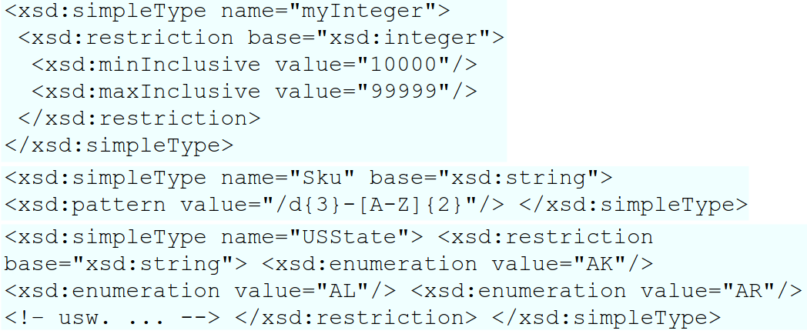
1. Weitere Typen
    - Liste
        * 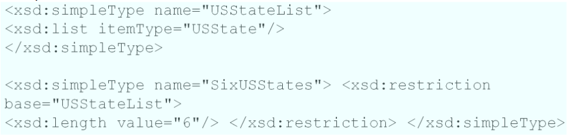
        * Folge von Instanzen einfacher Typen
        * Beispiel: \<sixStates\>PA NY CA NY LA AK \</sixStates\>
    - Union
        * 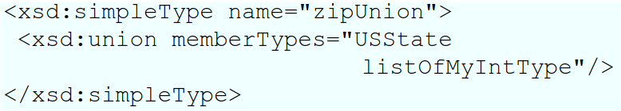
1. Typhierarchien
    - Hierarchische Abhängigkeit zwischen 2 Typen (Erweiterung und Restriktion)
    - Alle Typen bilden eine Typhierarchie
        * Baum mit Wurzel
        * Keine Mehrfachvererbung
    - Erweiterung
        * 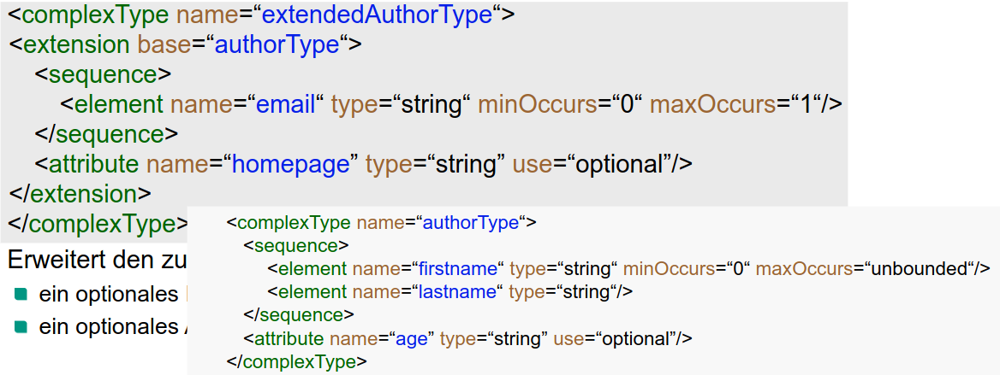
            + Erweitert Type authorType um Element email und Attribut homepage
        * Strukturergänzung (Hinzufügen von Elemente oder Attribute)
        * Erweiterungen werden an bestehenden Definitionen angehängt
    - Restriktion
        * 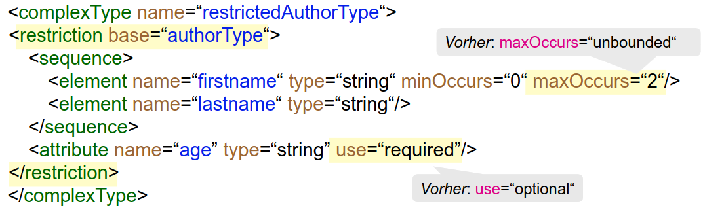
        * Struktur bleibt gleich (Es dürfen keine Elemente oder Attribute weggelassen werden)
        * Verschärfung von Angaben (z.B.)
            + Nicht angegebene type-, default- oder fixed-Attribute
            + Einschränkung der Kardinalitäten (min-, maxOccurs)
    - Extensions
        * Wie funktioniert Type-Checking?
            + 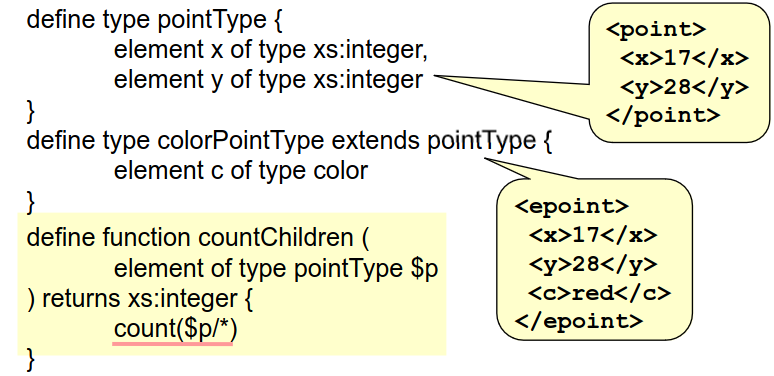
            + Aufruf auf Instanz von Typ 'colorPointType'
            + Ergebnis bei statischer Typüberprüfung: 2
            + Ergebnis in XQuery: 3 (natürlicher)
        * Polymorphe Konsistenzbedingungen
            + Möglich mit XML Schema
            + Beispiele: Uniqueness, Schlüssel, getypte Links
