# Einleitung
1. Erweiterbarkeit von Datenbanksysteme
    - RDBMSe ursprünglich nur für Verwaltung von 'Facts und Figures'
    - Nur limitierte Menge von (alphanumerischen) Datentype
    - Heute: mehr Datentypen und Erweiterbarkeit
1. Erweiterbarkeit ermöglichen
    - Abstrakte Datentypen (ADTs) = grundlegendes Konzept
    - Charakterisiert durch
        * (strukturelle) Attribute: x-Wert links, y-Wert unten
        * Funktionen: fläche(), intersect()
    - Benötigte Erweiterungen
        * Möglichkeit Datentypen und Methoden zu hinterlegen
        * Parser muss damit umgehen können
        * Umgebung zur Ausführung des Codes
            + z.B. fläche(): als stored procedure oder in gängiger Programmiersprache
        * Anfrageoptimierer muss teuere Methoden kennen
1. Benutzerdefinierter Code in Anfragen
    - Üblich: Mash-up von SQL-artigen Sprachen und Benutzer-erstellten Code
        * Hive, Pig, SCOPE, Spark-SQL, usw.
        * Beispiel:
        ```
        select f(x) , ...
        from R1, R2
        where g(y) = ... and ...
        ```
            + f, g = Benutzer-definierte Funktionen
    - Unterscheidung zwischen User-Defined Function (UDF) und User-Defined Aggregate (UDA)
    - Anfrageoptimierung benutzerdefinierter Funktionen noch offenes Problem
        * Beliebige Zusammenhänge zwischen Input und Ausführungsdauer möglich
            + z.B. dauert länger wenn Primzahl und Fibonaccizahl enthalten
        * Idee: Anwender schreiben Meta-Code der die Ausführungsdauer vorhersagt
            + Erfahrungsgemäß wird nicht gemacht
            + Ist der Meta-Code richtig?
            + Ist der Meta-Code konsistent mit dem eigentlichen Code?
1. Datenbankunterstützung für XML
    - 1NF ist sinnvoll
    - DBMSe unterstützen strukturierte Typen (Mengen, Arrays, Bäume)
    - XML als weiterer Datentyp?
        * Strukturierte Repräsentation der XML-Daten in der DB
            + Relationen entsprechen generischen Konzepten oder dokumenttypspezifischen Konzepten
        * XML als ADT
            + d.h. XML Dokument = ganzer Attributwert
            + XML-spezifische Auswertungen (z.B. Pfadausdrücke) sind transparent für DBMS
        * EDGE-Modell
            + Jede Kante = Tupel
            + bzw. Jedes Element enthält als Schlüssel Verweis auf Vaterelement
            + Braucht viele Joins für einfache Informationsbedürfnisse
            + Reihenfolge der Kindelemente geht oft verloren
1. Volltextsuche
    - Einfache Implementierung: Inverted Files
        * Tupel: (word, documentID, position)
        * Index über word
    - Braucht linguistische Vorverarbeitungen
    - Anfragen nicht nur boolsch (auch Ranking möglich)
        * Wie oft ein Suchbegriff im Dokument vorkommt
        * Wie viele andere Begriffe noch im Dokument vorkommen
    - Keine einheitliche Rankingvorschrift über alle Suchmaschinen
1. Eigenschaften von Systemen für die Verwaltung von Dokumentbeständen
    - Text Indexing Engines
    - denormalisiertes Datenbankschema
        * Tupel: (word, list\<documentID, position\>)
        * Vorteil: aggressivere Komprimierung (delta compression)
        * Sinnvoll, posting list oft sehr lang
    - Suffixbäume
    - Textindexierung: Subsystem des DBMS oder separates System
    - Aktualisierung des Textindices (asynchron)


# Strings und Suffixe
1. Definitionen
    - s = String, n = |s|, s[n] = $ = Endsymbol
    - s[i...j] = Teilstring s[i],s[i+1],...,s[j-1],s[j]
        * i, j in [i, n]
    - suff\_i(s) = s[i]s[i+1],...,s[n]
        * suff\_n(s) = $ = leerer String
    - pre\_j(s) = s[1],...,s[j-1],s[j]
    - Jeder Teilstring von s lässt sich als Präfix eines Suffixes darstellen
        * s[i...j] = pre\_j-i+1(suff\_i)
1. Beispiele: 
    - s = 'mississippi$' => |s| = 12
    - 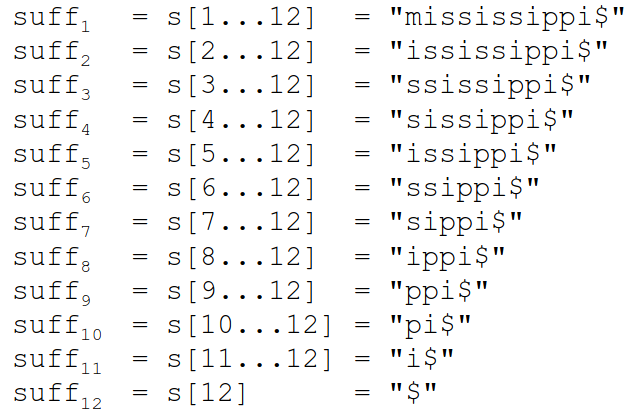
    - allgemeine Teilstrings (Infixe)
        * s[2...5] = 'issi'
        * s[7...10] = 'sipp'
1. Motivation
    - Sehr wertvoll bei: Suche von Zeichenfolgen, Indizierung, Auswertung regulärer Ausdrücke
    - Effiziente Speicherung erfordert: geringe Speicherbedarf und Zugriffszeit
1. Suffix-Bäume
    - 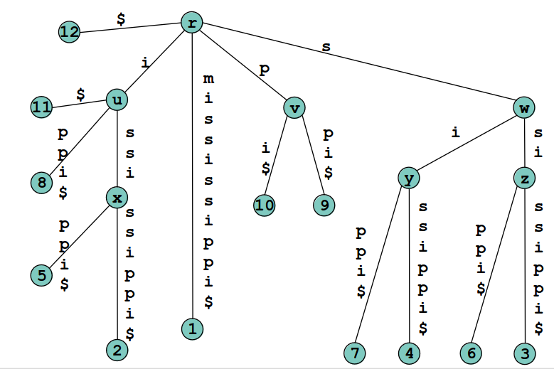
    - Definition und Eigenschaften
        * ST(s) = Suffixbaum von s
        * ST(s) hat genau |s| Blätter
            + Beschriftete 1...|s|
        * Jeder innere Knoten hat mindestens 2 Kinder
        * Jede Kante ist mit einem Teilstring von s beschriftet
        * Verkettung der Kantenbeschriftungen: Wurzel -> Blatt\_i = suff\_i
        * Die Beschriftungen der ausgehenden Kanten eines Knotens beginnen mit paarweise verschiedene Buchstaben
    - 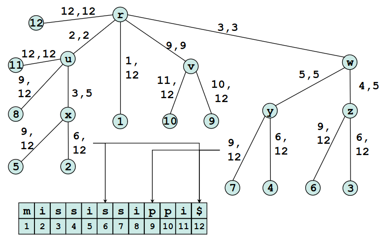
    - Tiefe
        * v = Knoten in ST
        * path-label(v) = Verkettung der Kantenbeschriftungen: Wurzel -> v
            + = das durch v repräsentierte Infix
        * string-depth(v) = Summe der Längen der Kantenbeschriftungen: Wurzel -> v
            + = |path-label(v)|
        * tree-depth(v) = Anzahl der Kanten im Pfad: Wurzel -> v
        * string-depth(v) >= tree-depth(v)
            + Da Beschriftungen mindestens 1 Zeichen lang
        * Beispiel: Stringtiefe (unter) vs. Baumtiefe (über)
            + 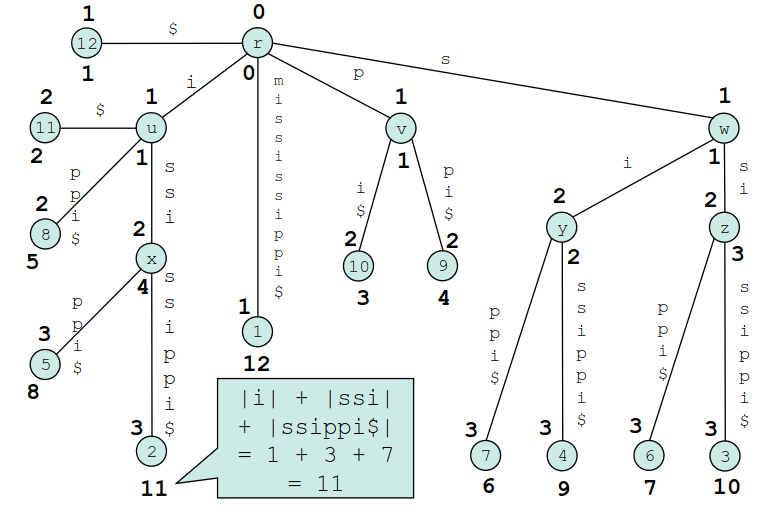
    - Rechtsmaximalität
        * Länge des längsten gemeinsamen Präfixes zweier Suffixe = Stringtiefe des tiefsten gemeinsamen Vorgängerknotens der Blätter der Suffixe
        * Teilstring t von s ist rechtsmaximal, wenn es mindestens 2 Vorkommen von t gibt, denen unterschiedliche Zeichen folgen
            + Beispiel: s=mathematik, t=mat (folgen h und i)
            + t=ma ist nicht rechtsmaximal (folgt nur t)
        * Die Pfadbeschriftung jedes inneren Knoten entspricht einem rechtsmaximalen Teilstring
        * Weiteres Beispiel
            + 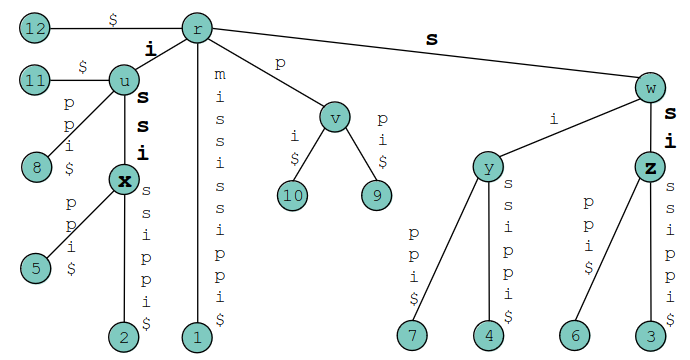
            + path-label(z) = 'ssi' = rechtsmaximal (folgen p und s)
            + path-label(x) = 'issi' = rechtsmaximal (folgen p und s)
            + 'is' ist NICHT rechtsmaximal (kein solcher innerer Knoten)
    - Suffixverweis
        * 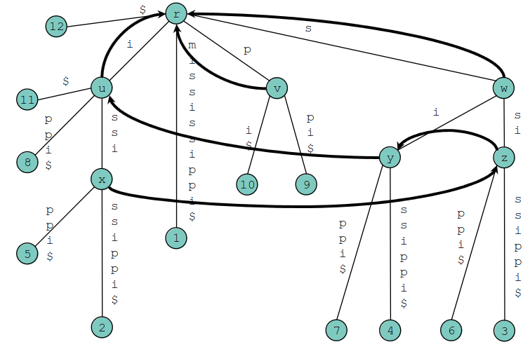
        * Definition
            + v = Knoten mit Pfadbeschriftung ca
            + c = einzelnes Zeichen
            + a = (eventuell leerer) String
            + u = Knoten mit Pfadbeschriftung a
            + SL(v) = u = Suffixverweis = Zeiger von v nach u
            + aka suffix Node with path-label = last n-1 Chars of v
        * Eigenschaften
            + Jedes suff\_i im Teilbaum unter v hat das Präfix ca
            + Jedes suff\_i+1 mit dem Präfix a ist im Teilbaum unter u vertreten
            + Jeder innere Knoten (außer der Wurzel) hat einen Suffixverweis
            + Der Teilbaum unter v ist komplett im Teilbaum unter u enthalten
            + SL(v) = u => tree-depth(u) >= tree-depth(v)-1
    - Generalisierter Suffixbaum
        * 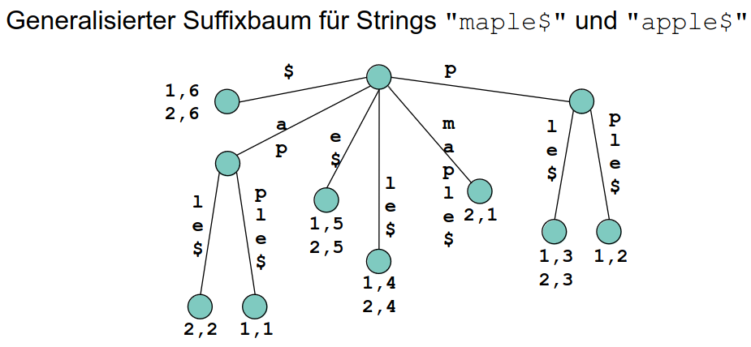
        * S = Menge von Strings = {s1,s2,...,s\_k}
        * GST(S) = Generalisierter Suffixbaum
        * GST(S) enthält alle Suffixe aller Strings in S = Vereinigung der ST(s\_i)
        * Beschriftung jedes Blatts: Liste von ganzzahligen Paaren (i, j) = suff\_j von s\_i
        * Kanten sind beschriftet mit ENTWEDER...ODER
            + einem Teilstring eines Strings aus S
            + mindestens einem ganzzahligen Triplet (i,j,l): Kantenbeschriftung [j...l]
    - Lexikalische Tiefensuche: Besuchen der Kinder in lexikographischer Reihenfolge der Kanten
    - Pattern Matching
        * Algorithmus
            + s = String, ST(s) = Suffixbaum, P = Pattern
            + Von der Wurzel in ST(s) entlang P absteigen
            + Falls kein Pfad -> kein Match
            + Falls Ende von P und Knoten -> done
            + Falls Ende von P und inmitten einer Kante -> springe zum Zielknoten
            + Matches von P = Blätter im Teilbaum unter erreichtem Knoten
        * Anfrage kann Intervall sein -> Nach Intervallgrenzen suchen
        * Anfrage als Regex
            + Regex durch Automaten ersetzen
            + Tiefensuche durch den Automaten (Gleichzeitig im Baum nach unten)
            + Backtracking um Automat und im Baum, wenn es nicht mehr weitergeht
            + Wenn Zielzustand des Automaten: Alle Blätter um Teilbaum ausgeben und Backtracking
    - Datenstruktur
        * 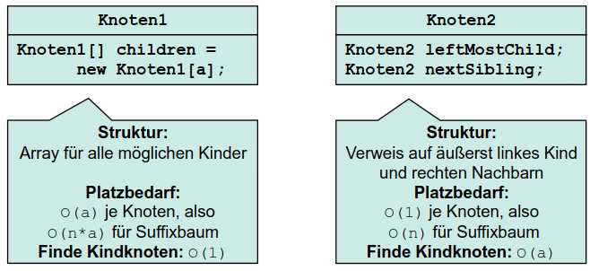
    - Konstruktion
        * TODO: McCreight-Algorithmus
        * Laufzeit = O(n^2)
    - Beschleunigung mit Suffixverweise
        * Idee: Folgende eigenschaften ausnutzen
            + v = innerer Knoten auf Pfad: Wurzel -> Blatt\_i-1
            + path-label(v) = ca-Präfix von suff\_i-1
            + es existiert suff\_j (j < i-1) mit Präfix ca
            + suff\_j+1 bereits eingefügt => es existiert Pfad mit Präfix a (u = Ende des Pfades)
            + SL(v) = u => kann von v zu u springen
            + Sparen der Vergleiche der ersten |a| Zeichen von suff\_i
        * Lemma
            + v = innerer Knoten, erzeugt beim einfügen von suff\_i-1
            + path-label(v) = ca
            + es existiert schon ODER wird beim Einfügen von suff\_i erzeugt: u mit path-label(u) = a
            + => Beim erzeugen von suff\_i+1, kann mann den Suffixverweis auf suff\_i erzeugen
    - Traversierungsarten beim Einfügen
        * Begriffe
            + Schritt O = nach oben steigen
            + Schritt S = Suffixverweis folgen
            + Schritt U = nach unten gehen
        * Typ 1
            + Traversierung ohne zeichenweisen Vergleich
            + Lemma: erzeugt O(n) Aufwand
        * Type 2
            + Traversierung beinhaltet zeichenweisen Vergleich
            + Nicht bekannt, wie weit ein Pfad im aktuellen Suffix übereinstimmt
            + Lemma: erzeugt O(n) Aufwand


# Suffix-Array und LCP-Array
1. Definitionen
    - 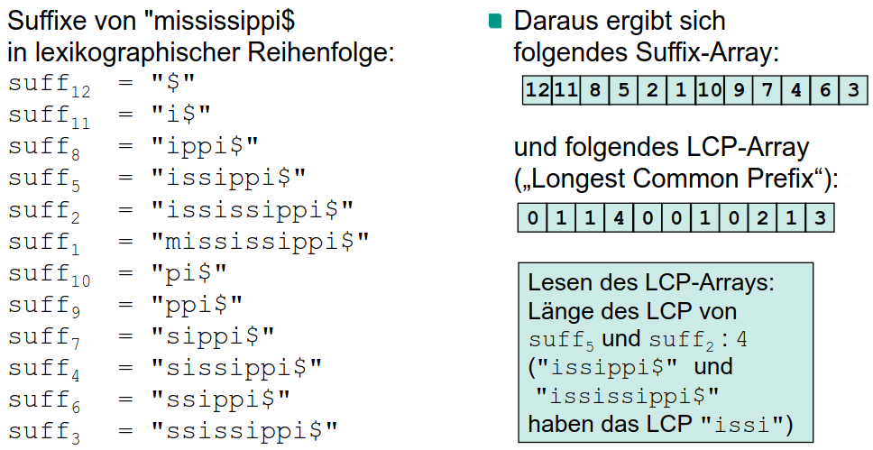
    - SA(s) = Suffix-Array von s
    - SA(s) hat genau |s| Einträge
    - Einträge in SA(s) = Suffixe in lexikographischer Reihenfolge geordnet
    - LCP-Array = Longest Common Prefix zwischen 2 in SA(s) benachbarten Suffixe
1. Suffixbaum, Suffix-Array und LCP-Array
    - Eigenschaften
        * Kanten sind alphabetisch sortiert
        * Reihenfolge der Blätter = Sortierreihenfolge der Suffixe
        * Tiefensuche durch Baum = Einträge in Suffix-Array
    - Suffixbaum -> Suffix-Array und LCP-Array
        * 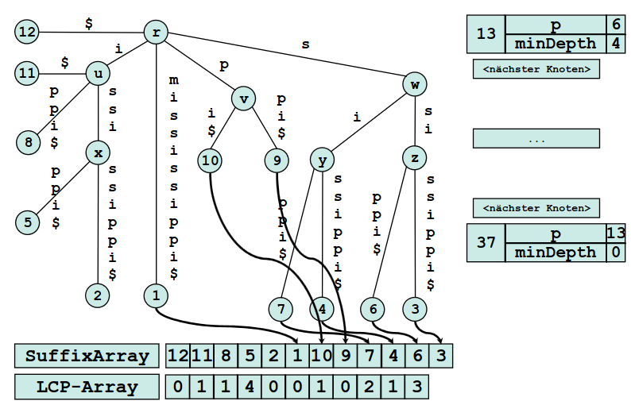
        * Idea: DFS in lexicographical order and add to array
    - Suffix-Array und LCP-Array -> Suffixbaum
        * 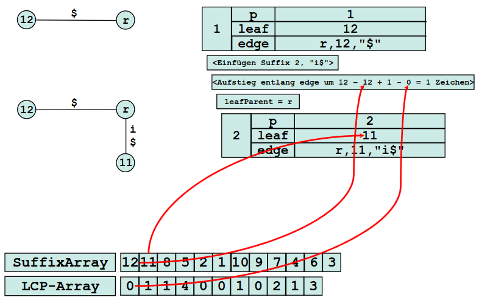
        * Idea: Build leaf from entry and use LCP to build inner nodes
        * Erläuterung
            + Wir befinden uns bei Blattknoten (gerade konstruiert)
            + Stringtiefe = |s| + 1 - Eingang-Suffix-Array
            + Stringtiefe des tiefsten gemeinsamen Vorgängers aus LCP-Eintrag berechnen
            + Konstruktion von innere Knoten von unten


# Anwendung von Suffixbäume und Suffix-Arrays
1. Pattern Matching mit Suffix-Array
    - Algorithmus
        * Idee: lexikographisch sortiert => Positionen der Matches stehen unmittelbar hintereinander
        * Schritte
            + Finde kleinste Position i: P ist Präfix von suff\_SA[i]
            + Falls nicht existiert -> keine Matches
            + Finde größte Position j (j >= i): P ist Präfix von suff\_SA[j]
            + Positionen SA[i...j] = Startpositionen der Matches
        * Laufzeit
            + O(|P| \* log(|s|))
            + log(|s|) = count Präfixvergleiche für binäre Suche
    - Beschleunigung
        * Idee: Reduktion der Zeichenvergleiche durch Verwendung von LCP-Informationen
        * Beispiel 1: LCP-Array hat an Position 3 den Wert 4 => Inspektion des Suffixes 4 nicht erforderlich
        * Beispiel 2: LCP-Array hat an Position 4 den Wert 0 => Inspektion des Suffixes 5 auch nicht erforderlich
        * Laufzeit: O(|P| + log(|s|))
1. Textkompression mit Suffixbaum
    - Ziv-Lempel-Algorithmus
        * 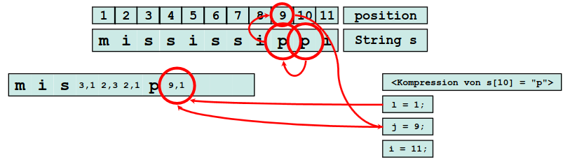
        * Idee: Nutze Redundanz des Strings zur Kompression
        * Geht schrittweise links -> rechts außer s[1]
        * Komprimiere das längste vorhandene Präfix mit schon gesehenen Zeichen und eine Länge
    - Beschleunigung des Ziv-Lempel-Algorithmus mit Suffixbaum
        * Idee: Nutze Suffixbaum zum effizienten Finden von Anfangsposition (j) und Länge (l)
        * Vorbereitung des Suffixbaums
            + In jedem Knoten: die Stringtiefe speichern
            + In jedem inneren Knoten: min(v) speichern = Nummer des kleinsten Blattes im Teilbaum
        * Algorithmus
            + Finden von l und j für suff\_i
            + Steigen entlang Pfad für suff\_i in ST ab
            + Finde eufeinanderfolgende Knoten a und b mit:
            + min(a) + string-depth(a) < i UND min(b) + string-depth(b) >= i
            + Falls min(b) + string-depth(a) > i: j = min(a), l = string-depth(a)
            + Falls min(b) + string-depth(a) \<= i: j = min(b), l = i - min(b)
        * Beispiel
            + 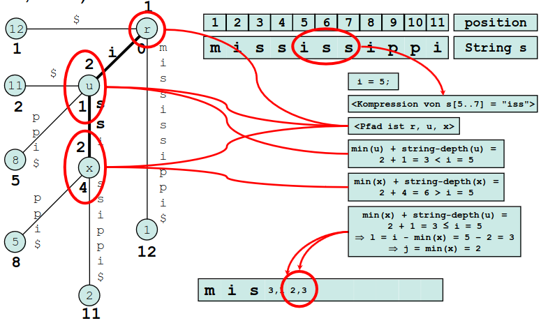
            + Für jeder Knoten: oben = min, unten = Stringtiefe
            + Komprimieren von 'iss', Position i = 5
            + a = Knoten u, b = Knoten x
            + min(x) + string-depth(u) = 3 <= 5 => j = 2, l = 5-2 = 3
1. Vertikale Partitionierung
    - 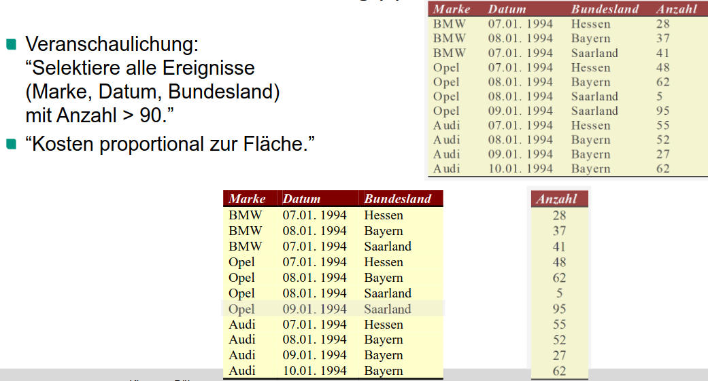
    - 2 Möglichkeiten
        * Tupel haben in den Partitionen die gleiche Reihenfolge
            + Das machen Column Stores
        * Alle Partitionen enthalten Schlüssel
            + Dann ist Reihenfolge egal
    - Komplett spaltenweise Betrachtung ergibt bessere Komprimierungsmöglichkeiten
1. Komprimierungsmöglichkeiten
    - Dictionary Encoding
        * z.B. Ziv-Lempel-Algorithmus
        * Dictionary = Menge der Zeichenfolgen, die durch Verweis ersetzt werden
        * Dynamisch links-\>rechts konstruiert
        * Existiert auch mit statischem Dictionary
            + z.B. Dictionary für ähnlichen Text schon konstruiert
    - Run-Length Encoding
        * Volge identischer Symbole durch Symbol und Anzahl ersetzen
        * Beispiele
            + 0000 0111 = 5 3 (Speziallfall, da nur 2 Symbole)
            + AAAA ABBB BBBB CDDD EE = A 5 B 7 C 1 D 3 E 2
        * Symbol muss nicht eine Buchstabe sein
1. Kodierung und Speicherung relationaler Daten
    - Wiederholung einzelner Attributwerte ist häufiger als bei Tupel
    - Spaltenweise Kompression hat Effizienzvorteile (oft bei statische Daten gemacht)
