# Hauptbeispiel
1. 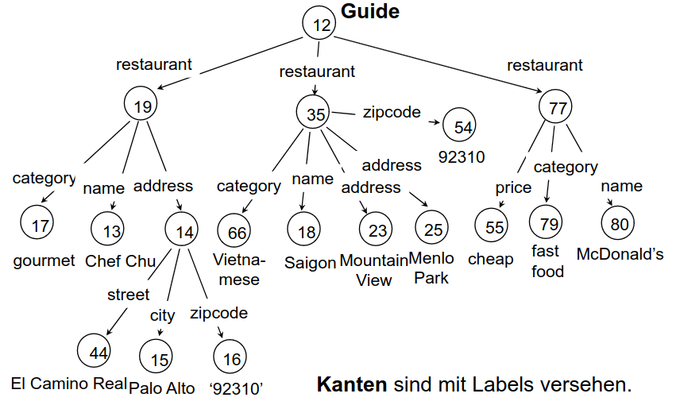
1. Unregelmäßigkeiten
    - Restaurants haben beliebig viele Adressen
    - Adressen sind manchmal Blätter und manchmal haben Struktur
    - Zipcode ist manchmal Bestandteil von Restaurant und manchmal von Adresse
1. Zusammenhang zum deklarativem Zugriff
    - Manchmal will Anfragender anhand der Struktur differenzieren
        * Beispiel: Selektiere genau die zipcodes, die direktes Bestandteil von restaurant sind.
    - Erfordert präzise Darstellungsmöglichkeiten
    - Anfragender muss die Struktur kennen


# Anforderungen bezüglich deklarativem Zugriff
1. Ausdrucksmächtigkeit
    - Mindestens so mächtig wie Sprachen für das relationale Modell
    - Nicht zu viel
        * Optimierungen teilweise nicht möglich. Müssen identifiziert und implementiert werden
        * Keine Garantien für Ausführungszeiten
    - Beispiel: Optimierung von Push Selection
        * 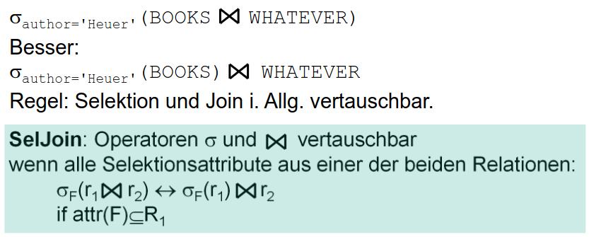
        * Optimierung möglich, da Operatoren vergleichsweise einfach und ihre Arbeitsweise ist bekannt
        * Vergleichbare Transformationen für komplexe Operatoren (die benutzerdefinierten Code ausführen)
            + Sind gar nicht angebbar.
            + Oft unklar in welche Richtung sie vorteilhaft sind.
1. Semantik
    - Genaue Definition ist erforderlich
1. Einfache Erzeugung von Anfragen aus Programmen
    - Karg, aber einfach
    - MMn sind keine Eigenschaft der Anfragesprache, sondern der Entwicklungsumgebung
1. Schema
    - Structure-Consciousness
    - Keine Eigenschaft der Querysprache, sondern der Implementierung


# XPath
1. 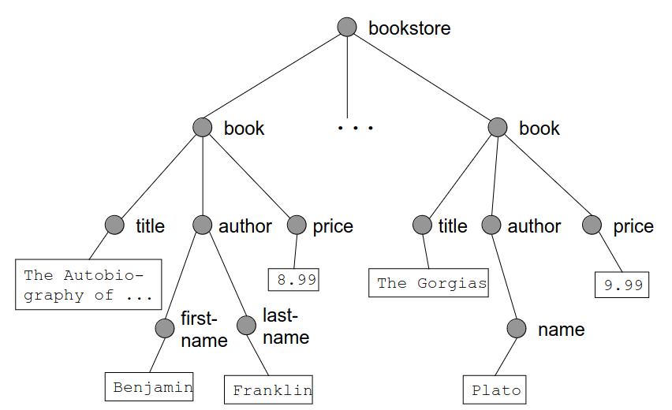
1. Basics
    -  Definitionen
        * Label path von o = Folge von Labels, separiert durch Punkte
            + Muss Instanz im Dokument haben
        * Data path von o = Alternierende Folge von Labels und Element-IDs, separiert durch Punkte
            + Data path d ist Instanz eines Label paths l, wenn die Folgen der Labels übereinstimmen
        * Target Set von o = Menge aller Instanzen eines Label paths l von o
    - Was?
        * Motivation: Adressierung beliebiger logischer Dokumentbestandteile
        * nicht XML Syntax
        * Standardisierung im XML-Kontext
    - Typen von Pfadausdrücke
        * Relative: Auswertung beginnt an aktueller Position im Dokument
            + Ergebnis ist kontextabhängig
        * Absolute: Auswertung beginnt an absoluter Position im Dokument
            + Ergebnis ist stets dasselbe, unabhängig vom Kontext
1. Beispiele
    - Elemente
        * titel = ./titel = Alle Titel im aktuellen Element (Relativ)
        * author/name/firstname = alle firstname-Element in name-Element in author-Element
        * //titel = Alle Titel im Dokument (gibt letzter Element zurück)
        * buch/* = Alle Kinder des Elements buch
    - Attribute
        * buch/@* = Alle Attribute des Buchs (Name + Wert)
        * preis/@währung = Alle Währungen von Preisen
        * buch[zusammenfassung] = Alle Bücher, die eine Zusammenfassung enthalten
        * buch[zusammenfassung]/tiel = Titel aller Bücher, die eine Zusammenfassung enthalten
        * author[vorname="Hans"] = author[string(vorname)="Hans"] = Alle Authoren mit Vornamen Hans
            + vorname liefert Liste von Vornamen und Vergleicht elementweise mit Hans
        * author[(titel $or$ auszeichnung)] = Alle Authoren mit Titel oder Auszeichnung
            + $ und () kann man weg lassen
    - Namensräume
        * mein\_namensraum:\* = Alle Elemente in mein\_namensraum
        * //.[local-name(.)="T"] = Alle Elemente mit Namen T (egal welcher Namensraum?)
    - Äquivalenzen
        * book[@genre=./author/@pipapo]/title = book[@genre=author/@pipapo]/title
        * book[author/first-name and author/last-name]/title = book[author[first-name and last-name]]/title
    - Weitere Beispiele
        * //book[.//firstname] = Alle book-Elemente mit firstname-Element als Nachkomme
        * //book[//firstname] = Alle book-Elemente, wenn firstname-Element im Dokument
        * //buch[./buchladen/@spezialität=@gattung] = Alle Bücher, deren Literaturgattung gleich der Spezialität des Buchladens ist
        * book[price<10]//title, book[price<10]/\*/name, book[title<="The B"]/title
        * book/author[first-name and last-name]
        * book[.//name="Plato"]/title
        * book/@genre, book[@genre="novel"]/title, book[@genre=./author/@pipapo]/title
1. Location Paths
    - Basics
        * Bestehen aus Location Steps
        * Location Steps bestehen aus
            + Achse
            + Node Test
            + Prädikaten
        * Beispiel: /descendant::figure[position() = 42] = Das 42. Bild im Dokument
    - Auswertung von Pfadausdrücke für mehrere Knoten
        * Auswertung von axis steps für Liste von Knoten
        * Beispiel: //author/ancestor::book
        * Ergebnis jedes Schritts = Liste von Elementen in Dokumentreihenfolge
1. Joins mit XPath 1.0
    - Anfrage: Selektiere die Titel aller Bücher, die in deutschen Verlagen erschienen sind
        * /Bib/Buch/VName=/Bib/Verlag[Land='Deutschland']/Name]/Titel
    - Verlage und Bücher könnten auch auf 2 Dokumente aufgeteilt sein
    - Nur mit XPath nicht möglich: alle (Land, Titel)-Paare
1. Logische Dokumentstruktur
    - Alle book-Elemente, die (direkt oder indirekt) ein firstname-Element enthalten
        * //book[.//firstname]
    - Die Preise aller book-Elemente mit Autor-Name Plato
        * //book[author/name="Plato"]/price
1. XML-Schema: Polymorphe Konsistenzbedingungen (Uniqueness Constraint)
    - 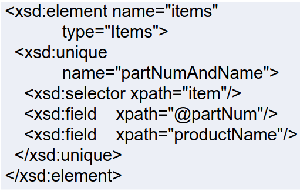
    - Ziel: Bestimmte Werte (bzw. Kombinationen von Werten) sollen eindeutig sein
    - Schritte
        * Identifizieren der Elemente, die eindeutig sein sollen
        * Identifizieren der Attributwerte, die eindeutig sein sollen
        * Festlegung innerhalb welchen Kontexts die eindeutig sein sollen
    - Beispiel: Kombination Vorname und Nachname von Personen sollen innerhalb von ... eindeutig sein
        * selector-Element (Personen) hat keine Entsprechung im Relationalen
        * Dto.Kontext = Relationen
1. Schlüsselbedingung
    - Beispiel
        ```
            <key name="papierSchlüssel">
                <field xpath="bib/paper/@id"/>
            </key>
        ```
        * Attribut id in paper dient als Schlüssel
        * Schlüssel sind eindeutig und NICHT null (Unterschied zu uniqueness-Constraint)
        * Können referenziert werden
    - Fremdschlüsselbedingung
        ```
            <keyref name="papierFremdschlüssel" refer="papierSchlüssel">
                <field xpath="bib/paper/@references"/>
            </keyref>
        ```
        * references = Liste von Papieren
        * Beachten: refer bezieht sich auf das name-Attribut, NICHT auf das Schlüsselfeld
            + Werte in references sind immer unter den Schlüsseln zu den Papieren zu finden
1. Absolute und Relative Lokatorterme
    - 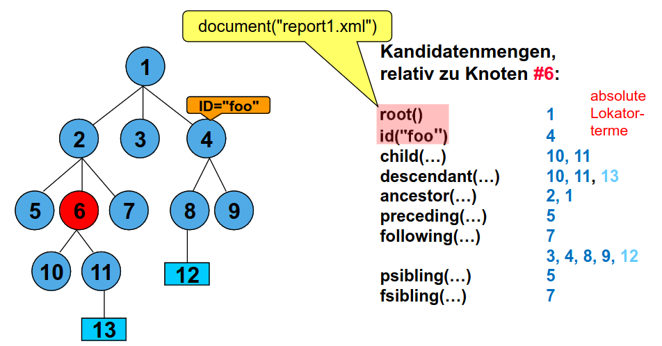]


# XQuery
1. Charakteristika von XML-Querysprachen
    - select-from-where mäßiger Aufbau der Anfragen
    - Pfadausdrücke
1. FLWR-Ausdrücke
    ```
        for var_1 in Ausdruck_1,...,var_n in Ausdruck_n
        let var_n+1 = Ausdruck_n+1,...,var_n+m = Ausdruck_n+m
        where Bedingungs-Ausdruck
        order by Ausdruck ASC/DESC
        return XML-Ausdruck
    ```
    - For = Bindungsliste
        * Sukzessives Binden jeweils einer Variablen an das Ergebnis eines Pfadausdrucks
    - Let = Bindungsliste
        * Einmaliges Binden jeweils einer Variablen an das Ergebnis eines Pfadausdrucks
    - Where = Bedingung
        * = Selektion (Bedingungen an die gebundenen Variablen)
    - Return = Ergebnis
        * An die Variablen gebundene Werte, die die Bedingung erfüllen
        * Eingebettet in die gewünschte Form eines XML-Dokuments.
1. Beispiel 1
    - Query: Alle Bücher (Jahr und Titel), die von Addison-Wesley nach 1991 publiziert wurden.
    - 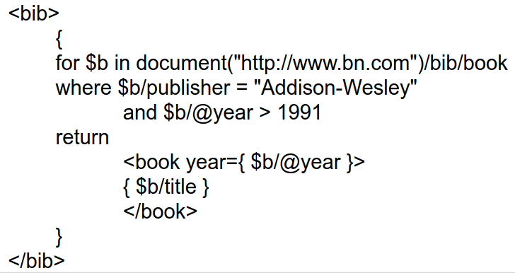
    - Notizen
        * Pfadausdrücke in allen Anfragebestandteilen
        * Robustheit: Buch ohne publisher verursacht keine Fehlermeldung
    - Flexibilität von Pfadausdrücke
        * Falls Anfrager die genaue Position der title-Objekte nicht kennt
            + $b//title = rekursiver Abstieg
        * Falls Anfrager nicht kennt welches Element den String "Addison-Wesley enthält"
            + $b/* = "Addison-Wesley" = Wildcard, Abstieg nur über eine Stufe
1. Beispiel 2
    - Query: Für jedes Buch: Titel und Autoren, in result-Element gruppiert.
    - 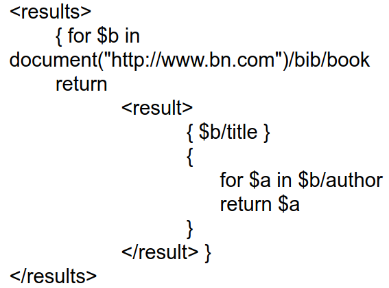
    - Notizen
        * Schachtelung von Anfragen ($a in result)
        * Alternativ: $b/author (wtf is the point of the above then?)
1. Zu entwickelndes Beispiel
    - Query: Liste aller title-author Paare, und jedes Paar soll in einem result-Element enthalten sein
    - 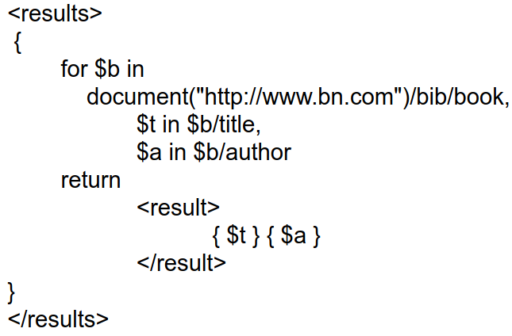
1. Wertvergleiche vs. allgemeine Vergleiche
    - Atomisierung (atomization)
        *  Transformation, die Folge atomarer Werte zurückliefert oder Fehlermeldung
        * Beispiel: "Obama Nixon Kennedy" wird zu [ "Obama", "Nixon", "Kennedy" ]
    - Wertvergleiche (value comparison)
        * eq = Operator zum Vergleich von Werten (manchmal auch =)
        * Liefert wahr, wenn Wert gleich Ergebnis dr Atomisierung ist
        * Beispiele
            + $book1/author eq "Kennedy"
            + [ "Kennedy" ] eq "Kennedy"
            + //product[weight gt 100]
            + \<a\>5\<a/\> eq \<a\>5\<a/\>
            + \<a\>5\<a/\> eq \<b\>5\<b/\>
    - Allgemeine Vergleiche (general comparison)
        * Existentiell quantifizierte Vergleiche anwendbar auf Folgen von Operanden beliebiger Länge.
        * Beispiele
            + $book1/author = "Kennedy" = Wahr, wenn author Instanz von xs:string und "Kennedy"
            + ["Obama", "Nixon", "Kennedy" = "Kennedy" = Wahr, weil Atomisierung
1. Beispiel 3
    - Query: Von jedem Autor, der vorkommt: Name (des Autors) und Titel seiner Bücher, in result-Element gruppiert.
    - 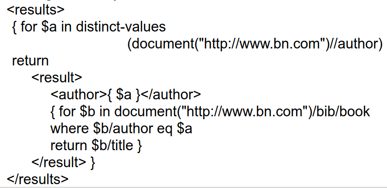
    - Notizen
        * Umstrukturierung des Dokuments
        * Join
        * built-in Funktionen
        * Wertvergleich
1. Beispiel 4
    - Query: Wieviele top-level Sections sind in book1 enthalten?
    - 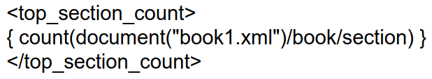
    - Notizen
        * Aggregation (Zählen von Dokumentbestandteile)
1. Beispiel 5
    - Query: Von allen Büchern mit mind. einem Autor: Titel, die ersten beiden Autoren und ggf. leeres "et-al" Element.
    - 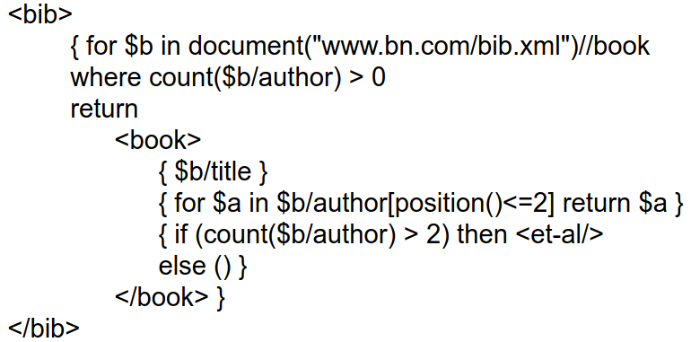
    - Notizen
        * Prädikate in Pfadausdrücke
        * Aggregation in der where-Klausel
        * Bedingte Ausgabe
1. Zu entwickelndes Beispiel 2
    - Query: Liste der Titel und Erscheinungsjahre aller Bücher, die Addison-Wesley nach 1991 herausgebracht hat, alphabetisch sortiert
    - 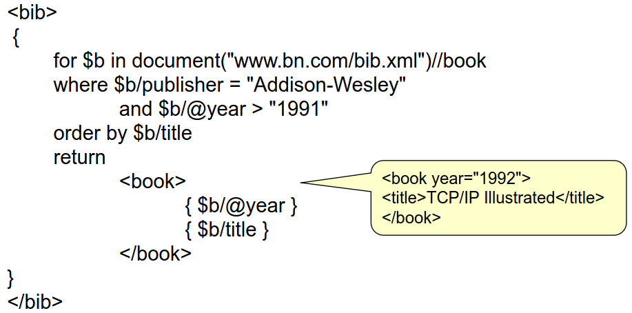
    - Notizen
        * XMLSpy: macht aus Attribute wieder Attribute
        * string($n/@attrib) = Generierung eines Elements
        * XMLSpy gibt Fehlermeldung bei nicht wohlgeformten XML als Ergebnis
        * Was passiert wenn mehrere title-Elemente?
            + Sortierung ans Ende?
            + besser: order by $b/title[1]
            + stable order by = Dokumentreihenfolge bleibt erhalten bei gleichem Sortierschlüssel
1. Beispiel 6
    - 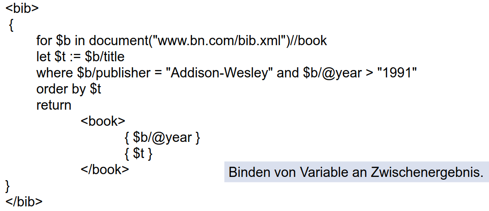
1. Konvertierung: Attribu <-> Element
    - Attribut -> Element: \<year\> { string($b/@year) } \</year\>
    - Element -> Attribut: \<book year="{ string($b/year) }"\>
1. Beispiel 7
    - Query: Für alle Bücher, die Element enthalten, dessen Tag mit "or" endet: Titel und Element zurückliefern.
    - 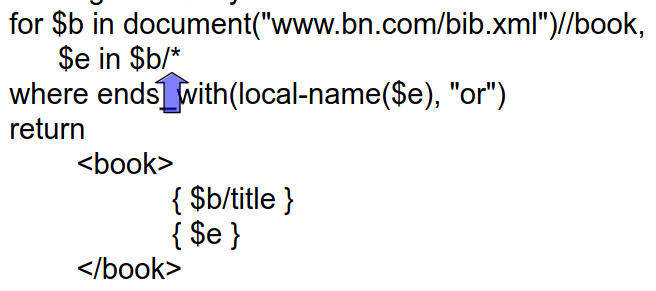
    - Notizen
        * String-Funktionen
        * Übergang zwischen Schemainformation und Daten
1. Alternative Repräsentation der Daten
    - 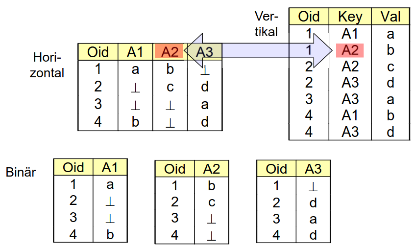
1. Übergang: Inhalt <-> Markup
    - 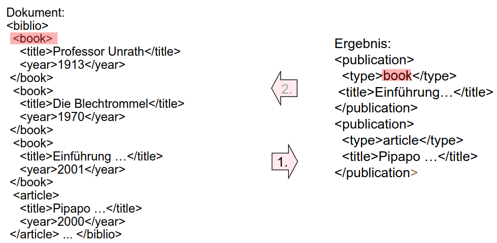
    - Makup -> Inhalt
        * 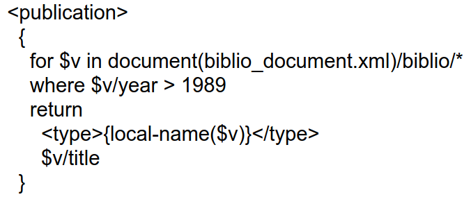
    - Inhalt -> Teil der Anfrage
        * 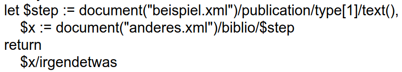
        * $step = "book"
        * $x = Menge von book-Elementen
    - Inhalt -> Markup
        * Geht nicht
        * \<{$b/type}\> und \<{string($b/type)}\> = Syntax Error
1. Beispiel 8
    - Query: minimaler Preis jedes Buchs, in Form eines "minprice" Elements mit Buchtitel als Attribut "title"
    - 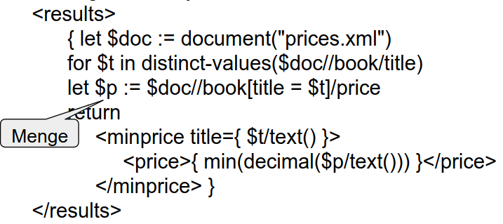
    - Notizen
        * $p = Menge von price-Elemente pro Titel
1. Filterung
    - 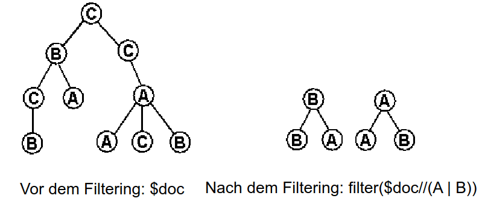
    - | = OR
1. Beispiel 9
    - Query: Geschachteltes Inhaltsverzeichnis für book1, das Sections und ihre Titel enthält. Original-Attribute jedes section-Elements ins Inhaltsverzeichnis übernehmen.
    - 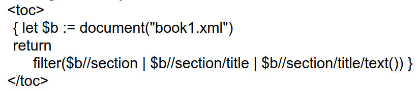
    - Notizen
        * Filterung
        * Wurzel wird neu erzeugt
1. Beispiel 10
    - Query: Teil des Dokuments zwischen erstem und zweitem incision-Element innerhalb des ersten procedure-Elements.
    - 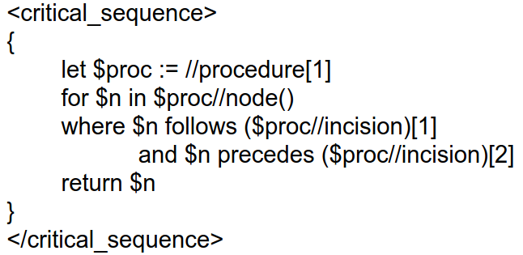
    - Notizen
        * Ausgabe in Dokumentenreihenfolge
        * Funktion node()
        * Entsprechend der XPath-Achsen
1. Beispiel 11
    - Query: Namen aller User, die ein Gebot für jedes Item abgegeben haben.
    - 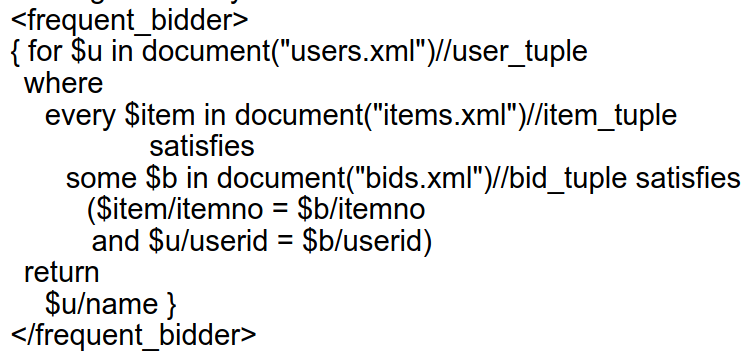
    - Notizen
        * every ... satisfies = forall
        * some ... satisfies = exists
1. Beispiel 12
    - 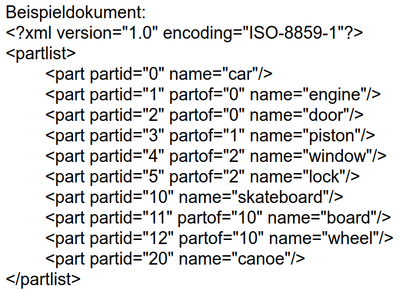
    - 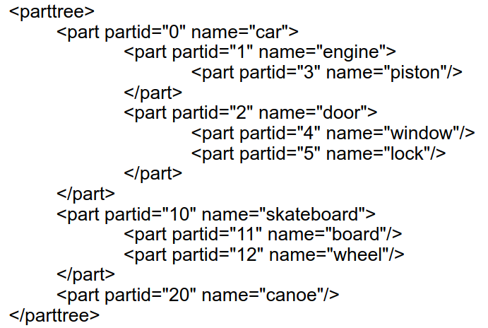
    - 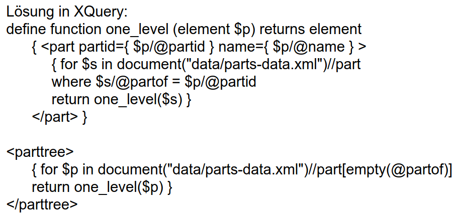
    - Notizen
        * Rekursion
    - Blätter mit gekürzten Syntax darstellen
        * 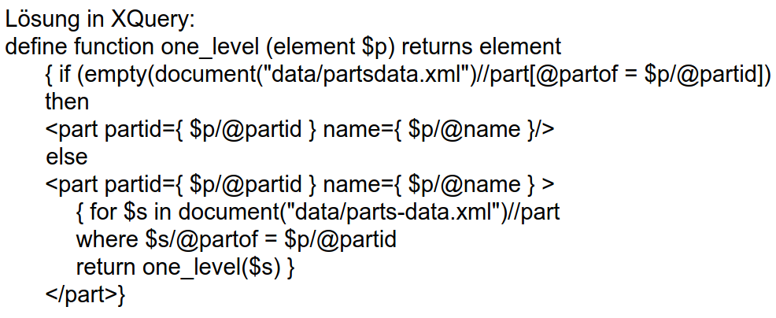
1. Beispiel 13
    - Query: Finde den Gatten von Magda
    - 
    - Notizen
        * shallow = gibt Knoten ohne Kinder zurück
        * Queries über ID-/IDREF-Struktur

