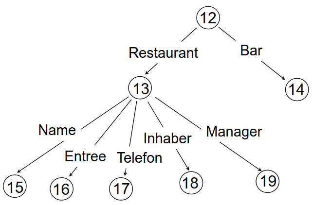

# Motivation
1. Verwendung relationaler Datenbanktechnologien
    - Relationale Sichten auf semistrukturierte Daten
        * Sichten sind indexierbar
    - Datenbankfunktionalitäten "umsonst" levaragen (Concurrency Control, Indices, usw.)
        * In der Regel mit nicht besonders guter Performance
    - Native XML Database = Entwurf von Datenbanktechnologien auf semistrukturierte Daten
1. Physischer Entwurf
    - = Entscheidungen, wie die physische Repräsentation eines Datenbestands aussieht
    - Beispiele (im zentralisierten Fall)
        * Welche Indices?
        * Welche materialisierten Sichten?
        * Welche vertikalen Partitionierungen
1. Index
    - Tupel = Student(name, age, gpa, major)
        * t(Student) = 16
    - Non-clustered primary B+-tree für Attribut gpa
    - 
1. Sichten
    - Query auf Datenbank (Virtuelles Konzept). Wie normale Relation verwendbar
        * Sinnvolle Namen => Programm übersichtlich
        * Kann an verschiedene Stellen aufgerufen werden
        * Verfügbar gemacht als Bibliothek
    - Materialisierte Sichten
        * Sicht, deren Inhalt physisch vorhanden ist
        * Nutzenversprechen: Beschleunigte Anfrageauswertung
        * Nicht sehr übersichtlich (wird begründet)
    - Materialiserte Sichten in MS-SQL
        * 
        * Materialisierung durch Erstellung eines unique clustered Index
            + unique => es gibt einen Schlüssel
            + Voraussetzung für inkrementelle Updates (Anpassung der Sicht nach Änderung der Basisrelation ohne komplette Neuberechnung)
            + weitere Indices möglich
        * Nicht alle Views sind indexierbar
        * with schemabinding
            + Voraussetzung für Indexierung
            + Zugrunde liegende Relation nicht mehr beliebig änderbar
            + count = voraussetzung für inkrementelles Löschen
            + count_big = count, Ergebnis vom Type BIGINT
    - Nutzung materialisierter Sichten
        * 
        * Sichten werden automatisch von DBMS eingebunden
        * Auswertung auf v1 schneller als auf Basisrelation
        * DBMSe können nicht alle hilfreiche materialisierten Sichten identifizieren
        * Wenn automatische Einbindung erfolgt
            + Sinnvolle Benamung nicht mehr wichtig
            + => Übersichtlichkeit kein Verkaufsargument mehr
    - Instandhaltung (Maintenance) von materialisierten Sichten
        * Sicht muss i. Allg. konsistent sein mit der zugrunde liegende Relation
            + Änderungen der Relation müssen mit Änderungen der Sicht einhergehen
            + Naives Herangehen: Anfrage auf Sicht neu ausführen (Teuer)
            + Oft besser: inkrementelle Updates
        * Basics
            + 
            + Updates von anderen Relationen oder Attributen, die nicht in der Sicht sind, kann man ignorieren
        * Inkrementelle Updates: Fall a
            + Aktion: Einfügen eines neuen Films
            + Neuer Film: title = 'Parasite', year = 2019, producerC# = 12345
            + producerC# = Schlüssel von MovieExec => select name from movieExec where cert# = 12345
            + insert into MovieProd values('Parasite', 2019, 'Bong Joon-ho')
            + Indexierung für materialisierte Sicht existiert
            + Weniger Arbeit als Query neu auswerten
            + Anwender sieht nichts davon
        * Inkrementelle Updates: Fall b
            + Aktion: Löschen eines Films aus Movies
            + Film: title = 'Dumm und Dümmer', year = 1994
            + delete from MovieProd where title = 'Dumm und Dümmer' and year = 1994
            + Billiger als Auswertung der Query
    - Diskussion
        * Vorteile
            + Schnellere Auswertung bestimmter Anfragen
            + weitere Beschleunigung durch Indexierung möglich
        * Nachteile
            + Speicherplatz
            + Wenn viele Updates: mehr Änderungsaufwand + Verlangsamung von Anfragen (lock contention)
1. Beispiel: Relationale Speicherung (EDGE-Modell)
    - 
        * Dokumenttypunabhängig
        * Relationale Sicht auf XML-Dokument, materialisiert
        * Generierbar über XQuery-Statement
        * Normalisieren der Ausgabe
            + 
            + Normalisierung + weitere Zerlegung
1. Vorteile wenn das System das Dokumentstruktur kennt
    - Beschleunigung der Queryevaluierung
        * Beispiel: select Order.Company where Order.OrderPerson = "Weber"
        * Query hat Lösung, wenn Order.Company in der DB vorkommt
        * Das soll schnell gehen
    - Bessere Speicherung (weniger Seitenzugriffe)
    - Definition von Indices
    - Unterstützung bei der Formulierung von Anfragen (Autocompletion)
    - Bessere Kontrolle über Updates
1. Ausnutzung der Struktur für die Speicherung

# Mehrstufiges Query Processing
1. Motivation
    - Es gibt immer Queries, die nur mit Index nicht evaluierbar sind
    - Ansatz
        * Index, um Menge der Dokumente einzuschränken
        * Inspektion der restliche Dokumente (Kandidaten)
1. Was?
    - 
    - Vorteilhaft, wenn
        * Volltext-Engine schneller als XML Query Engine
        * Zwischenergebnis kleiner als Ausgangskollektion
1. Subsuming Query
    - Qs sbsumiert Q wenn \<Q\> subset von \<Qs\>
    - Beispiele
        * select * from Person where salary > 50K subsumiert select * from Person where salary > 100K
        * select * from Person where salary > 50K subsumiert select * from Person where salary > 50K and name = "Boehm"
1. Filter Query
    - Qf = Filter Query, Qs = subsuming Query von Q
    - Qf(Qs) = Q (Qf auf Qs anwenden = Q)
    - Beispiele
        * Q: select * from Person where salary > 50K and name = "Boehm"
        * Qs: select * from Person where salary > 50K
        * Qf: select * from Qs where name = "Boehm"
1. Aufteilung von Query in Filter und Subsuming Query sinnvoll, wenn
    - Systam kann nur Subsuming Query evaluieren und ist schnell
    - Ergebnis der Subsuming Query ist klein

# Data Guides
1. Einleitung
    - Volltext-Engine = Ermöglicht Suche nach Dokumenten, die Zeichenfolge enthalten
    - Volltextindex = zugrundeliegende physische Struktur (z.B. Suffixbaum)
    - Volltextindex vs speziellere Indexstrukturen
        * Beispielquery: Selektiere alle Firmen, bei denen Weber bestellt hat
        * Volltextindex: alle Dokumente, die String 'Weber' enthalten
        * Probleme
            + Dokumente können 'Weber' im anderen Zusammenhang enthalten
            + Wir brauchen nur Firmennamen (nicht ganze Dokumente)
            + Pfadausdrücke mit Suffixbaum möglich, aber teuer (Suchmuster sehr flexibel)
        * Feldweiser Index ist besser (Besteller)
1. Struktur
    - Data Guide = konkrete Zusammenfassung des Datenbankinhalts
    - Datenbank ist gerichteter Graph (OEM-Instanz)
    - Beispiel
        * 
        * 
    - DataGuide d einer DB s ist selber eine DB, so dass
        * jeder label path in s genau eine data path-Instanz in d hat
        * jeder label path von d ein label path von s ist
    - DataGuide erlaubt offensichtlich nachzusehen, welche Pfade in der DB vorkommen
    - Eigenschaften
        * Kurz: jeder label path wird genau einmal beschrieben
        * Akkurat: nur label paths, die in der DB vorkommen
        * Geeignet: Speicherung und Zugriff mit gleichen Mechanismen wie einer DB möglich
    - Unterschied zu Schema
        * DataGuide ist konform zu Datenbank (nicht umgekehrt)
        * Stimmen nicht überein (Schema enthält Varianten, die nicht vorkommen)
    - Erzeugung von DataGuides
        * Ähnlich zu NEA -> DEA (Nichtdeterministischer endlicher Automat -> deterministischer)
        * Gilt für OEM (nur Kanten beschriftet), nicht für XML
    - Annotationen der DataGuide-Knoten (Inhalt)
        * Beispiele
            + Listen von Pointer auf DB-Objekte (label path -> {Object})
            + Häufigkeiten
            + Volltextindex
        * Hilfreich fürs Query Processing
1. Query Processing mit DataGuides
    - Beispiele, für die DataGuide/Annotationen nicht ausreichend sind
        * Selektiere alle Restaurants, die einen Inhaber haben
        * Selektiere alle Restaurants, in denen es sowohl das Entree 'Rind', als auch das Entree 'Lamm' gibt
    - Grundlegendes Problem: Man will nicht nur nach Pfaden, sondern nach Baummustern suchen können
    - DataGuides verwendbar für Vorauswahl
1. Strong DataGudies
    - 
        * Es kann mehrere richtige DataGuides geben
    - Minimale DataGuides
        * Es gibt Techniken um DataGuides zu minimieren (minimaler Anzahl Zustände)
        * Nachteile
            + Änderungen an der DB = mehr Arbeit
            + Annotationen weniger aussagekräftig
    - Motivation: DataGuides mit maximal präzise Annotationen
    - Definitionen
        * OEM Objekte s und d, d ist DataGuide für s
        * Ts(I) = Target Set von I in DB s
        * Td(I) = Target Set von I in DataGuide d
            + Ist stets einelementig
        * Ls(I) = {m | Ts(m) = Ts(I)}
            + = Menge aller label paths in d mit dem gleichen Target Set wie I
            + m = label path
        * d ist ein String DataGuide, wenn für alle I von s: Ls(I) = Ld(I)
            + Links im oberen Beispiel
1. Einordnung
    - Unterstützen sowohl Nachschauen von Pfaden, als auch gezielte Indexierung von Text
    - Noch akkuratere Beschreibung der DB möglich
        * z.B. welche Kombination von Labels von ausgehenden Kanten vorkommen (mit XML-DTDs)
        * Man kann reguläre Ausdrücke aus Daten lernen
    - Zusammenhang mit relationale DB?
        * Annotationen als Relationen
        * DataGuide entweder im Hauptspeicher oder auf Relation abbilden (gemäß EDGE-Modell)

# Combined Indices
1. Index Beispiel: Student mit Index auf gpa
    - 
        * Tupel = Student(name, age, gpa, major)
        * t(Student) = 16
        * Non-clustered primary B+-tree für Attribut gpa
    - Notizen
        * Index für mehrere Attribute möglich ((gpa, name) != (name, gpa))
        * Index ist Bestandteil der physischen Ebene
        * Indexdefinition ist Bestandteil des internen Schemas
        * Anwendung muss nicht selbst den Index durchsuchen (wird von DBMS gemacht)
1. Basics
    - 
    - Indexierung einzelner Attributwerte sinvoll
        * z.B. alle Vorkommen des Vornamens 'Frodo'
    - Kombinierte Anfrage = Anfrage über mehrere Attribute
        * z.B. Vorname = 'Frodo' and Alter = 25
    - Combined Index = Index auf Vorkommen von Wertekombinationen
    - Nachteile
        * Anzahl der Kombinationsmöglichkeiten wächst exponentiell
        * Großer Platzbedarf
    - Können wir Indexeinträge ohne Nachteile weglassen?
1. Anzahl der Kombinationen
    - Beobachtung 1
        * Viele Vorkommen der Vorname 'Kim'
        * Indexeintrag nicht hilfreich
        * Scan ist nicht teurer
    - Beobachtung 2
        * Vorname 'Frodo' nur einmal in DB
        * Wenn Indexeintrag 'Frodo' existiert, braucht man andere nicht
            + z.B. ('Frodo', 'Beutlin'), ('Frodo', 25), ('Frodo', '301c')
    - Beobachtung 3
        * Vorname 'Frodo' ist n-mal in der DB, Nachname 'Beutlin' - auch
        * Wenn 'Frodo' existiert, braucht man ('Frodo', 'Beutlin') nicht
        * Beispiel: Suche nach ('Frodo', 'Beutlin')
            + Kein Indexeintrag => entweder existiert nicht, oder genauso oft wie 'Frodo'
            + Muss Datenobjekt inspizieren um festzustellen
            + Verursacht konstante Kosten
    - Beobachtung 4
        * Vorname 'Frodo' is 1000-mal in der DB, Nachname 'Beutlin' - 999-mal
        * Wenn 'Frodo' existiert, braucht man ('Frodo', 'Beutlin') nicht
        * Beispiel: Suche nach ('Frodo', 'Beutlin')
            + Kein Indexeintrag => entweder existiert nicht, oder genauso oft wie 'Frodo'
            + 2 Tupel mit Vorname 'Frodo' aus dem Index holen
            + Überprüfen, ob Nachname 'Beutlin'
            + Warum 2? Nur 1 kann genau der mit anderem Nachname sein
        * q = Verhältnis der Anzahlen (999 / 1000)
        * Je kleiner q, desto
            + größer der Platzersparnis
            + geringfügiger die Beschleunigung beim Indexzugriff
            + Gleiches Prinzip wie oben, nur mehrere Tupel inspizieren
1. Verallgemeinerung für Text und semistrukturierte Daten
    - Beispiel für n-grams: 'character' = 'chara', 'harac', 'aract'
        * Indexeintrag mit 'chara' wird erzeugt, wenn deutlich seltener als 'char', 'hara', usw.
    - Gleiches Vorgehen möglich für Pfade (im XML-Dokument)
        * Indexierung: Pfadfragment - Dokumenttext

# Semistructured TO RElational Data (STORED)
1. Ziel: Verwendung eines RDBMSs zur Verwaltung semistrukturierter Daten
1. Arbeitsweise herkömmlicher XML-Query Engines
    - Arbeiten mit Dateien
    - Logische Struktur wird zur Anfrageauswertung vorübergehend erzeugt
        * Vergleichbar mit Hierarchie von DOM-Objekten
1. Inlining - Mengenwertigkeit
    - Es existiert Standardtechnik für das Verwalten von Mengen mit RDBMSen
    - 
        * Bestandteile der Menge in separater Relation
        * Verknüpfung über Fremdschlüssel
    - 
        * Welche Darstellung wann?
            + Feste Mengengröße
            + Reihenfolge wichtig
            + Duplikate
            + Suche nach einzelnem Spieler
            + Joins bei elementare Informationsbedürfnisse
1. Einleitung
    - Auswahl und freie Definition der relationalen Sichten
    - Keine generischen Tabellen (wie meistens bisher)
    - Problem: Welche Sichten zu materialisieren?
        * Randbedingungen: Plattenplatz, Maximalanzahl von Relationen
    - Relationale Sichten enthalten i.d.R. nur Teil des Dokuments
1. Abbildung
    - 
    - 
1. Storage Queries
    - Beschreiben Abbildung von semistrukturierten Daten aufs Relationale
    - Beispiele
        * 
        * OID bei inneren Knoten
        * Textinhalt bei Blättern
        * Notizen
            + Erste Variable in FROM ist per Default Schlüsselvariable (man geht davon aus, dass Objekte OID haben)
            + Leere Optionale Attribute (OPT) führen zu NULL-Werten
    - I. Allg. kann es mehrere Sichten auf die gleichen Daten geben
    - Beispiel: mehrere ausgehende Kanten mit gleichem Label
        * 
    - Beispiel: explizite Schlüsselvariable
        * 
        * Taxpayer-ID kann mehrmals als Attribut in Relation vorkommen (obwohl im Dokument nur einmal)
    - Beispiel: mehrere Relationen und geschachtelte Mengen
        * 
        * irscenter enthält Menge von hearing-Elementen
        * KEY ist redundant, da $Y sowieso 1. Attribut
    - Overflow Graph
        * Restliche Dokumentinhalte
        * Speicherung im EDGE-Format
        * Muss nicht sein
            + XML-Dokumente können auch als Dateien vorliegen
            + mehrstufige Anfrageauswertung möglich
1. Mining
    - Auswahl der Sichten
        * Wie kommt man zu den Storage Queries?
        * (Strukturelle) Patterns finden, die (in Anfragen) häufig vorkommen
        * Patterns auf Storage Queries abbilden
    - Support und Query-Support
        * Support eines Patterns = Anzahl der Vorkommen des Patterns
        * Oder: Anzahl der Dokumente, die Pattern enthalten
    - Query-Support eines Patterns
        * Q1,...Qn = Menge von Anfragen
        * P = Query-Support von P = Anzahl der Qi, die P enthalten
        * Setzt voraus
            + Anfragen aus der Vergangenheit kennen
            + Zukunftige Anfragen werden nicht erheblich anders
    - Ziel: Finden von Mustern mit hohem Query-Support
        * möglichst wenig Überlappung von Mustern
    - Algorithmus zur Auswahl der Sichten
        * Definitionen
            + Fk = Menge der Frequent Patterns der Größe k
            + Pi = Muster, Grundlage der i-ten Storage Query
        1. Erzeuge alle Label Paths mit ausreichendem Support (oft genug vorkommen)
        1. Erzeuge Frequent Patterns (mit existierendem Algorithmus)
        1. STORED wählte gierig (greedy) Patterns aus
            + Nicht jedes Frequent Pattern kann einer View entsprechen
            + Wähle Pi, sodass es Pfade aus F1 mit hohem Support enthält
            + Minimale Überlappung zwischen P1 und P1,...,Pi
            + Neue Pfade aus F1 sollen mit hohem Support abgedeckt werden
        1. Wähle obligatorische und optionale Attribute pro Pattern
            + zu viele optionale = mehr NULL-Werte = mehr Überlappung
            + zu wenige optionale = zu wenig matches
        1. Erzeuge Storage Query
1. Queryevaluierung
    - Fall 1: Query sucht Pattern, das exact einer Sichtdefinition entspricht
        * Q = V
        * einfach, angenehm
    - Fall 2: Query sucht Pattern, das Storage Pattern enthält
        * Q enthält V
        * mehrstufiges Query-Processing

# XPath Accelleration
1. Einleitung
    - Abbildung von XML auf Relationen (von XPath auf SQL)
    - EDGE-Modell: naiv und teuer (hohe Join-Kosten)
1. Räumliche Indexstrukturen
    - Motivation
        * 
        * Punkte = Bars, Rechteck = Gebiet von Interesse
        * Ziel: Mögliche Bars finden
        * Offensichtlich: Relationen scannen, Position jedes Tupels überprüfen
    - R-Baum
        * 
            + Kosten der Anfrageevaluierung abhängig von Fenstergröße
1. Regionen
    - XPath Achsen
        * Richtung, in der man sich mit einem XPath Schritt bewegt
        * Teilmenge von Knoten eines Dokuments, aus Perspektive eines Knotens
        * 4 Achsen
            + Ancestor = parent?
            + Preceding = previous siblings and their children?
            + Descendant = children and their children?
            + Following = next siblings and their children?
        * Achsen partitionieren die Menge der Knoten (d.h. Union von alle = jeder Knoten im Dokument genau einmal)
    - Repräsentation von Regionen im Dokument
        * 
        * Preorder = Tiefensuche
        * Postorder = jeder Knoten vor seinem Vater und rechten Nachbarn
        * Eine Region für jede Achse
        * v' ist Descendant von v <=> pre(v) < prev(v') and post(v) > post(v')
    - Repräsentation der Knoten als Vektoren
        * description(v) = \<pre(v), post(v), parent(v), kind(v), name(v)\>
            + parent(v) = preorder von parent
            + kind = z.B. element, attribut, text
            + name ist leer, falls Textknoten
        * Vektor kann auch zur Beschreibung der Anfrage
        * Auch absolute Werte oder Intervalle angebbar
        * Location Steps einfach abbildbar
            + window(preceding::text(), v) = \<[0, pre(v)], [0, post(v)], \*, text, \*\>
            + window(descendant, v) = \<[pre(v), infinity], [0, post(v)], ...\>
            + window(child, v) = \<\*, \*, pre(v), element, \*\>
    - Relationale Repräsentation der Knoten
        * Vektoren als Relationen
        * Location Steps als einfache Bereichsanfragen
        * Unterstützung der Evaluierung mit R-Bäume
1. Optimierungen
    - Übersicht
        * Verkleinerung des Fensters der pre-/post-Ebene
        * Zugriff durch eingeschränkten Zugriff ersetzen
        * Ausnutzung von Symmetrien für die Optimierung der Auswertung
        * Vermeidung mehrfacher Zugriffe auf den gleichen Knoten
    - Zugriff mit Einschränkung nur einer Achse
        * 
        * Bisher: Range Query in 2 Dimensionen (pre, post)
        * Jetzt: Modifikation von pre und post
            + pre(c) < pre(v) < post(c)
            + pre(c) < post(v) < post(c)
        * Weitere Eigenschaften
            + Ordnung der Pre-Werte = Dokument-Reihenfolge
            + pre(v) und post(v) identifizieren Knoten eindeutig
            + size(v) = 1/2 (post(v) - pre(v) - 1)
        * Descendant folgendermaßen evaluierbar
            + window(descendant, v) = \<[pre(v), post(v)], \*, \*, element, \*\>
            + window(descendant, v) = \<\*, [pre(v), post(v)], \*, element, \*\>
    - Symmetrien in XPath-Ausdrücken
        * Beispiel: alle Elemente mit Name m, die mindestens 1 Element mit Name n enthalten
        * /descendant::n/ancestor::m
        * Mindestens 2 Ausführungsalternativen
            + 
            + 1. Alternative: großes Fenster
            + 2. Alternative: mit Optimierung (modifizierte pre-/post-Numerierung) - keine False Hits
    - Auswertung von Pfadausdrücken für mehrere Knoten
        * Auswertung für Liste von Knoten
        * TODO: WTF?
1. Umsetzung in SQL
    - Zentrale Relation accel mit Schema (pre, post, parent, kind, name)
    - Separate Relation für zisätzliche Infos (z.B. (pre, text), (pre, attribute))
    - TODO: wtf?
