# Graphdaten
1. Motivation
    - Allgegenwärtig
        * Soziale Netzwerke
        * chemische Zusammensetzungen
        * Repräsentation von Prozesse und Programmasuführungen
1. Einführung
    - naheliegende Lösung
        * 1x Relation für Knoten und 1x für Kanten
        * Knoten können beliebige Attribute haben (inklusive Kanten)
        * ODER: mehrere Relationen je nach Knoten- und Kantentypen
        * Sowohl für gerichtete als auch für ungerichtete Graphen möglich
    - Fragen
        * Können wir alles mit SQL ausdrücken? (oder mit Variante mit Rekursion)
        * Ist die Anfrageauswertung effizient?
1. Notation
    - V = Menge an Knoten
    - E = Menge an Kanten
    - V & E sind Disjunkt
    - G = Graph = Endliche Menge von (V, E)-Paaren


# Soziale Netzwerke
1. Einführung
    - 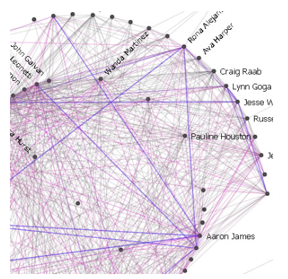
    - allgegenwärtig
        * SnapChat, LinkedIn, Tinder, Twitch, usw.
            + Knoten = Teilnehmer
            + Kanten = Beziehungen (Empfehlungen für Freundschaften, Nachrichten, Follower Beziehungen)
        * Email-Graphen, Kommunikationsstrukturen (Kommentare auf Reddit)
            + Strukturen sind analog
    - Informationsbedürfnisse
        * Einfach & konkret
            + Einzelner Pfad (Was ist meine kürzeste Verbindung zu X?)
            + Aggregation (Welche Studierende haben die meisten Freunde auf FB?)
            + Gefilterte Aggregation (Wie viele Freunde haben Studentinnen durchschnittlich?)
        * Komplex
            + Welche Teilnehmer sind zentral / sichtbar / wichtig / einflussreich?
            + Gibt es Gruppen ähnlicher Teilnehmer?
        * Grundlagen für Entscheidungen
            + Auf wen konzentriere ich meine Werbung?
            + Wem ist was erlaubt?
        * Verhaltensbasiert vs Strukturell
            + Verhaltensbasiert = Jeder, der 3x positives Feedback bekommen hat, bekommt X.
            + Strukturell = Professoren haben X.
    - Verhaltensbasierte Trust Policies
        * Beispiele
            + Alice: "Andere dürfen X (ich traue ihnen), wenn sie durchschnittlich positives Feedback haben."
            + Bob: "Dienst nur wenn in die letzte 24 Stunden kein negatives Feedback."
            + Carol: "Dienst nur nach K Empfehlungen."
        * Als Anfragesprache darstellbar
            + Selektiere Personen, deren durchschnittliches Feedback positiv ist.”
            + Selektiere Personen, die in den letzten 24 Stunden kein negatives Feedback bekommen haben.
    - Anforderungen
        * Trust Policies bedürfen komplexe Operation
            + Aggregation = durchschnittliches Feedback
        * Es existieren unterschiedliche Typen von **verhaltensspezifischem Wissen**
            + mit adäquate Repräsentation
            + Beispiele: Feedback, Reputation, Empfehlung
        * Repräsentation des Wissens in Form eines gerichteten Graphen
            + 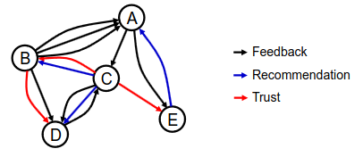
    - Typen von Verhaltensspezifischen Wissen
        * Feedback = Bewertung einer Interaktion mit einem Partner (ratee) durch einen Bewertenden (rater)
        * Empfehlung = Meinung einer Entität (recommender) über das Verhalten eines Partners (recomendee) in der Vergangenheit.
        * Reputation = Meinung des Netzwerkes gesamthaft über eine bestimmte Entität, (globale Eigenschaft)
        * Vertrauten = Überzeugung einer Entität (truster), dass ein Partner (trustee) sich wie erwartet verhalten wird.
    - Feedback Graphen
        * 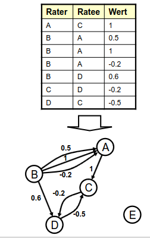
            + Teilnehmer = Knoten
            + Feedback von A zu B = Kanten
            + Wert des Feedbacks = Gewicht der Kante
        * Ableitung aus Feedback
        * Eigenschaften
            + Gerichtet
            + Nicht stark verbunden
            + Mehrere Kanten zwischen 2 Knoten
            + Gewichtet


# Zentralität
1. Zentralitätsmaße (centrality indices)
    - 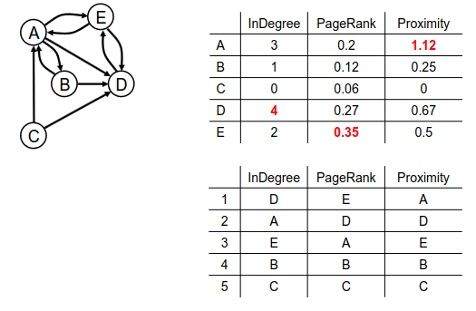
    - Graphenbasierte Maßen (Wichtigkeit eines Knoten gemäß der Graphstruktur)
    - Beispiele: InDegree, PageRank, Proximity Prestige, Authority (HITS)
    - Unterschiedlich => unterschiedliche Rankings
1. Kategorien
    - Lokal
        * Betrachten nur direkte Nachbare
        * Beispiele: InDegree
    - Eigenvektorbasierte
        * Rekursiv definiert (betrachten sowohl direkte als auch indirekte Nachbare)
        * Beispiele: PageRank, HITS, Positional Weakness Function
    - Distanzbasiert
        * Beziehen sich auf kürzeste Pfade
        * Beispiele: Proximity Prestige, Integration
1. InDegree
    - = Anzahl der eingehende Knoten
    - Beispiel: FB likes
    - Diskussion
        * Leicht zu berechnen
        * Hat gewisse Aussagekraft
        * Relativ leicht auszuhebeln (remove)
1. PageRank
    - 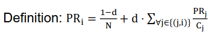
        * d = Dämpfungsfaktor (damping factor)
        * Cj = Anzahl Seiten, auf die j verweist
    - Kann man als Reputation (Wichtigkeit) interpretieren
        * Kanten stehen meistens für positive Beziehung (Empfehlung, Erwähnung)
    - Intuition
        * 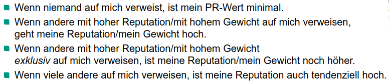
    - Beispiel
        * 
1. Proximity Prestige (PP)
    - Definition
        * 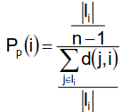
        * Zähler = Anteil der Knoten, von denen aus i erreichbar ist
    - Ii = Influence Domain = Menge der Knoten von denen aus (from which) i erreichbar ist
    - d(j,i) = kürzester Pfad j -> i
        * Durchschnitt = sum(d(j,i), j in Ii) / |Ii|
    - Verständnis
        * PP = normalisierte Größe des Influence Domains
        * PP = durchschnittliche Länge kürzester Pfad
        * Große Influence Domain = großer PP-Wert
        * Große durchschnittliche länger kürzester Pfad = kleiner PP-Wert
    - Maximaler PP-Wert
        * Wenn i von alle Knoten erreichbar ist (Zähler ist maximal)
        * Wenn die Länge kürzester Pfad von allen Knoten = 1
    - Kleinster PP-Wert
        * Kleine Influence Domain
        * Sehr große Länge kürzester Pfad
1. Betweenness Centrality
    - Ausgangslage
        * Zwei nichtbenachtbarte Knoten j und k wollen miteinander interagieren
        * i ist auf dem Pfad zwischen beiden (hat etwas Kontrolle über die interaktion)
        * i ist wichtig, wenn auf viele solche Pfade liegt
        * Pjk = Anzahl kürzester Pfade zwischen j und k
    - Definition
        * 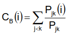
    - Andere Art von Zentralität
        * Proximity = Erreichbarkeit von anderen Knoten
        * Betweenness = wie häufig kann man Einfluss ausüben
    - Beispiel: One-centered star vs Clique (every 2 vertices are neighbors)
        * PP(N) in beide Fälle maximal (zusätzliche Knoten in der Clique machen kein Unterschied)
        * Betweenness(N) ist maximal bei Star, aber sehr klein bei Clique
1. Informationsbedürfnisse
    - Normalerweise in der WHERE Klause
    - Oft in Kombination mit andere Berechnungen (z.B. Frauen mit Zentralität > x)
    - Beispiele
        * Wer hat den höchsten PageRank?
        * Was ist der durchschnittlich kürzeste Pfad zwischen Individuen mit höher Zentralität?
        * Welche Personen haben hohe Proximity, aber klein Betweenness (vernetzt, aber kleinen Einfluss)?
    - Zentralitätsberechnung soll Primitiv der Anfragesprache sein (sonst muss man von Hand berechnen)
1. Transformationen
    - Die meisten Maßen erfordern Transformationen der Graphen
    - Gewichtete Mehrfachgraphen -> einfache gewichtete Graphen -> einfache ungerichtete Kanten
    - Beachten: Transformation führt zu Informationsverlust
    - EigenTrust Transformation
        * 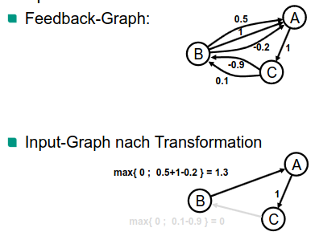
    - Beta Transformation
        * 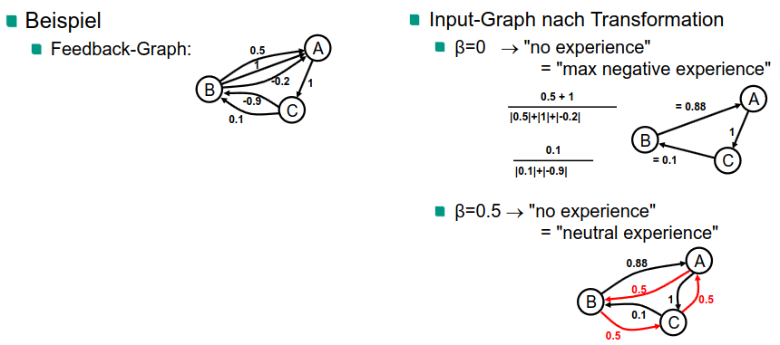
    - Informationsbedürfnisse
        * Graph, für dessen Knoten Zentralitätsmaß berechnet wird, muss aus existierendem Graph abgeleitet werden.
        * Sicht spezifiziert diese Transformation. Verwendung einer Anfragesprache, um diese Sicht zu spezifizieren.
        * Die Transformationen oben sind in SQL darstellbar.


# Query Algebra für Vertrauen
1. Rahmenwerk (Framework) für verhaltensbasierte Modellierung von Vertrauen
    - Aspekte
        * Relationale Repräsentation von verhaltensbasiertem Wissen
        * Algebra für die Formulierung von verhaltensbasierten Trust Policies
    - Vorteile
        * Unterstützt die Definition beliebiger benutzerdefinierter verhaltensbasierter Trust Policies
        * Relationale Repräsentation ermöglicht eine wenig aufwändige Implementierung
1. Relationale Repräsentation des Wissens
    - Relationen, die verhaltensspezifisches Wissen repräsentieren:
        * Feedback, Recommendation, Reputation, Trust
        * Weitere Relation: Entity(ID)
    - Beispiel + Ziel
        * 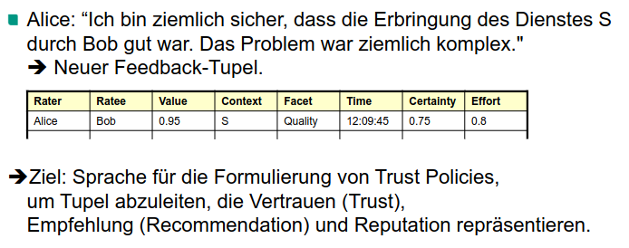
1. Algebraische Darstellung der Policies
    - Trust Policy = Anfrage bezogen auf den Datenbestand
    - Übliche Art mit Relationen zu arbeiten (Relationale Algebra)
        * Menge von Operationen, die auf Relationen anwendbar sind
        * Abgeschlossenheit => Kombination der Operatoren = komplexe Algebraausdrücke
    - Relationale Algebra = Kern der Sprache für Trust Policies
        * Operatoren reichen nicht aus => Erweiterung ist erforderlich
    - Neue Operatoren
        * TOP\[k, attr\](Relation)
            + 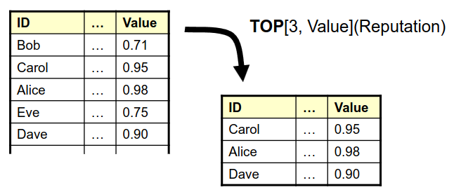
            + Gibt die k Tupel mit dem höchsten Wert des Attributs attr zurück
        * MAP\[attr, expression(A1,...,An)\](Relation)
            + 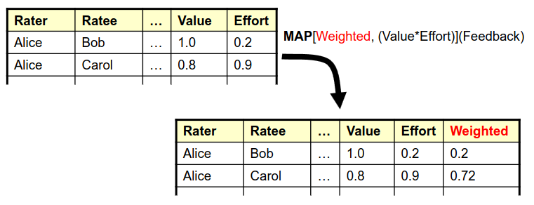
            + Ermöglicht die Ausführung benutzerdefinierter Funktionen auf den Attributen einer Relation.
            + Die Funkionen werden separat auf jedem Tupel ausgewertet; die Ergebnisse werden zu einem neuen Attribut.
        * CENTRALITY\[attr, Av, As, At, Aw, Measure\](Rvertices, Redges)
            + 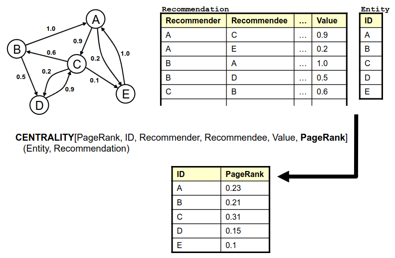
            + attr = new attribute
            + Av = vertex, As = source, At = target Aw = weight
1. Trust Policies: Beispiel
    - Formulierung:
        * Ich vertraue Individuen in Kontext c und bezüglich Aspekt fc, wenn das durchschnittliche Feedback über sie von den zehn angesehensten Entitäten einen gewissen Schwellwert übersteigt.
        * Nur Feedback mit hoher Verlässlichkeit (Certainty > 0.8) soll berücksichtigt werden.
    - Algebraausdruck
    ```
        PROJECTION[trusted] (
            MAP[trusted, avg_value > threshold] (
                GROUP[avg_value, AVG(Feedback.value), {ratee}] (
                    JOIN[Feedback.rater = Reputation.entity] (
                        TOP[10, Reputation.value] ( SELECTION[context=c, facet=fc](Reputation) ),
                        SELECTION[ratee=id, context=c, facet=fc, certainty>0.8](Feedback)
                    )
                )
            )
        );

    ```
