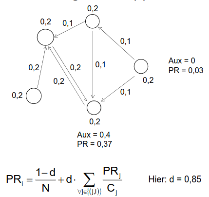

# Graphdaten
1. Motivation
    - Allgegenwärtig
        * Soziale Netzwerke
        * chemische Zusammensetzungen
        * Repräsentation von Prozesse und Programmasuführungen
1. Einführung
    - naheliegende Lösung
        * 1x Relation für Knoten und 1x für Kanten
        * Knoten können beliebige Attribute haben (inklusive Kanten)
        * ODER: mehrere Relationen je nach Knoten- und Kantentypen
        * Sowohl für gerichtet als auch für ungerichtete Graphen möglich
    - Fragen
        * Können wir alles mit SQL ausdrücken? (oder mit Variante mit Rekursion)
        * Ist die Anfrageauswertung effizient?
1. Notation
    - V = Menge an Knoten
    - E = Menge an Kanten
    - V & E sind Disjunkt
    - G = Graph = Endliche Menge von (V, E)-Paaren

# Soziale Netzwerke
1. Einführung
    - 
    - allgegenwärtig
        * SnapChat, LinkedIn, Tinder, Twitch, usw.
            + Knoten = Teilnehmer
            + Kanten = Beziehungen (Empfehlungen für Freundschaften, Nachrichten, Follower Beziehungen)
        * Email-Graphen, Kommunikationsstrukturen (Kommentare auf Reddit)
            + Strukturen sind analog
    - Informationsbedürfnisse
        * Einfach & konkret
            + Einzelner Pfad (Was ist meine kürzeste Verbindung zu X?)
            + Aggregation (Welche Studierende haben die meisten Freunde auf FB?)
            + Gefilterte Aggregation (Wie viele Freunde haben Studentinnen durchschnittlich?)
        * Komplex
            + Welche Teilnehmer sind zentral / sichtbar / wichtig / einflussreich?
            + Gibt es Gruppen ähnlicher Teilnehmer?
        * Grundlagen für Entscheidungen
            + Auf wen konzentriere ich meine Werbung?
            + Wem ist was erlaubt?
        * Verhaltensbasiert vs Strukturell
            + Verhaltensbasiert = Jeder, der 3x positives Feedback bekommen hat, bekommt X.
            + Strukturell = Professoren haben X.
    - Verhaltensbasierte Trust Policies
        * Beispiele
            + Alice: "Andere dürfen X (ich traue ihnen), wenn sie durchschnittlich positives Feedback haben."
            + Bob: "Dienst nur wenn in die letzte 24 Stunden kein negatives Feedback."
            + Carol: "Dienst nur nach K Empfehlungen."
        * Als Anfragesprache darstellbar
            + Selektiere Personen, deren durchschnittliches Feedback positiv ist.”
            + Selektiere Personen, die in den letzten 24 Stunden kein negatives Feedback bekommen haben.
    - Anforderungen
        * Trust Policies bedürfen komplexe Operation
            + Aggregation = durchschnittliches Feedback
        * Es existieren unterschiedliche Typen von **verhaltensspezifischem Wissen**
            + mit adäquate Repräsentation
            + Beispiele: Feedback, Reputation, Empfehlung
        * Repräsentation des Wissens in Form eines gerichteten Graphen
            + 
    - Typen von Verhaltensspezifischen Wissen
        * Feedback = Bewertung einer Interaktion mit einem Partner (ratee) durch einen Bewerdenden (rater)
        * Empfehlung = Meinung einer Entität (recommender) über das Verhalten eines Partners (recomendee) in der Vergangenheit.
        * Reputation = Meinung des Netzwerkes gesamthaft über eine bestimmte Entität, (globale Eigenschaft)
        * Vertrauten = Überzeugung einer Entität (truster), dass ein Partner (trustee) sich wie erwartet verhalten wird.
    - Feedback Graphen
        * 
            + Teilnehmer = Knoten
            + Feedback von A zu B = Kanten
            + Wert des Feedbacks = Gewicht der Kante
        * Ableitung aus Feedback
        * Eigenschaften
            + Gerichtet
            + Nicht stark verbunden
            + Mehrere Kanten zwischen 2 Knoten
            + Gewichtet

# Zentralität
1. Zentralitätsmaße (centrality indices)
    - 
    - Graphenbasierte Maßen (Wichtigkeit eines Knoten gemäß der Graphstruktur)
    - Beispiele: InDegree, PageRank, Proximity Prestige, Authority (HITS)
    - Unterschiedlich => unterschiedliche Rankings
1. Kategorien
    - Lokal
        * Betrachten nur direkte Nachbare
        * Beispiele: InDegree
    - Eigenvektorbasierte
        * Rekursiv definiert (betrachten sowohl direkte als auch indirekte Nachbare)
        * Beispiele: PageRank, HITS, Positional Weakness Function
    - Distanzbasiert
        * Beziehen sich auf kürzeste Pfade
        * Beispiele: Proximity Prestige, Integration
1. InDegree
    - = Anzahl der eingehende Knoten
    - Beispiel: FB likes
    - Diskussion
        * Leicht zu berechnen
        * Hat gewisse Aussagekraft
        * Relativ leicht auszuhebeln (remove)
1. PageRank
    - 
        * d = Dämpfungsfaktor (damping factor)
        * Cj = Anzahl Seiten, auf die j verweist
    - Kann man als Reputation (Wichtigkeit) interpretieren
        * Kanten stehen meistens für positive Beziehung (Empfehlung, Erwähnung)
    - Intuition
        * 
    - Beispiel
        * 
1. Proximity Prestige
    - Ii = Influence Domain = Menge an knoten von denen aus (from which) i erreichbar ist
    - d(j,i) = kürzester Pfad j -> i
        * Durchschnitt = sum(d(j,i), j in Ii) / |Ii|
1. TODO: continue
