# Einleitung
1. Unterscheidung von Graphen
    - Basis
        * Gerichtet oder nicht
        * Gelabelt oder nicht
        * Mehrere Kanten zwischen Knoten oder nicht
        * Zusammenhängend oder nicht
    - 1x groß vs mehrere kleine (Facebook vs Moleküle)
        * Ganzes Graph als Ergebnis nur bei kleine sinnvoll
1. Informationsbedürfnisse auf Graphen
    - Suche nach konkrete Muster in Graphen. (anders geartet als Zentralitätsberechnungen)
    - Abstand ist sinnvolles Konzept => Anfragesprachen aus semistrukturierte Datenbanken reichen nicht aus
    - Beispiele
        * Basic
            + Alle Knoten in FB mit Abstand < 4 von X.
            + Alle Moleküle, in denen eine Instanz des Elements A mit einer von Element B direkt verbunden ist.
        * Komplex
            + Längste Pfade in allen Molekülen mit bestimmte Eigenschaft (Folge von Labels, Knoten mit Mindestgrad, usw.)
            + Kleinste Komponente (min. Summe der Gewichte)
    - Diskussion
        * Wie ausführen? Erst A und dann B? Erst B und dann A?
            + Gibt es mehr As oder Bs? Wie viele Verknüpfungen haben As und Bs?
            + Kanten anschauen?
            + Schema anschauen und Infos ableiten?
    - Anforderungen
        * Wir möchten Anfragen formulieren, die
            + Graphstrukturen berücksichtigen
            + auf Graph-spezifische Eigenschaften Bezug nehmen
        * Queryergebnis = Graphen
            + nicht einzelne Knoten
            + Gemeint: Teilgraphen, insbesondere wenn zu groß
        * Graphspezifische Optimierung und Heuristiken
1. Illustration
    - 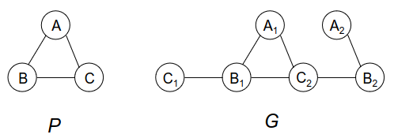
    - 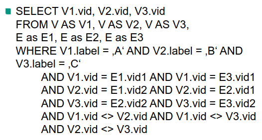
    - Struktur des Querygraphen verloren gegangen
        * C1 kann kein Match für C sein
        * A2 kann kein Match für A sein
        * B2 kann kein Match für B sein
    - Andere Perspektive
        * Jeder Knoten kennt seinen Grad
        * Grad > 1 hilft bei Queries


# Neo4J
1. Einleitung
    - Graph-DBMS
    - Anfragen können Bezug nehmen auf Pfade und ihre Eigenschaften
    - Allgemeiner als Pfadausdrücke für XML
    - Ausgaben haben relationale Struktur
        * Modell ist nicht abgeschlossen
        * Nicht 1NF (Graphen haben komplexere Struktur als Relationen)
    - Keine Sichten (Views)
    - Anfrageoptimierung nicht so mächtig (schweres Problem zu lösen)
    - Graphalgorithmen als Funktion gekapselt & in Abfragen anwendbar
        * Beispiel: kürzester Weg
1. Zugrunde liegendes Datenmodell
    - Knoten und Kanten
    - Können sowohl Labels als auch Attribute haben
        * Attribute: ("Vorname", "Heinrich")
    - Kategorisierung mit Hilfe von Labels
    - Konsistenzbedingungen (z.B. Uniqueness Constraints)
        * Einhaltung durch DBMS überwacht
1. Beispielszenario
    - 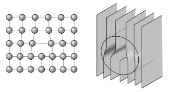
    - Aus der Materialwissenschaft
    - Man interessiert sich für die Bewegungen und Interaktionen von Versetzungen (Fehlstellungen im Atomgitter) über die Zeit.
1. Anfragen
    - Übersicht
        * MATCH = Auf was zugreifen? = FROM in SQL
        * WHERE = Filterbedingung = WHERE in SQL
        * RETURN = Was zurückgeben? = SELECT in SQL
    - Beispiel 1: Implizite Gruppierung im RETURN
        * Ausgabe der Anzahl der 'Loop'-Knoten für jeden Zeitpunkt.
        ```
            MATCH (n:Loop)
            RETURN n.time AS time, COUNT(n) AS count
        ```
        * Ausgabe
            + 
        * Erläuterungen
            + Erste Zeile = Zeilennummer (Systemgeneriert)
            + Nur Knoten mit Label 'Loop'
            + Kompakt, da keine WHERE Klause (alternativ: MATCH (n) WHERE 'Loop' in labels(n))
            + Implizite Gruppierung (explizite Attribute = Gruppierungsschlüssel)
    - Beispiel 2: Bedingungen bezogen auf Graphstruktur
        * Ausgabe der IDs aller Loops mit burges\_vector = 4, slip\_normal = 1 und mehr als 10 Kanten.
        ```
            MATCH (n:Loop)
            WHERE n.burges_vector = 4 AND n.slip_normal=1
            AND size((n)--()) > 10
            RETURN n.id
        ```
        * Erläuterungen
            + burges\_vector & slip\_normal = Attribute, uns egal
            + (n)--() = Kante, adjazent zu n (keine Aussage zum anderen Knoten)
            + size()  = Zählt Elemente in Liste/Array
            + count() = Anzahl der Werte/Knoten (siehe Beispiel 1)
    - Beispiel 3: Komplexe Bedingungen bezogen auf Graphstruktur
        * Finde alle Junction-Knoten, die mit einem Loop-Knoten mit ID = 1 verbunden sind, gruppiert nach Zeitpunkten.
            + verbunden = ex gibt ein Elementar-knoten dazwischen (keine direkte Kante)
        ```
            MATCH (n:Loop {id:1})-[*2]-(m:Junction)
            WITH n, collect(distinct m.id) as ids
            RETURN n.time, ids
        ```
        * Ausgabe
            + 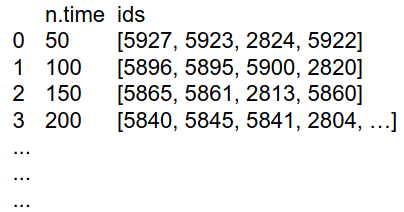
        * Erläuterungen
            + [\*2] = Pfad, bestehend aus 2 Kanten
            + collect = generiert Liste von Werten
            + WITH Klausel: Transformationen durchführen und Variable für Return definieren
            + Attributen in Return müssen nicht atomar sein (ids = Liste)
    - Beispiel 4
        * Für jeden Zeitpunkt und für jeden Junction-Typ - Ausgabe der Loops, die mit einer Junction dieses Typs verbunden sind.
        ```
            MATCH (n:Loop)-[*2]-(m:Junction)
            WITH n.time as time, m.type as type,
                 collect(distinct n.global_id) as ids
            RETURN time, type, ids
        ```
        * Ausgabe
            + 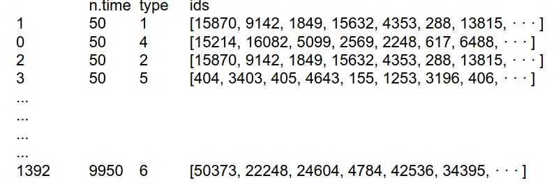
        * Erläuterungen
            + Man kann auf Kanten nicht zugreifen, das Muster muss immer mit einem Knoten enden
            + Nur eine Kante finden: MATCH () - [k] - () RETURN k
            + Labels einschränken oder nach Attribute filtern: [k: Label {length: 50}]
            + Elemente in WITH und RETURN müssen nicht die gleiche Reihenfolge haben
    - Beispiel 5: Darstellung von Pfaden
        * Ausgabe der Anzahl aller Loops verbunden mit Junction vom Typ 1 und verbunden mit anderer Loop, die wiederum mit Junction vom Typ 2 verbunden ist.
            + Vorgehen1: Finde zunächst beide Loops jeweils mit ihren strukturellen Eigenschaften, dann Überprüfung, dass sie ungleich sind, aber gleichen Nachbarn haben
            ```
                MATCH (nj:Junction {type:1})--()--(l:Loop),
                      (mj:Junction {type:2})--()--(k:Loop)
                WHERE l.id <> k.id AND (l)--()--(k)
                RETURN count(distinct l.id)
            ```
            + Vorgehen2: Finde erst alle benachbarten Loops, dann Überprüfung der Typen
            ```
                MATCH (nj:Junction {type:1})--()--(l:Loop)--(:Node)--(k:Loop)--()--(mj:Junction {type:2})
                RETURN count(distinct l.id)
            ```
        * Erläuterungen
            + Optional: :Node = Bedingung für Knoten ohne Label (elementare Knoten)
            + Je spezifischer die Query, desto schneller die Auswertung
            + Insbesondere: Labels benutzen, an Stelle von :Node
            + Alle Knoten in der Instaziierung des Pfads sind unterschiedlich
            + d.h. Graph-Knoten darf in Muster nur einmal vorkommen (l.id <> k.id ist redundant)
            + Die Abfragen sind gleichbedeutend, der Anfragenoptimierer erkennt das aber nicht
            + Länge Pfaden erzeugen riesige Zwischenergebnisse bei dichte Graphen
    - Spezifikation komplexer Muster
        * 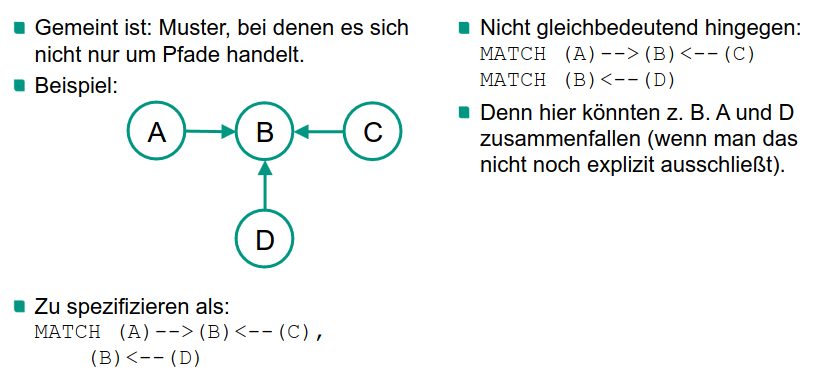 
1. Weitere Sprachmerkmale
    - Pfadausdrücke
        * gerichtete vs ungerichtete Graphen
        * Navigation über kontrollierte Anzahl von Schritte
        * Ausgabe ganzer Pfade
        * Ausgabe der Labels oder Attributwerte bestimmter Kanten
        * Abstraktionen (z.B. kürzester Pfad)
    - Pfade mit bestimmten Eigenschaften der Kanten
        * Alle Personen, die über zwei Schritte (d. h. Kanten) mit Charlie Sheen verbunden sind, und Schritte sind ACTED_IN oder DIRECTED.
            ```
                MATCH (charlie {name: 'Charlie Sheen'}) - [:ACTED_IN|DIRECTED*2] - (person:Person)
                RETURN person.name
            ```
            + Name enthält Leerzeichen => braucht '
        * Alle Pfade zwischen Charlie Sheen und Martin Sheen, von denen alle Kanten für 'blocked' den Wert 'false' haben.
            ```
            MATCH p = (charlie:Person) - [* {blocked:false}] - (martin:Person)
            WHERE charlie.name = 'Charlie Sheen' AND martin.name = 'Martin Sheen'
            RETURN p
            ```
    - Zugriff auf Kantenlabels und -attributwerte
        ```
            MATCH (wallstreet {title: 'Wall Street'}) <- [r:ACTED_IN] - (actor)
            RETURN r.role
        ```
        * Erläuterungen
            + Richtung der Kanten explizit gegeben
            + Actor entbehrlich (superfluous)
            + für bessere Performance: actor: Actor
        * Pfad ausgeben
        ```
            MATCH p = (michael {name: 'Michael Douglas'})-->()
            RETURN p
        ```
    - Kürzester Pfad
        * Kürzester Pfad zwischen Charlie Sheen und Martin Sheen, allerdings ohne die Vater-Sohn Beziehung
        ```
            MATCH (charlie:Person {name: 'Charlie Sheen'}),
                  (martin:Person {name: 'Martin Sheen'}),
                  p = shortestPath((charlie)-[*]-(martin))
            WHERE none(r IN relationships(p) WHERE type(r) = 'FATHER')
            RETURN p
        ```
        * Erläuterungen
            + relationships(p) = alle Menge der Einzelschritte/Kanten des Pfads p
            + WHERE = kürzester Pfad der die Bedingung erfüllt (nicht: kürzester Pfad ausgeben, wenn er die Bedingung erfüllt)
    - Analogien zu SQL-Features
        * Outer Join
            ```
                MATCH (a:Movie {title: 'Wall Street'})
                OPTIONAL MATCH (a)-->(x)
                RETURN x
            ```
            + Wenn kein Match - null
            + Falls nur OPTIONAL MATCH - nichts ausgeben
        * Schnittmengenberechnung
            + Selektiere alle Filme, in denen alle Schauspieler mitgespielt haben, deren Namen in einer gegebenen Liste enthalten sind.
            ```
                WITH ['Keanu Reeves', 'Hugo Weaving', 'Emil Eifrem'] as names
                MATCH (p:Person)
                WHERE p.name in names
                WITH collect(p) as persons
                MATCH (m:Movie)
                WHERE ALL(p in persons WHERE (p)-[:ACTED_IN]->(m))
                RETURN m
            ```
            + Elemente der Schnittmenge müssen alle Bedingungen erfüllen/in allen Ausgangsmengen enthalten sein
        * Aggregation
            + RETURN [x IN range(0,10) WHERE x % 2 = 0 | x^3 ] as result = [0, 8, 64, 216, 512, 1000]
1. Anfrageausführung
    - Einleitung
        * Anfrage -> Anordnung physischer Operatoren
        * Generierung des Queryplans
            + Zwischenschritt der Anfrageauswertung
            + Enthält Schätzung zu Größen der Zwischenergebnisse
        * In Neo4J: eine Unterscheidung zwischen logischer und physischer Ebene
    - Arbeitsweise des Anfrageoptimierers
        * 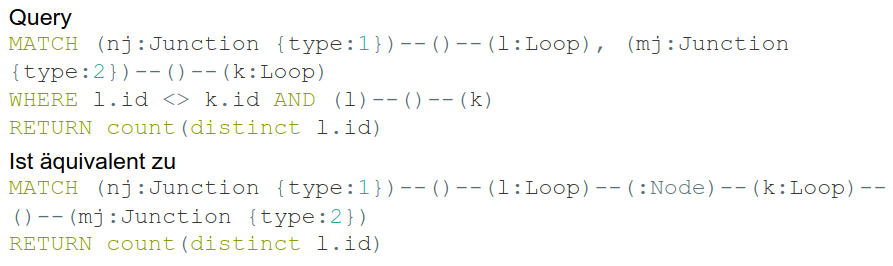
        * EXPLAIN = Erläuterung
            + TODO: see plan\_explain\_kl.png
1. Physische Operatoren
    - Wirkliche Operationen auf Daten während Query Ausführung
    - Expand all
        * Navigation ausgehend von gegebenem Knoten gemäß spezifischer Kante
        * Im Beispiel: mj = Ausgangsknoten, anon\_8 = Kante, anon\_7 = Knoten
        * Kann auf Kanten mit bestimmten Label einschränken: (p) -> [anon\_0: FRIENDS_WITH] -> (fof)
        * Expand into = findet alle Kanten zwischen 2 Knoten
    - SemiApply
        * Für Selektionsbedingungen: ist Muster X vorhanden?
        * Param 1/Links = select, Param 2/Rechts = where
        * Apply = gibt sowohl links als auch rechts aus
        * AntiSemiApply = ! Param 2
    - EagerAggregation
        * Aggregatberechnung (pro Gruppe)
    - ProduceResults
        * Abschließender Operator in jeden Plan
    - CacheProperties
        * Caching von bestimmten Werten
        * Insbesondere sinnvoll, wenn die Werte nach Join-Berechnung mehrmals vorkommen
        * Zugriff auf Werte im Cache: cache[...]
1. Limitierung des Anfrageoptimierers
    - Basics
        * Nur rudimentärer Schätzer
        * TODO: what else?


# Graphs-at-a-Time
1. Übersicht
    - 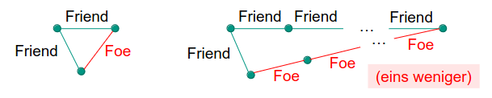
    - Graphmuster specifiziert
    - Flexible Spezifikation des Graphmusters mit Hilfe einer formalen Sprache
1. Graph Motifs
    - Grammatiken:
        * S1 = S2 *
        * S2 = S3 | c
        * S3 = a b
    - Bei Graphen:
        * Kanten, Knoten = Terminalsymbole
        * Graph = Nichtterminalsymbol
1. Zusammensetzung von Graphen
    - Konkatenation mit Kanten
        * 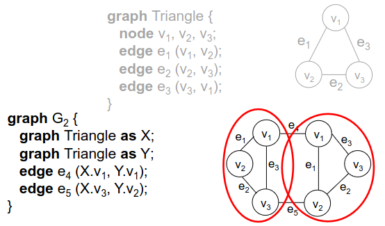
    - Konkatenation durch Unifikation
        * 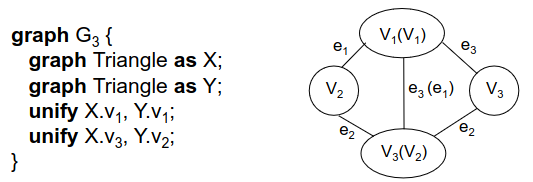
    - Disjunktion
        * 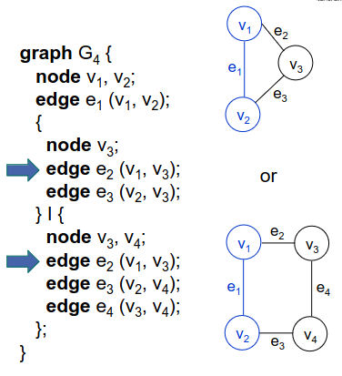
        * Blauer Teil = Externe Interface
        * Beim einbauen in größeren Motif: nur externer Interface sichtbar
    - Rekursion
        * 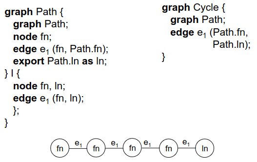
        * External Interface = fn und ln
        * Beispiel: Zyklus
            + 
        * Beispiel: Binärbaum
            + 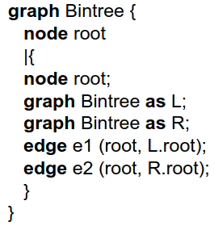
1. Diskussion
    - Begrenzte Ausdrucksmächtigkeit der Motifs
        * TODO: explain?
        * Binomialbaum
        * Cliquen
1. Graph Algebra
    - Selektion = nur Graphen mit bestimmten Eigenschaften zeigen
    - Projektion = nur bestimmte Knoten/Kanten anzeigen
    - Karthesisches Produkt = Menge von Graphen mit jeweils zwei Komponenten, eine aus G1 und eine aus G2
    - Storage queries
        * 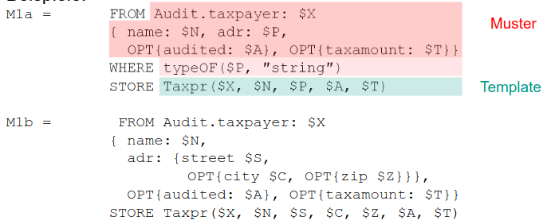
        * beschreiben Abbildung von semistrukturierten Daten aufs Relation
        * OID bei inneren Knoten, Textinhalt bei Blättern
    - Komposition
        * 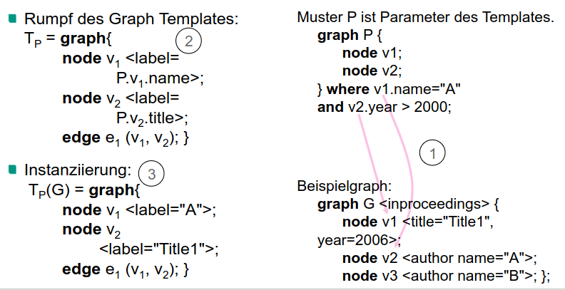
        * Rumpf des Templates = was passiert bei der Instaziierung des Musters
        * v1,v2 in Template = Variablen des Musters
        * TODO: wtf does this mean?
    - Graphalgebra ohne Rekursion = Relationale Algebra
        * Tupel = Graph aus einem Knoten mit Attributen X
        * Alle Operatoren problemlos darstellbar
            + Selektion, Projektion, kartesisches Produkt, Vereinigung, Differenz
    - Graphen => Datalog
        * 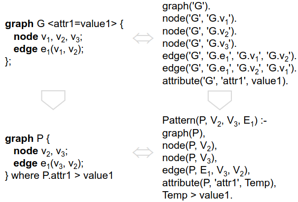
            + Graph = Fakten
            + Graphmuster = Datalog-Regeln
