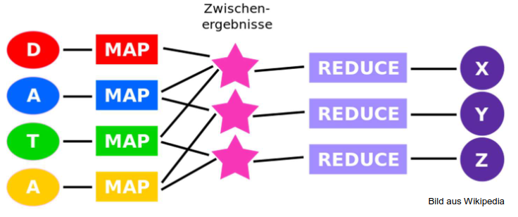
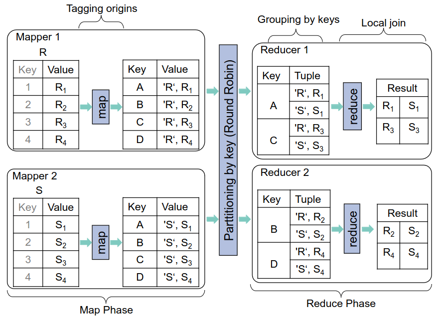
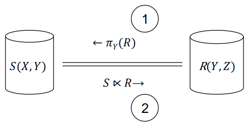
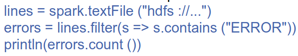
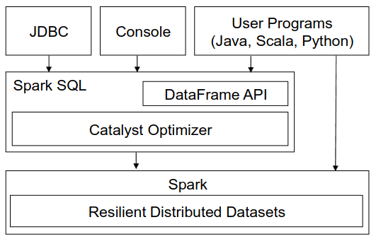
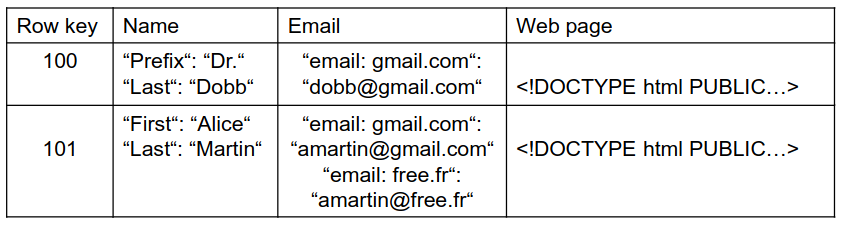
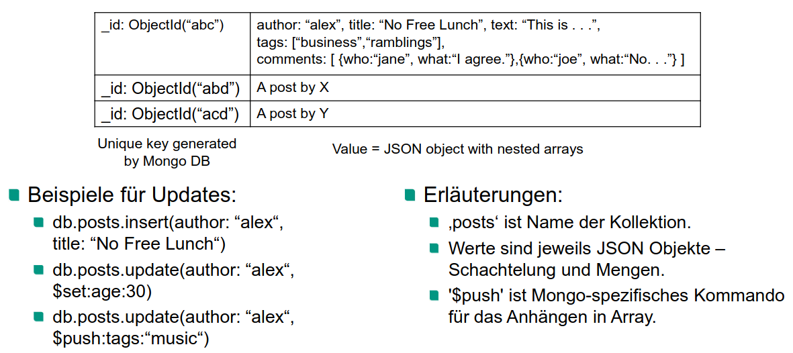

# Einleitung
1. Eigentschaften von Big Data
    - Volumn = Zahlen/Größe
    - Variety = Bilder, Text, Audio, Video - nicht nur relationen
    - Velocity = Wie viel Daten werden übertragen
    - Veracity = Impact?
1. Begriffe
    - Partitionierung = Partitionen der Daten an physisch unterschiedlichen Orten
    - Replikation = mehrere Kopien der Daten an unterschiedlichen Orten
    - Kombination aus beiden ist möglich
1. Software Stack für Big Data Management
    - Data Storage = Verwaltung von Dateien, die auf Cluster von Rechnern verteilt sind
    - Data Processing Frameworks
        * Anwender schreiben Code
        * Code wird parallel in fehlertoleranter Weise ausgeführt
        * Beispiel: MapReduce
    - NoSQL Search = Umgang mit multimodalen Daten

# Dateiverwaltung
1. Dateisystem
    - Verwaltet Dateien (Folgen von Bytes)
    - Organisiert Dateien in Verzeichnishierarchien
    - Verwaltet Metadaten von Dateien (Name, Position, Owner, Länge, Erstellungszeitpunkt)
    - Verteiltes Dateisystem für riesige Dateien
1. Google File System (GFS)
    - Verteiltes Dateisystem von Google
    - Offene Implementierung: Hadoop Distributed File System (HDFS)
    - Infrastruktur: Tausende Knoten mit Fehlertoleranz => Replikate jeder Datei
    - Anforderungen
        * Riesige Dateien (mehrere GB)
        * Hauptsächlich read- und append-Operationen (Änderungen eher selten)
        * Leseoperationen: n KB -> 1 MB
        * Append-Operationen: groß und gleichzeitig an eine Datei
        * Durchsatz wichtiger als niedrige Latenz
    - Arbeitsweise
        * Verzeichnisbaum, Pfadnamen
        * Create, Open, Read, Write, Close, Delete
        * Snapshot = Kopie von Datei/Verzeichnisbaum
        * Append = Record Append
        * Dateien bestehen aus Chunks fixer Größe (64MB)
        * Clients, Server, Master-Knoten
            + Clients = Stellen Interface zur Verfügung
            + Master = Metadaten, Zugriffskontrolle, Chunk platzierung
            + Mind. 3 Replikate eines Chunks

# Map-Reduce
1. Software Stack für Big Data Management
    - Skalierbarkeit wichtiger als Deklarativität, Transaktionen, Konsistenz
    - Einfache Parallelisierbarkeit
1. Prinzip
    - 
        * Map = Gruppierung
        * Reduce = Aggregatberechnung
    - Map-Reduce kümmert sich um die Ausführung
    - Beispiel: Word count
        * Map = word -> (word, 1)
        * Zwischenschritt gruppiert Listen
        * Reduce = summiert count Listen
1. Vorteile
    - Flexibilität = Benutzer muss nur Code schreiben
    - Skalierbarkeit = flexible Anpassung an Bedürfnisse
    - Effizienz = Daten werden nicht in DB geladen
    - Fehlertoleranz = Mehrere Knoten mit gleichem Task, Daten repliziert
1. Nachteile
    - Iterationen schwer umzusetzen
    - Einfache SQL Anfragen auch schwer
    - Keine Indices oder Queryoptimierung

# Join in MapReduce
1. Implementierung für SQL-Artige Sprachen on top of MapReduce
    - Ausführbarer Plan = gerichteter zykelfreier Graph von MR-Jobs
    - Speicherung des Resultats als verteilte, replizierte Datei
1. Map-Reduce-Implementierung von Datenbankoperationen
    - Selektion, Projektion = einfach
    - Aggregationen, Gruppierung = schon gezeigt
    - Theta-Join = Paaren von Tupeln t1 und t2
        * Theta = !=, =, <, <=, usw.
        * Join-Attributewerte von t1 theta Join-Attributewerte von t2
1. Natural Join/Equi-Join in MapReduce
    - Repartition Join
        * 
        * Map
            + 2 Mapper-Typen (1x für jede Relation R und S)
            + Output-Tupel = (k, \<z, v\>)
            + k = Join-Attributwert
            + z = ID der ursprünglichen Relation (R oder S)
            + v = eigentlicher Typel
            + Generieren der Output-Tupel
        * Shuffle
        * Reduce
            + Merge
            + Join
            + Resultat in verteilte Datei schreiben
    - Semi Join
        * 
        * Variante von Equijoin für den verteilten Fall
        * 3 Aufeinanderfolgende MR-Jobs
            1. Extrahierung der Menge der Join-Schlüssel aus R
                + Map extrahiert Join-Schlüssel
                + Shuffle = gleiche Schlüssel zu gleichem Reducer
                + Reduce = Diplikateeliminierung und Speicherung
            1. Berechnung des Semijoin-ZWischenergebnisses
                + Map-Only Job
                + Ergebnis von 1. wurde an alle Mapper geschickt
            1. Berechnung des Join-Resultats
                + Map-Only
                + Ergebnis von 2. an alle Mapper geschickt
    - Theta-Join
        * Beispiel: theta = !=
        * 1-Bucket-Theta-Join = Tupel in Join-Ergebnis nur von einem Reducer berechnet

# Spark
1. Motivation
    - MR-basierte Lösungen für iterationen = Wiederholungen zwischen Jobs
    - Unterscheidung zwischen invarianten und varianten Daten
        * d.h. ob im Lauf der Berechnung verändert werden
        * Beispiel: Clustering
            + Invariant = zu clusternden Punkte
            + Variant = Clustermittelpunkte
        * Fixpunkt = Ergebnis eines Berechnungsschritts, das sich im nächsten Schritt nicht mehr ändert
            + Im Beispiel: stabile Menge von Clustermittelpunkten
1. Resilient Distributed Data Set (RDD)
    - Zentrales Konzept
    - Relationen + Festlegung der physischen Repräsentation
    - 2 wesentliche Eigenschaften
        * Zuordnung von Partitionen zu Knoten bleibt erhalten über Iterationen hinweg
        * Puffern der Daten zwischen Iterationen (anstatt sie in Datei zu schreiben)
    - Weitere Eigenschaften
        * Benutzer legt fest
            + Partitionierung = ob/wie und welche Worker-Knoten
            + Ort der Speicherung = Disk/Main Memory
        * Cache, bzw. persist
        * RDD ist read-only (Update = Transformation = Generierung von neuem RDD)
        * Map, Filter, Reduce
        * Lazy Berechnung (Wenn Ausgabe explizit angefordert)
        * Ermöglicht Optimierungen (z.B. Pipelining)
1. Codebeispiel
    - 
    - lines und errors sind RDDs
    - lines wird durch Einlesen einer HDFS Datei erstellt
    - lazy Auswertung
        * print(...) löst die Evaluierung aus
        * Pipelining: Zusammenfassen von Einlesen, Filtern, Zählen (kein Zwischenspeichern)
1. RDDs mit Spark (k-Means clustering)
    - Generierung von RDD für die invarianten Daten (X) und Caching im Hauptspeicher
        * Spark kümmert sich und Partitionierung
    - Generierung von RDD für die varianten Daten (Medoide M)
        * Spark kümmert sich und Broadcasting
    - D = neues RDD für Ergebnis (Abstände zwischen x aus X und m aus M)
        * Zwischenergebnis effizient, weil lazy evaluierung
    - Mnew = Neues RDD = jedes x mit nächstgelegenem m
    - Konvergenztest (M = Mnew)
    - Falls keine Konvergenz
        * M = Mnew
        * Weiter mit Schritt 3
1. Fehlertoleranz
    - TODO: explain

# Spark SQL
1. Einleitung
    - SQL Variante on top of Spark
    - Ziele
        * Verarbeitung relationaler Anfrage (für RDDs und externen Quellen)
        * Effiziente Auswertung von Anfragen (leverage etablierter Datenbanktechniken)
        * Einbindung von "advanced analytics"-Algorithmen
    - Architektur
        * 
        * DataFrame API = kombiniert herkömmlicher und relationaler Code
        * Catalyst = Anfrageoptimierer

# NoSQL
1. Einleitung
    - NoSQL = "not only" SQL = breiter Begriff, deckt alles ab
    - Übliche Kategorien
        * key-value pairs
        * document (Text und semistrukturierte Daten) = MongoDB
        * wide column (NF2) = BigTable
        * graph
        * hybrid
1. Wide Column Stores
    - Eigenschaften
        * Relationen (aus klassischen relationalen DBMSen)
        * Attributwerte mit innerer Struktur (aus Nester Relational)
        * Tupel hat ID (aus Key-Value Stores)
    - Übliche Aktionen
        * Scan, Exact-Match, Range Queries
        * Kein Join, Mengenoperation, Gruppierung
1. Bigtable
    - 
    - Wide Column Store von Google
    - Auf Grundlage von Google File System
    - Bigtable-Instanz = Menge von (Schlüssel, Wert)-Paaren
        * Wert = Menge von Spalteninhalten
        * Zeilen sind nach Schlüssel sortiert
    - Begriffe
        * Column family = Menge von Spalten vom gleichen Typ
            + Name, Email, Web Page
            + Nicht Prefix, Last, email
        * Namen der Relation und column family sind Teil des Schemas
            + Spaltennamen (First, Last) sind frei wählbar
        * Column Key = column\_family\_name:column\_name
            + Wird für Zugriff auf Daten gebraucht
        * Mehrere Versionen eines Werts möglich (Identifizierung mit Zeitstempel)
    - Funktionalität konventioneller RDBMSe
        * z.B. Zugriffsrechte, Transaktionen für Zugriffe auf einzelne Zeilen
    - Verteilung der Daten
        * Automatisch, Auf verfügbaren Rechnern, Zusammenhängend gemäß Row IDs
        * Master Knoten
1. MongoDB (Document Stores)
    - Auf logischer Ebene = semistrukturierte DB
    - JSON anstelle von XML (konzeptionell kein Unterschied)
    - Anfragesprache
        * Insert, Delete, Update
        * Exact-Match
        * Bereichsanfragen
        * Textsuche (Ranking gemäß Information Retrieval Konzepten)
    - Beispiel
        * 
        * Beispiele für Queries
            + db.posts.find(author: "alex")
            + db.posts.find(comments.who: "Jane")
    - Vielfältige Indices
        * Unique-Indices = Updates nur möglich, wenn Einmaligkeit noch bleibt
        * Array-Indices = Index von einzelnen Einträgen
        * Partial Indices = Nur Dokumente, die Bedingung erfüllen
    - Scale-Out
        * Gemäß unterschiedlicher Partitionierungskriterien (Hash-, Bereichsbasiert, location-aware)
        * Benutzer ordnet Intervallen auf Schlüsselattributen Knoten zu
        * Partition und Replikation
    - Konsistenz
        * ACID-Transaktionen nur für einzelne Dokumente
        * Eventual Consistency für Replikate
        * Garantien für das Schreiben eines Replikats (Unacknowledged, Acknowledged, Journaled, Replica Acknowledged)
