# Traditional Computer Vision
1. Input -> hand-crafted features -> learning algorithm
1. Popular features
    - 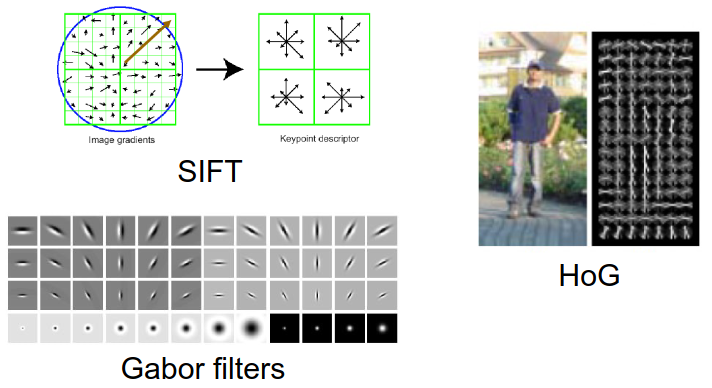
    - Scale-Invariant Feature Transformation (SIFT)
        * Use reference images to extract keypoints and store them in a database
        * Compare features from a new image to the database and find potential candidates
        * Matches need to agree on the object's shape, location, scale and orientation
        * Probability of an object's presence is calculated based on fit and probable false matches
    - Gabor Filter
        * Linear filter used for texture analysis
    - Histogram of Orient Gradients (HoG)
        * Counts occurrences of gradient orientations

# Machine Learning concepts
1. Learning feature hierarchy
    - Input (pixels) -> low-level features (edges) -> mid-level (object parts) -> high-level (objects) -> Trainable Classifier
    - Feature Learning Compass
    - 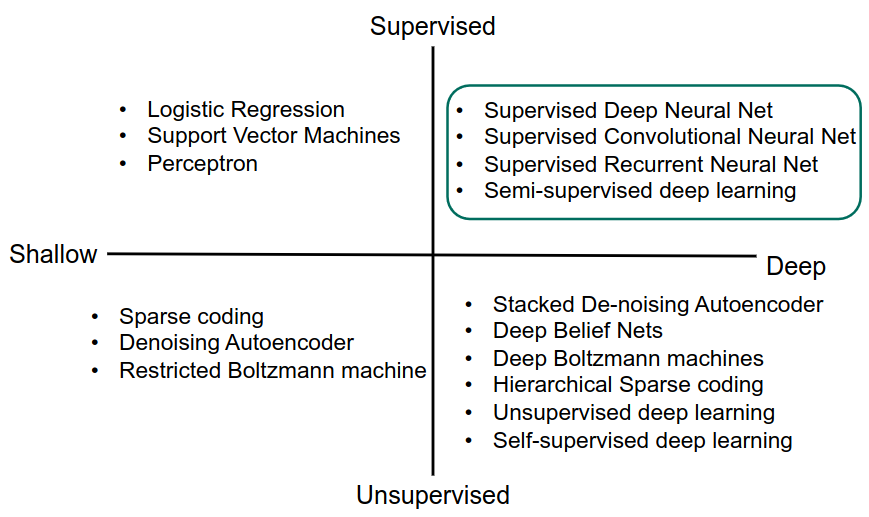
1. Train/Test/Validation Splits
    - Supervised = labeled data is used for loss calculation
    - Self-Supervised = no labeled data
1. Single-Layer Perceptron
    - 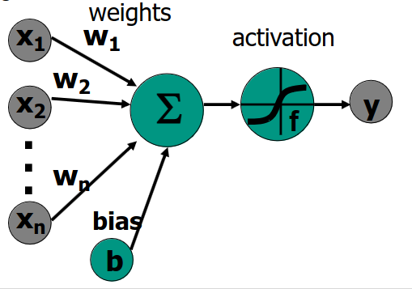
    - Inspired by information processing in biological nervous system
    - Input -> Process -> Output
    - Weighted sum & activation function (non-linear: binary step, Sigmoid, ReLU)
    - Without activation function = linear regression model
1. Multi-Layer Perceptron (MLP)
    - 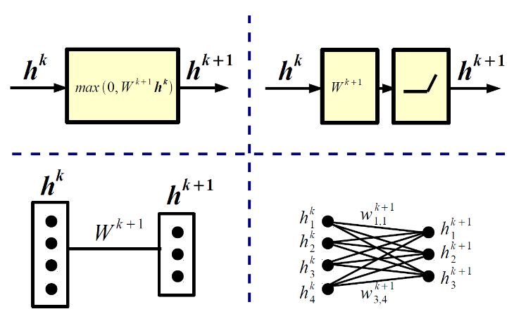
    - Combining layers allows the representation of non-linear functions
    - Single-layer cannot implement simple functions like NOT or XOR
    - Neural Network = MLP with multiple hidden layers?
    - What is a good classification network?
        * 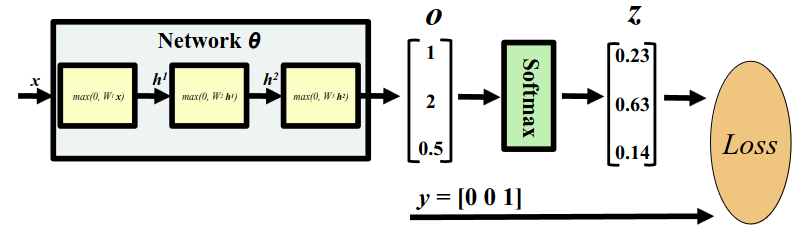
        * Final softmax layer
            + Takes the output of the last layer (logits) and converts them to probabilities for each class
            + The probabilities sum up to 1
            + Probability of class c_i given input image x (o = logits)
            + 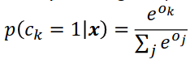
    - Reasoning
        * Q: Why need non-linearity? | A: Composition of linear functions = linear => network collapses to regression.
        * Q: How many layers / hidden units? | A: Hyper-parameters, best set using cross-validation. Wider and deeper = complicated function mapping.
        * Q: Why many layers? | A: Data with hierarchical structure => hierarchical model architecture allows to reuse intermediate feature (vehicles have wheels).
        * Q: Why deeper and not wider? | A: Wider networks memorize data => overfitting. Deeper learn and generalize.
    - Training
        * Initialize weights and biases for every layer
        * Calculate the loss L(x,y; Theta)
            + x = input, y = labels, Theta = model
        * Update weights and biases based on loss gradient 
            + How do you compute the gradient? **Backpropagation**!
        * Forward propagation
        * Compute network output given the input
        * Non-linearity = ReLU
    - Backpropagation
        * Explanation
            + Allows us to calculate the gradient of the loss function at each layer
            + Gradient = direction in which the function changes most quickly (generalization of the derivative)
            + Does this using the chain rule
        * Chair Rule
            + (f(g(x)))' = f'(g(x)) * f(g'(x))
            + Derivatives of loss in first layer:
            + 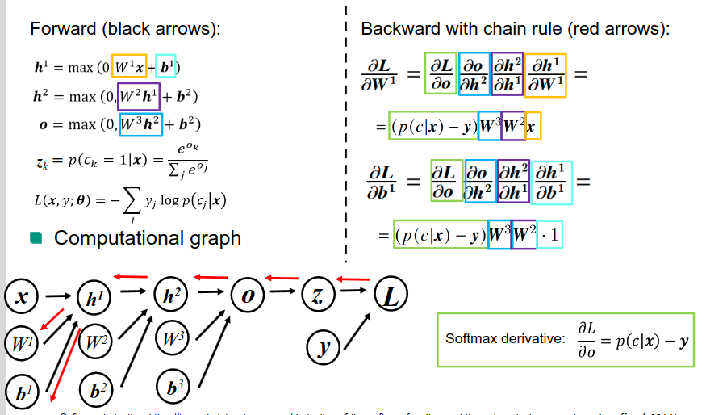
            + Doable, because we started from the last one backwards (see computation graph)
            + Derivatives of loss in last layer:
            + 
        * Using Gradient Descent
            + Use the previously calculated gradient to adjust the various weights and biases
            + 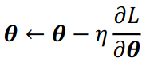
            + eta = learning rate
        * Classic / Batch Gradient Descent
            + Update parameters based on the gradient of the loss function
            + Converges to global minimum for convex surfaces and local minimum for non-convex surfaces
            + Sum is expensive for large N (memory size!)
        * Stochastic / Mini-Batch Gradient Descent
            + Incremental training: Break data into mini batches and update based on those
            + Almost certainly global for convex, same for non-convex
1. Challenges to Gradient Descent
    - Choosing the learning rate
        * Crucial hyperparameter for weight updates
        * too large = fluctuate around minimum OR diverge
        * too small = converges very slowly
    - Non-convex loss functions
        * Most error functions highly non-convex
        * => Problem: Many sub optimal local minima
    - Momentum
        * Hyperparameter (usually 0.9)
        * Takes gradient from previous steps into account
        * Gradient changes in same direction => accelerate => faster convergence
        * Gradient changes direction => reduce updates => less fluctuations
1. Annealing the learning rate
    - Gradually reducing the learning rate helps with training
    - Nesterov accelerated gradient descent
        * Modification of the Momentum update
        * Calculate the gradient at approximate future position and then update
    - Adagrad
        * Adapt the learning rate depending on the weights
        * Each weight is modified with a different learning rate, depending on past gradients (high gradient = reduced learning rate)
    - Adadelta
        * Adagrad with less aggressive decay
        * Fixed size of window of past gradients
    - Adam
        * Adadelta with momentum
1. Activation functions
    - Non-linear functions
    - Decide when the neuron will "fire".
    - Take as input the linear sum from the previous layer
    - Should be differentiable (because of backpropagation)
    - Classics: Sigmoid, Tanh
    - Modern: ReLU, Leaky ReLU, Maxout, ...
    - Sigmoid function
    - 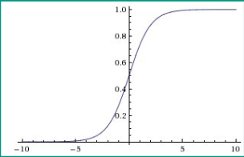
        * = 1 / (1 + e ^ -x)
        * Large negative numbers = 0, large positive ones = 1
        * Common in the past, rarely today
        * Drawbacks
            + Vanishing gradient: almost zero at either tail
            + Output non-zero centered. Bad, because input often non-zero centered.
            + All positive input => weight gradients either all positive or all negative => zigzagging movement
    - Tanh function
    - 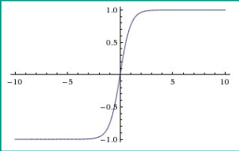
        * Similar to sigmoid: large nagative numbers = -1, large positive ones = 1
        * Zero-centered
        * Drawback: vanishing gradient
    - Rectified Linear Unit (ReLU)
    - 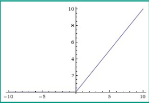
        * = max(0, x)
        * Simple, inexpensive (comparison, addition, multiplication)
        * Efficient gradient propagation (no vanishing gradient)
        * Greatly accelerates the convergence of stochastic gradient descent (compared to sigmoid and tanh)
        * Drawback: Dying ReLU Problem
            + Large gradient flow can cause the neuron to never fire again (weights and biases always result in 0)
        * Leaky ReLU
            + Tries to fix the Dying ReLU Problem
            + Instead of 0, have small slope for negative values
            + = max (a * x, x)
            + a = small constant, defines the slope for negative values
    - Maxout
        * Fixes the Dying ReLU Problem
        * Generalizes ReLU and Leaky ReLU
        * = max (w1 * x + b1, w2 * x + b2)
        * Drawback: doubles the number of parameters
    - Tips
        * Choice of function can affect performance
        * Use ReLU and take care of the learning rate (because else - dead units)
        * Alternatively Leaky ReLU or Maxout
        * Tanh is fun, but worse
        * Don't use Sigmoid
1. Loss Functions
    - Quantifies how good the model is
    - Depends on the task
        * Classification
            + Predicting a discrete (distinct / separate) class label
            + Loss: negative log-likelihood
            + 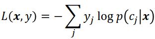
            + Used in multi class classification methods for NN training
            + Hinge loss: used in Support Vector Machines
            + 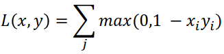
        * Regression
            + Minimize the distance between the predicted and the true value
            + Predicting continuous numerical values
            + L1-Loss (Mean Average Error)
            + 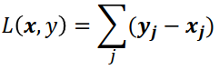
            + L2-Loss (Mean Square Error)
            + 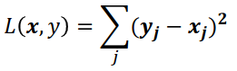
        * Metric / Similarity Learning
            + Measure distance (similarity) between objects
            + Input: 3 images: anchor, similar, dissimilar
            + Output: A model which produces a representation as a triplet
            + 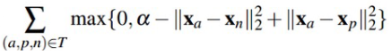
