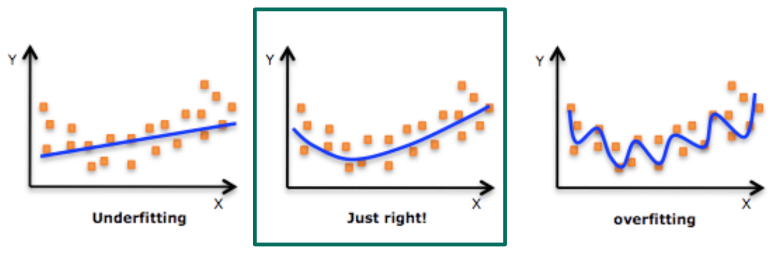
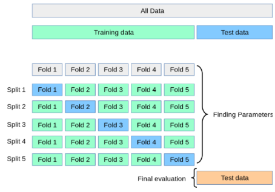

# How do classifiers work?
1. Generalization Error = How well the model performs on unseen data

1. Discriminative approach
    - Learn on training data
    - Test data might include values which are misclassified

# Underfitting
1. What is it?
    - The model is too simple => can't accurately capture relationships between input and target
    - Often leads to error on training data
    - Performs poorly on new data
1. Causes
    - Unclean training data (high noise or outliers => model can't derive patterns)
    - The model is too simple for the task (e.x. linear model, but complex task)

# Overfitting
1. What is it?
    - The model is too closely aligned with training data => loses applicability to new data points
    - Very good results on training data, but poor on new data
1. Causes
    - Unclean training data (high noise or outliers => model captures the noise)
    - Not enough training data (model trains on limited data multiple epochs)
    - Model architecture complex (optimized for a long time)

# General idea
1. 
1. Goal: Good generalization (performance on data points not seen during training)
1. Challenge: optimizing a model on a finite set of training data to perform on new data points (validation/test set)

# How to avoid overfitting
1. General ideas
    - Add more clean and diverse training data
    - Reduce network capacity
        * reduce the number of neurons and layers
        * reduces the ability of the network to learn complex relationships
        * improves performance
        * too much capacity leads to memorizing training data
    - Model ensembles
        * combine the predictions of multiple (diverse) models
    - Regularization
        * Modification to the learning algorithm
        * Intends to reduce generalization error, but **not** training error

# Regularization methods
1. Weight decay
    - Classical regularization
    - Large weights are a sign of overfitting
    - Shrinks weights during backpropagation by adding a penalty to the cost function
    - The model has to balance between fitting the data and complexity (small weights = less complex?)
    - Optimizes an Objective function (loss function + regularization factor (punishment for large weights))
    - L1 regularization (Lasso)
        * Drives some weights to 0 => Leads to sparse representations
        * Can be used as a feature selector (sparsity eliminates irrelevant or redundant features)
        * Penalty is proportional to the sum of absolute values of the weights
            + L1 Loss = Original Loss + lambda * sum(|x_i|)
            + lambda controls the strength of the regularization
    - L2 regularization (Ridge)
        * Forces the weights to be small, but not exactly 0
        * More continuous shrinkage effect
        * Penalty is proportional to the sum of squares of the weights
            + L2 Loss = Original Loss + lambda * sum(x_i ^ 2)
    - 

1. Early Stopping
    - Use Validation set to stop training before generalization error increases
    - Effective and simple
    - Costly because of periodically evaluating validation
    - Train/Test/Validation Split
        * Training set
            + Used during the training process to fit the network
            + In supervised learning - labeled data is used to calculate loss
            + For self-supervised learning - no labels
        * Validation set
            + Aka dev(elopment) set
            + A set of example data used to fine-tune the hyperparameters (the architecture)
        * Test set
            + Used to test the model
            + Independent of the training set
            + **but** follows the same probability distribution

1. (n-fold) Cross validation
    - 
    - Split training data in subsets of roughly equal size (folds)
    - Training and evaluation
        * Choose a different fold for validation each iteration
        * Train on n-1 folds, validate on the chosen one
        * Evaluation metrics (accuracy or mean square error) are computed each iteration
    - Performance aggregation
        * The metrics from each iteration are averaged/aggregated
        * The result is the estimated performance on new data
    - Advantages
        * Provides a robust and reliable estimate of the model's performance
        * Helps mitigate under- and overfitting which might happen if evaluated on a limited subset
        * Different subsets => more comprehensive evaluation => identify problems with model generalization

1. Data Augmentation
    - Labeling training data is expensive and difficult
    - For more data: alter existing labeled training data
    - Examples
        * Random crops
        * Translations
        * Horizontal reflections
        * Scale
        * Adding Gaussian noise ()
    - **DO NOT DO FOR TESTING!!!**

1. Dropout
    - Regularization technique
    - Training: Disable a random fraction (p) of nodes in each iteration
    - Tries to prevent the network from relying on specific neurons or their combinations
    - Testing: Have to scale weights of un-dropped by factor p (because now more neurons are active)
    - Effective against overfitting
        * Suspected reason: breaks up situations where layers co-adapt to correct mistakes of previous ones
        * Side-effect: activations of hidden units are sparse

1. Batch Normalization
    - Not specifically to fix overfitting, but still very effective
    - Enables:
        * Higher learning rates (faster training)
        * Less sensitive to weight initialization
    - Problem: Internal Covariate Shift (ICS)
        * Weights and biases are updated during backpropagation
        * Input distribution at intermediate layers shifts
            + Input distribution = statistical properties of the input (e.x. some features become more prominent)
            + Shifts, because the weights and biases of the previous layer have been updated
            + Can lead to slower convergence (generally faster if the inputs are normalized)
        * High learning rates are problematic (layers need to continuously adapt to large changes)
    - Solution: Obtain zero-mean unit-variance activations
        1. Compute the mean (average) and the variance (spread / distance from mean) of the batch (independently in each dimension)
        1. Normalize
            + Subtracting the mean centers the distribution around 0
            + Dividing by sqrt(variance) normalizes the distribution and ensures unit variance
        1. Scale and shift through learnable gamma and beta:
            + Forcing strict zero-mean unit-variance limits network expressiveness
            + Learning extra parameters solves this
    - At test time
        * Problem: no batches + desired deterministic output
        * Mean and variance **not** computed based on batch
        * Compute mean and standard deviation during training and use that
            + Using running average (Keep track of running sum and recalculate average each time)

# Model ensembles
1. What?
    - train multiple networks for same task
    - merge results
1. Types
    - Homogeneous
        * Same base learner, used multiple times
        * Diversify training flow (i.e. no 2 models should make the same error on the same data sample)
        * Train with different data samples / initializations / augmentations / regularizations
    - Heterogeneous
        * Use different base models (architecture, learning mechanism, input representation)
        * Each model captures different aspects of the data
        * Results in complementary strengths
    - Sequential
        * Model tries to improve its predecessor
    - Non-sequential
        * Independence between base learners

