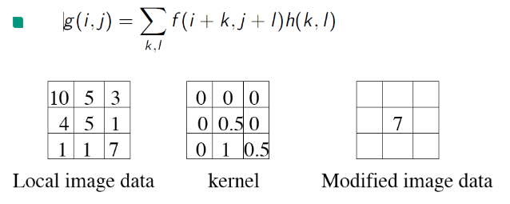
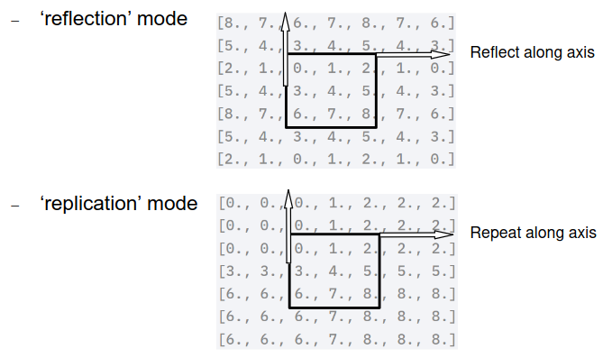
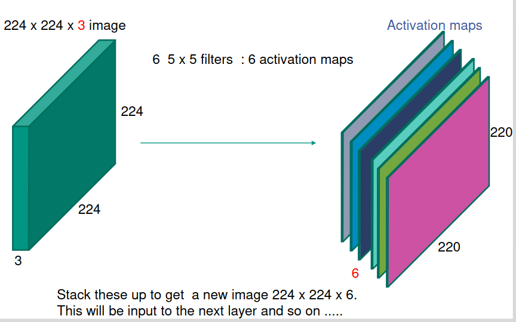
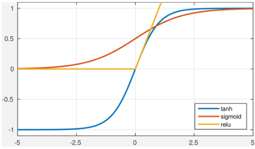
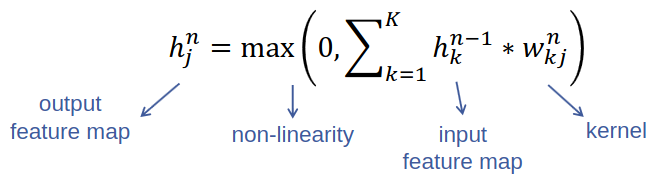
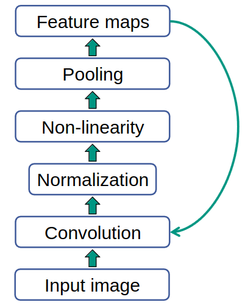
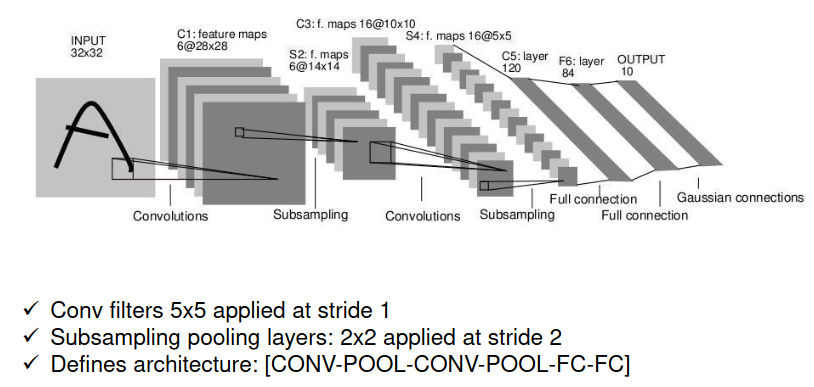
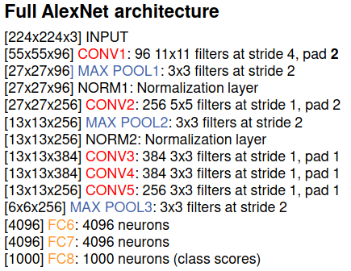
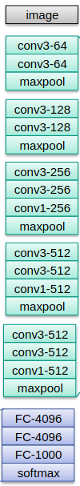

# Random notes
1. Currently in the praxis not just fully connected layers
1. Notes on 3B1B Video
    - Convolution = list of product sums
    - Useful for combining lists of stuff or functions
    - A smaller window calculates a value based on an area of the input
        * Example: a 5-element array of 0.2 calculates the average value in an area of 5 elements
    - Speed up computation by using Fast Fourier Transformations (FFTs)
        * 

# Intro
1. Image = fully connected layer?
    - Math: 200x200 pixels = 40K hidden units = 1.6B parameters (40K ^ 2)!
    - a lot of parameters
    - waste of resources
    - no explicit recognition of local (surrounding pixels) correlation
    - not enough data
1. Convolutions
    - Go over data with filter
        * filter = nxn grid which calculates a value for a region of the image
        * go over = move filter along image
    - filter response = multiply function value with weights
    - map each area of the image to a filter response (activation map)
    - 
    - padding
        * Edge pixels not considered => pad image with extra pixels
        * padding = 0 => constant mode, no changes
        * padding = 2
            + 
            + replication mode = keep repeating last pixel in direction
            + reflection mode = mirror the values along an axis

1. Convolution layer
    - image with depth 3, because of RGB (= input channels)
    - convolution operation
        * slide filter / kernel over image with step (stride = X pixels)
        * the filter is the same depth as the image (so that it considers all the data)
        * compute dot product at each location
        * use multiple filters to create multiple activation maps
            + 
            + each filter can calculate a different feature of the image area
            + stack all activation maps into an image
            + this image is the input to the next layer
        * weight sharing = use same weights when moving filter
        * receptive field = area of the image which each neuron uses to generate data (position of filter when calculating neuron value)
    - Math: 200x200 image, 96 filter kernels x 11x11 filter size = 11K parameters (96 * 11 * 11)!!!
    - Reasoning
        * Output size of convolution
            + D = image dimension, K = kernel size, M = image channels (aka kernel depth)
            + Output size = (D - K + 2 x padding) / stride + 1
            + Params: N * M * K * K
        * How many feature maps to use?
            + Usually more than input
    - Use non-linearity
        * The network collapses without it (can't solve non-linear problems)
        * Options:
        * 
        * Use Rectified Linear Unit (ReLU)
            + f(x) = max(0, x)
            + simpler math
            + very fast
            + avoids saturation
        * End result:
        * 

1. Pooling
    - a layer which shrinks the image
        * basically sums up an area of pixels, effectively zooming out of the image
        * sliding window which summarizes the content (similar to convolution)
        * Sum / Average = calculate average of patch
        * Max = calculate max value of patch
    - Reduces computational complexity of next layer (since the image is smaller)
    - introduces invariance to transformations (focuses on presence/absence of feature and not its precise location)
    - improves robustness to noise and clutter

    - Overlapping pooling (stride < patch size)
        * Recall pooling = introduces invariances to small variations
        * s = stride, p = patch size, usually s=2, p=3
        * patches of the image overlap

1. Normalization layer
    - Used to normalize the activations and stuff
    - Can be used on input image to fix high contrast
    - Contrast normalization
        * For each patch: subtract mean and divide by standard deviation
        * Equal response regardless of local contrast
        * Improves invariance, optimization, sparsity
    - Used before, but now other solutions (batch normalization)

1. CNN Block
    - Typical feed-forward CNN
    - 
        1. convolve (filter)
        1. non-linearity (ReLU)
        1. pooling (local max)
        1. normalization (contrast)
        1. repeat
    - Supervised learning
    - Back propagate classification error

1. LeNet
    - handwritten digit classification
    - LeCun et al. 1989
    - multiple convolution and fully connected layers
    - subsampling = pooling
    - 

1. MNIST
    - Very popular dataset for handwritten digit recognition in the 1990's

1. ImageNet
    - 14K annotated images
    - WordNet hierarchy (cat -> feline -> mammal -> animal -> living thing -> physical entity -> entity)
    - almost 22K classes
    - ImageNet Large Scale Visual Recognition Challenge (ILSVRC)
        * 1000 classes, no ancestry
        * fine-grained categories (120 types of dogs)
        * 1.2M training, 50K validation, 100K test images
        * Metric
            + top-5 error rate (is object in top 5 predictions)
            + accounts for multiple objects in image

# AlexNet

1. What?
    - First CNN-based winner of the ILSVRC
    - Multiple convolution layers
    - Couple dense (fully connected) layers
    - Final classification using soft-max layer (takes the previous raw input and turns it into probability distributions)
    - Train end-to-end using backpropagation
    - Math:
    - 
    - filter size vs NW depth
        * multi-GPU not so much these days

1. Implementation
    - CNNs use simple add/multiply = use GPU
    - model complexity is limited by GPU memory
    - Multi-GPU implementations
    - Data parallelism
        * Train same model
        * Share gradients and adjust weights
        * Efficient when gradients are sparse
    - Model parallelism
        * Train different parts of the model on the same data
        * Share neuron activations
    - ZFNet
        * AlexNet with some changes
        * Improved hyperparam
        * CONV 1 = 7x7, stride 2
        * CONV 3,4,5 = 512,1024, 512

# VGGNet

1. What?
    - Smaller filters, deeper network
    - 16-19 layers, 3x3 Conv stride 1 pad 1, 2x2 max pool stride 2
        * More layers, more non-linearities
        * stack of 3 3x3 conv stride 1 has same **effective receptive field** as 1 7x7 conv
        * fewer parameters

# Take home
1. CNNs are great feature extractors when there is a lot of data
