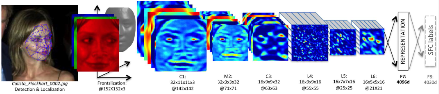
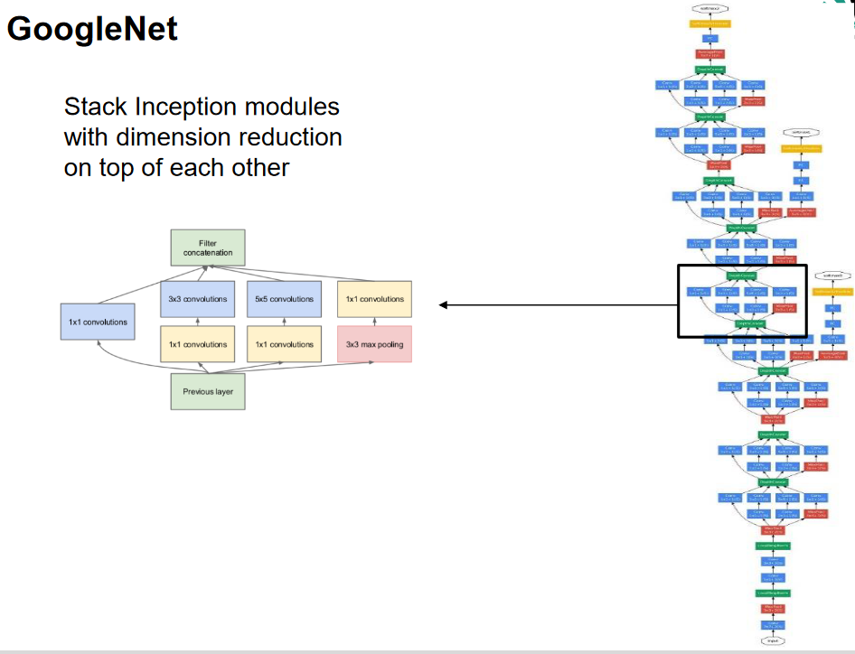
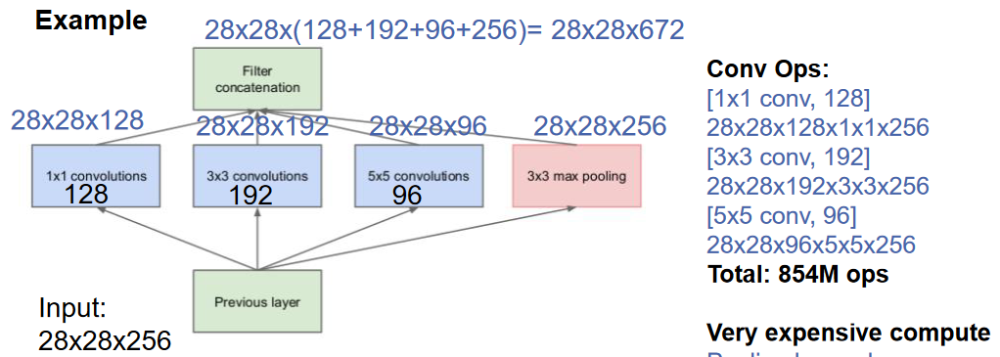
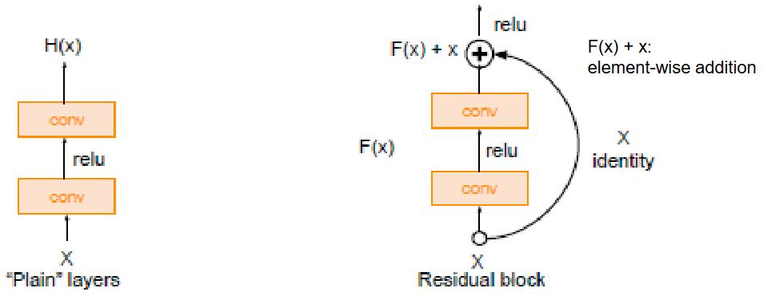
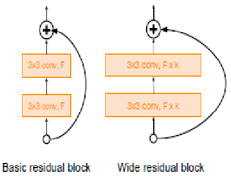
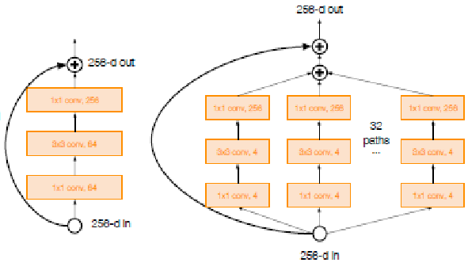
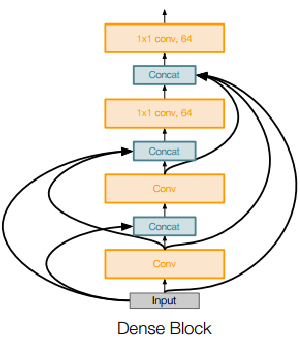
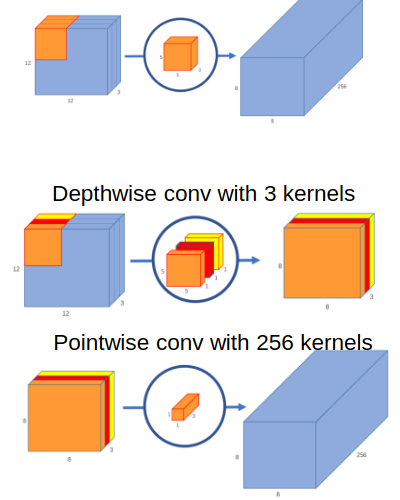

# Modern CNN Revolution
1. Networks are getting deeper
    - Getting good results in the ILSVRC
1. How deep?
    - 16-19 weight values
    - small, simple filters: reduces number of weights
    - small receptive fields: 3x3
    - Receptive field = area of the image to which a given neuron is sensitive to

# CNN as feature extractors
1. Deep Convolutional Activation Feature for Generic Visual Recognition (DeCAF)
    - Goal: describe the image, not just classification
    - Deep networks automatically learn good features
    - Hierarchy of filters: simple edges -> parts of objects -> objects
    - Last layer is typically the softmax
    - Train network end-to-end on classification
    - Use pre-trained network
        * classification for other tasks on the images (scene recognition)
        * for different tasks: switch last layer and train for a few epochs
        * for feature extraction: remove last layer and use the hidden unit values

1. DeepFace
    - Deep networks as face feature extractors
        * 
        * Input = 3D aligned face image
        * L4,L5,L6: 4096 dim representation (locally connected filters)
        * F7,F8: feature representation (fully-connected)
        * No more max pooling, since the images are only faces and already aligned
    - Without last layer -> very discriminating (similar faces -> similar results)

# Further CNN Networks
1. GoogleNet
    - 
        * Stem Network
        * Stacked Inception Modules
        * 2x Auxiliary Loss layers
        * Output = Average pooling + 1 linear layer
    - FC = fully connected
    - Features:
        * 22 layers
        * No FC layers
        * Inception module = network within network
        * Only 5M parameters (12x less than AlexNet!)
    - Stack inception modules
    - Naive inception module:
        * Apply multiple convolutions (filters) in parallel
            + multiple receptive fields: 1x1, 3x3, 5x5
        * Concatenate the outputs with pooling depth-wise
        * 
        * Problem: lots of channels and computation ops
            + pooling preserves depth
    - Solution: Bottleneck layers
        * Reduce the depth of the previous layer's output
            + 1x1 convolution layers with smaller depth
    - Classifier architecture
        * Average pooling + 1 linear layer instead of FC layers
        * Global Average Pooling
            + Calculate average value for each feature map and store as vector
            + Use softmax on that
            + less parameters & better performance than FC
    - Auxiliary Loss Layers
        * Tries to fix the vanishing gradient problem
            + During backpropagation, the gradients might get too small and not be useful for changing the weights
        * The auxiliary layers are basically small classifiers
            + They predict a label based on the previous layers
            + Their loss and gradient are propagated backwards

1. ResNet
    - Depth Revolution
        * Deep networks with residual connections
    - Why?
        * Deep Networks perform better up until a certain point
            + At some point no longer due to overfitting
        * Solution
            + Residual block passes input identity around convolutional layers
            + Then add output + identity element-wise
            + 
        * Idea:
            + Instead of learning the whole transformation (input -> output)
            + Learn small changes between current state and expected value
    - Full architecture
        * Stack residual blocks
        * Each has two 3x3 layers
        * Periodically double the number of filters and downsample by 2
        * Extra conv layer at the beginning
        * No FC at the end
        * Global average pooling after last conv layer
    - Improving
        * Identity Mappings in Deep Residual Networks
            + Improves block design, more direct path for propagating information
        * Wide Residual Networks
            + 
            + More shallow network, but wider
            + Argues that residuals are more important than depth
            + Outperforms the original, more performant (parallelization)
        * ResNeXt
            + 
            + Increases width through multiple parallel pathways
            + Similar to the Inception module
    - DenseNet
        * 
        * Densely connected layers (every layer connected to every other one)
        * Alleviates vanishing gradient
        * Strenghtens feature propagation
        * Encourages feature reuse

1. MobileNet
    - Properties
        * Useful for mobile and embedded vision applications
        * Smaller models (fewer params)
        * Less complexity (fewer multiplications and additions)
    - Splits depthwise and pointwise convolution
        * depthwise = convolve for each channel with wider, but shallow filter: depth x depth x 1
        * pointwise = convolve with a narrow, but deep filter 1x1xdepth
        * Convolve for each channel, then concatenate (1x1 convolution on all channels)
    - 
    - Math
        * Example:
            + Input = 12x12x3
            + Output = 8x8x256
        * Usually: 256 5x5x3 kernels = 256x5x5x3x8x8 = 1.228M multiplications
        * Depthwise: 3 5x5x1 kernels = 3x5x5x1x8x8 = 4800
        * Pointwise: 256 1x1x3 kernels = 256x1x1x3x8x8 = 49K
        * Total: ~54K multiplications
