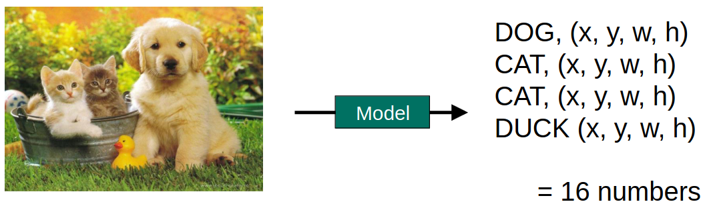
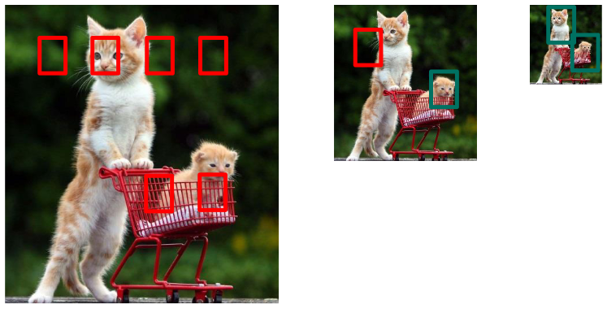
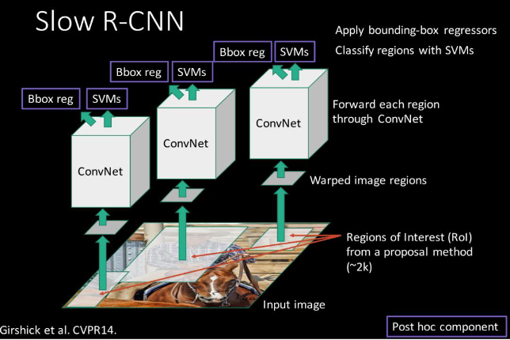
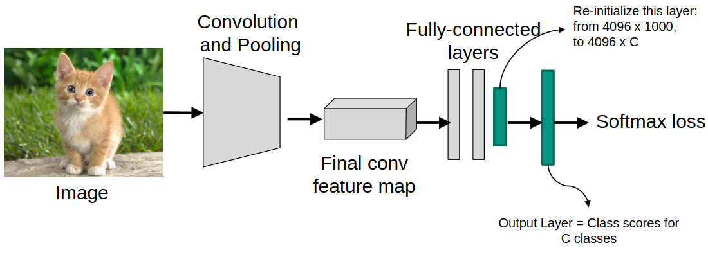
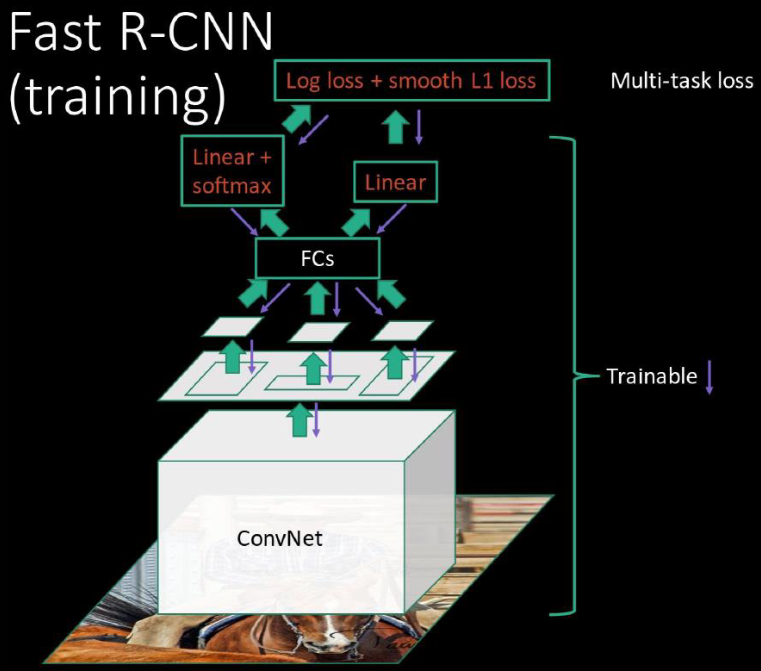
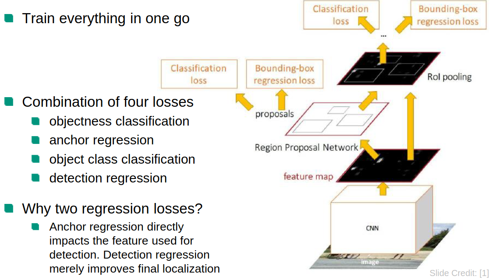
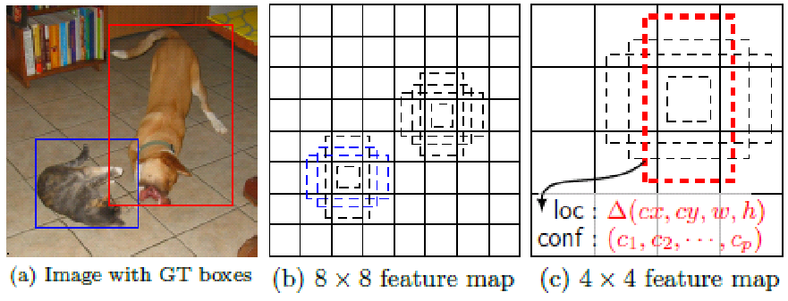

# Tasks
1. Classification (What is this?)
1. Localization (Where is this?)
1. Detection (what things do I see and where are they?)
1. Segmentation (what things and where exactly? (outline))

# Object detection
1. What is it?
    - Localize objects using bounding boxes (bbox)
    - Classify each bbox to its object class
1. As a Regression Problem?
    - 
    - Regression model = statistical model which looks at the relationship between a dependent and independent variables
    - Idea: use regression model to detect objects
    - Model output = coordinates of objects in the image (x, y, width, height)
    - Problem: need variable sized outputs (images contain different number of cats)
1. As a Classification Problem?
    - Sliding Window Approach
        * 
        * Only check small parts of the image
        * Classify each patch
        * How do you classify objects of different sizes?
            + Apply the sliding window at different scales of the image
        * Problem: classifying at different locations and scales takes a lot of time
        * Solutions:
            + Use a fast classifier (HOG, DPM)
            + Only run on some locations and scales (region proposals)
        * Histogram of Oriented Gradients (HOG)
            + HOG = calculate gradient orientations of cells along the image
            + Idea: image -> normalize -> calculate HOG -> linear SVM -> classification
            + Advantage: very fast
            + Disadvantage: does not work well on deformable objects
        * Region Proposal Methods
            + Look for blobby regions (likely to contain objects: eyes, nose, change in background)
            + Class-agnostic object detector
            + Able to detect blobs of different sizes
        * Objectness (likelihood that a region contains an object of any category)
            + Scale to 8x8 and extract normed gradients (NG)
        * Alternative: Selective Search
            + Split image into regions based on color
            + Iteratively merge neighboring regions based on similarity
    - Fast dense generic detection + Slow sparse classification
        * Use more complex object classifier on region proposals
1. R-CNN
    * 
    * Only feed the proposed regions to the classifier
    * Training
        + Train AlexNet on ImageNet (1000 classes)
        + 
        + Train the classifier (binary SVMs for each class, features = output of pool5 of AlexNet)
        + Improve region proposals (use regression model with input = features and output = locations of regions)
    * Correct classification of a bbox = if at least 50% overlap with ground truth
    * Metrics
        + Precision (P) = # relevant retrieved / # retrieved
        + Recall (R) = # relevant retrieved / # relevant in data
        + F/F1 measure = 2 * P * R / (P + R)
    * Fast R-CNN
        + 
        + Idea: share computation on entire image
        + Region Proposals: on entire image instead of each class
        + Feature Extraction: give whole image to CNN for feature extraction
        + Region of Interest (ROI) Pooling: turn irregularly shaped proposals to a fixed size (to feed into FC network)
        + Classification and Regression: 2x FC layers (1x classification, 1x bbox regression)
    * Faster R-CNN
        + 
        + Tries to integrate the region proposal generation into the network
        + Convolutional Backbone: process input image with a CNN (extracts rich feature maps)
        + Region Proposal Network (RPN): small network which slides a small window and generates candidate regions (evaluates windows of different sizes for objectness)
        + Loss: 
        + ROI Pooling: as above
        + Classification and Regression: as above

# Single Shot MultiBox Detector (SSD)
1. Current state of the art
1. Until now
    - Generate bboxes (proposals)
    - Resample pixels from them to uniform size
    - Apply high quality classifier
    - How to speed it up?
        * Try to avoid resampling
1. Idea
    - 
    - Use a set of fixed default boxes at each position in a feature map
    - Classify objects and box regression for each box
    - Apply boxes at different layers in the ConvNet (use layers of different sizes => avoids rescaling)

# Recent Developments
1. Mask R-CNN
    - Adds segmentation to the classification step
    - Two-step detectors are well-suited
1. YOLO-9000
    - You Only Look Once
1. Feature Pyramid Networks
    - Features early in net have high spatial resolution, but low semantics and context
    - Later ones have semantics and context, but low spatial resolution
    - Classification needs high context and Localization needs high spatial resolution
