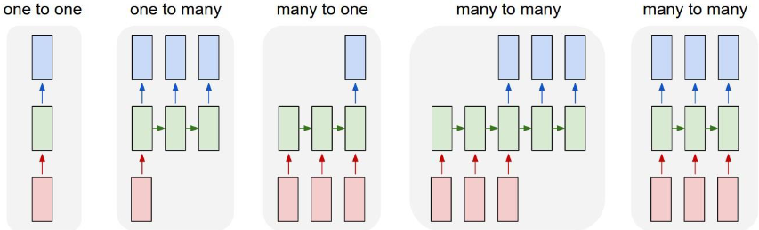
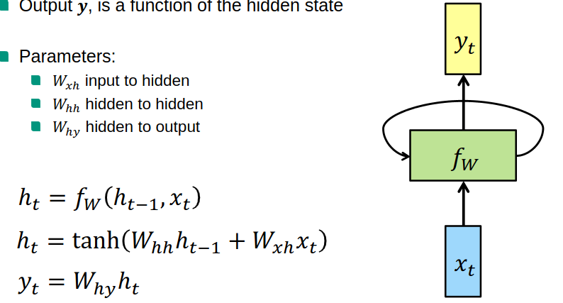
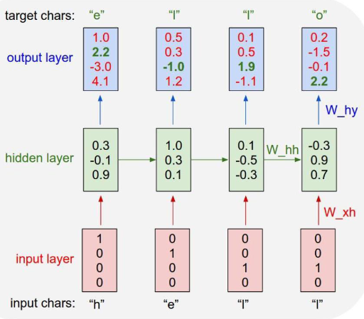
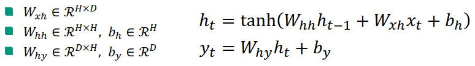
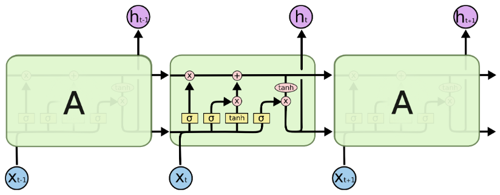
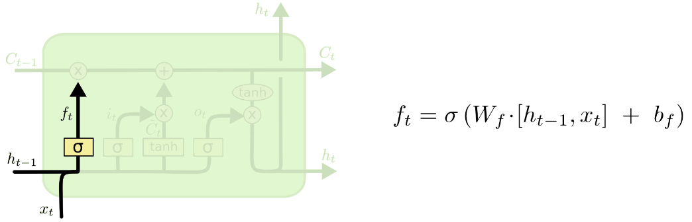
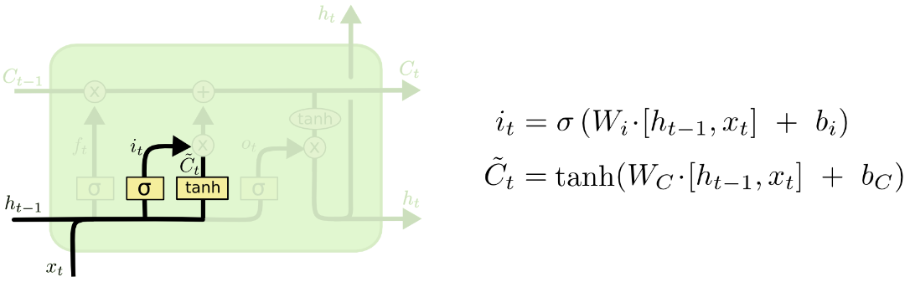
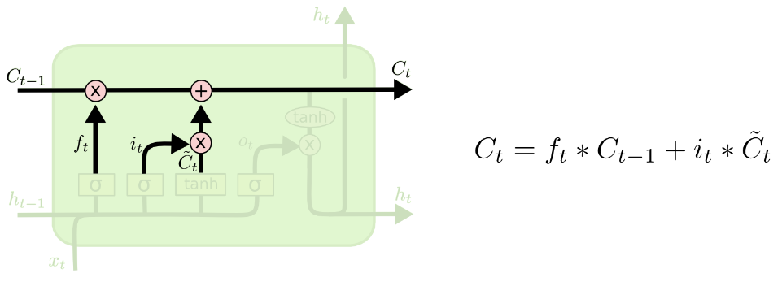
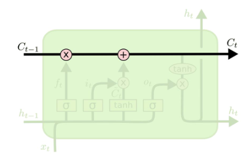
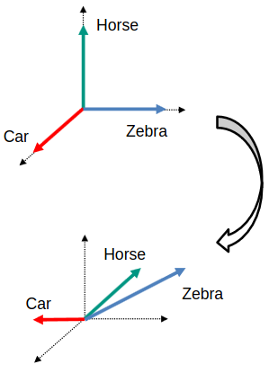

# Intro
1. Until now: Feed-forward
1. How to process streams of data?
    - Sequences of words, frames in a video?
    - Not just classification of objects
    - Image / Video Captioning
        * Input: Image (Sequence)
        * Output: Word Sequence
    - Action Recognition

# Recurrent Neural Networks (RNNs)

1. What?
    - Input = sequence
    - Update state representation
    - State = function of current input + previous state
        * The function is parameterized with the weights (stay the same once learned)
    - 
1. Vanilla RNN
    - Single hidden vector h
    - Output y = function of hidden state
    - Use different weights for input -> hidden, hidden -> hidden and hidden -> output
    - depending on what output we want we can use another non-linearity
    - 
1. RNN Scenarios
    - Single input, Single output = standard feed-forward network
    - Single input, Stream of outputs = e.g. Image captioning
    - Stream of inputs, Single output = Stream classification, action recognition
    - Stream of inputs, Stream of outputs (seq-to-seq models) = machine translation
    - Stream of inputs, Stream of outputs (instant-output models) = per frame video classification
1. Character-RNN example
    - interesting to consider image and text processing together (same methods)
    - Similar to n-grams (predict next word given previous ones)
    - One-hot encoding (bit vector with element for each possible value, 1 if it)
    - 
    - Training
        * Definitions
            + D = vocabulary size
            + H = hidden size
            + n = sequence length
        * Step 1
            + Initialize model parameters
            + Draw weights randomly (from a Gaussian)
            + Biases = 0
            + 
        * Step 2
            + Unroll network
            + Computer forward pass (share weights across recurrences of characters? across the whole sequence?)
            + Compute prediction scores
            + Soft-max (for classification)
        * Step 3
            + Backpropagate gradients from every output
            + Use later outputs to update parameters multiple times
            + Gradients are calculated at each time step and either combined or update multiple times?
            + Update parameters (Gradient-descent)
    - Testing (Sampling)
        * Initial input (aka seed) - w0
        * Output scores
        * Compute soft-max
        * Pick character with highest score
        * Feed as input at next step
    - soft-max normalization, cross-entropy is the logical loss function
        * If output in continuous vector space: regression loss (n 2 loss?)
1. Vanishing / Exploding gradient
    - Unrolling the gradient at large distances (> 20)
    - Gradient at t-1 = Whh^T * dh_t
    - Vanishing (gradient -> 0) if largest eigenvalue of Whh < 1
    - Exploding (gradient -> Inf) if largest eigenvalue of Whh > 1
1. Long Short-Term Memory (LSTM)
    - More complex: two states (Cell State Ct & hidden state ht)
    - Prevents gradient problems: Additive changes instead of multiplicative ones (like RNN)
    - 
    - Forget gate
        * How much of the previous cell state is retained
        * Looks at previous hidden state and new input
        * Sigmoid with weight and bias
        * 
    - Input and new cell state
        * How much of the new input is used to generate the current state
        * Also looks at previous hidden state
        * new cell state = tanh => [-1, 1]
        * 
    - Update cell state
        * Consider the forget gate
        * Add modulated info from the new input
        * Create new cell state and pass it forward
        * 
    - Output gate
        * How much is passed to the next state
        * Also looks at previous hidden state and new input
        * Modulate new cell state to produce new hidden state
        * Weight the output
        * 
    - Cell state
        * Straight line with little interaction
        * Allows gradient to flow easily
        * Gradients are added and **not** multiplied
        * 
1. Multi-layer RNNs
    - An RNN going deeper similarly to CNNs and MLP
    - Typically improves results
1. Gated Recurrent Units (GRUs)
    - Similar performance to LSTM with less parameters
    - Reset gate: controls the previous state
    - Output gate: modulates the new hidden state with the old one
1. Seq-to-seq models (Machine Translation)
    - Translate sentence from one language to another
    - Dataset contains a parallel corpus
    - <EOS> = End of Sequence tag
    - Encode input sentence Decode output sentence (Encoder-Decoder models)

# Embeddings
1. Word embeddings (vector representations)
    - How to represent words?
        * Problem with one-hot: dimension = vocabulary size => impractical for large vocabularies
        * We want a compact representation which captures semantics
    - Class similarity (horse similar to zebra)
    - Word2Vec
        * Classes = binary vectors
        * One hot vs class similarity:
        * 
        * How to get semantic labels?
            + Supervised: manually provide labels (very expensive, subjective labeling)
            + Unsupervised: automatically learn similarity between words based on how they appear in text (leverage large-scale corpora, data-driven semantic learning)
    - Skip-gram Model
        * Words in same context share semantic meaning (euro,dollar = currency; car,bus = vehicle)
        * How?
            + Sliding window of fixed size with target word as center
            + Input: one-hot vector encoding of the target word
            + Output: Probability distribution of each word being a context (to the target)
            + Goal: Maximize the probability of the target words given a context word
        * Fully-connected feed-forward neural network
        * Training objective:
            + Learn embeddings which are good at predicting nearby words
            + Train on large corpora (billions of words)
            + Learn many words (millions)
            + Typical embedding size: 100 - 1000
        * Captures similarities using simple algebraic operations
            + v(king) - v(man) + v(woman) is closest to v(queen)
1. Semantic sentence representations
    - Like Word2Vec, but for sentences
    - Skip-Thoughts (similar to Word2Vec skip-grams)
        * Try to predict neighborhood sentences
        * Tries to model semantic meaning
        * Not good at distinguishing details
