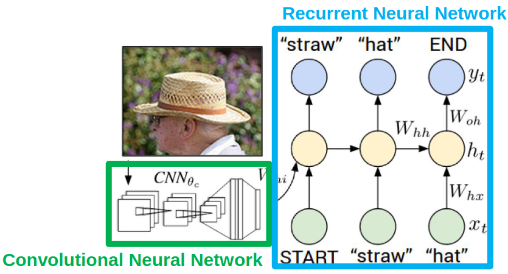
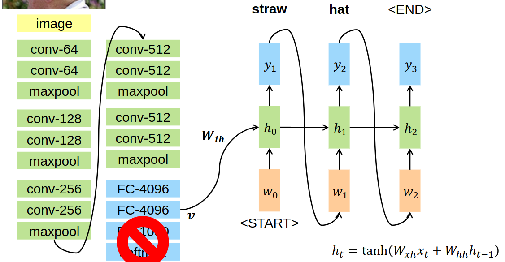
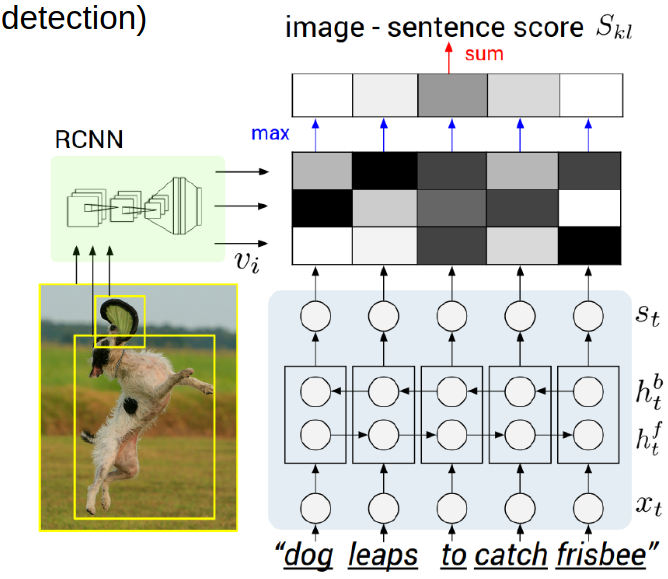
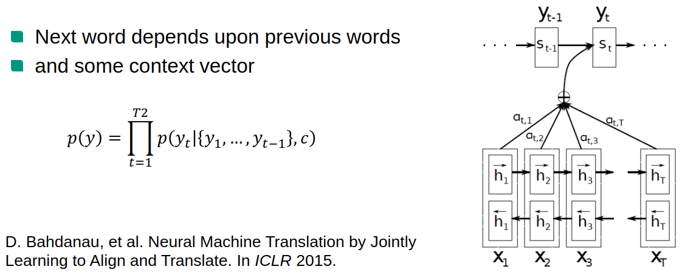
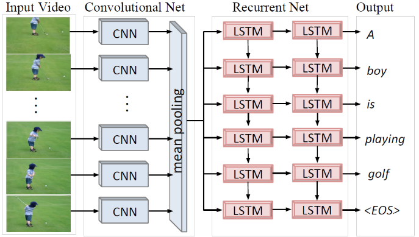

mage](/image](images//
# Intro
mage](/image](images//
1 Image Captioning
mage](/image](images//
    - Generating text which explains what's happening in a picture
mage](/image](images//
1. Pre deep learning
mage](/image](images//
    - Every picture tells a story
mage](/image](images//
        * Meaning space = triplet <object, action, place>
mage](/image](images//
        * Create template-based sentences
mage](/image](images//
    - BabyTalk
mage](/image](images//
        * Detect objects
mage](/image](images//
        * Create sentences based on object neighborhood
mage](/image](images//
1. CNN + RNN
mage](/image](images//
    - 
mage](/image](images//
    - Vision Deep CNN = feature extractor
mage](/image](images//
    - Language Generating RNN = description
mage](/image](images//
1. VGG CNN RNN
mage](/image](images//
    - 
mage](/image](images//
    - Simple VGG Network, trained on ImageNet
mage](/image](images//
        * Uses 3x3 conv and 2x2 max pooling layers
mage](/image](images//
    - As feature extractor
mage](/image](images//
        * discard last layers
mage](/image](images//
            + FC-1000 for the classes, softmax for probabilities
mage](/image](images//
        * FC layers output a summary of the image as a X-dimensional vector
mage](/image](images//
        * Output can be used to train various networks (e.g. SVM, RNN, etc.)
mage](/image](images//
    -  Connecting CNN & RNN
mage](/image](images//
        * CNN output + weight = first hidden state
mage](/image](images//
        * generate a description in each iteration and use it for the next one
mage](/image](images//
        * CNN stays pre-trained and RNN is learned
mage](/image](images//
1. Evaluation Metrics
mage](/image](images//
    - Info
mage](/image](images//
        * Captioning usually uses machine translation metrics (how well do sentences match?)
mage](/image](images//
        * Subjective task => metrics are dicey
mage](/image](images//
    - BiLingual Evaluation Understudy (BLEU)
mage](/image](images//
        * Measures precision (ratio between matching and words in generated sentence)
mage](/image](images//
        * Example:
mage](/image](images//
            + Hyp: the cat is on the mat
mage](/image](images//
            + Ref: there is a cat on the mat
mage](/image](images//
            + Unigram BLEU score = 1
mage](/image](images//
            + n-gram BLEU scores = count how many n-word pairs match
mage](/image](images//
        * Problem: "on the mat" gets high score
mage](/image](images//
        * BLEU-4 used, supposed to be good English
mage](/image](images//
    - Metric for Evaluation of Translation with Explicit Ordering (METEOR)
mage](/image](images//
        * Measures recall (ratio between matching and words in reference sentence)
mage](/image](images//
        * Example:
mage](/image](images//
            + Hyp: on the mat sat the cat
mage](/image](images//
            + Ref: the cat sat on the mat
mage](/image](images//
            + unigram precision = 1, recall = 1
mage](/image](images//
            + Fmean = (10 * P * R) / (R + 9P) = 1
mage](/image](images//
            + Meteor = (1 - mapping penalty) * Fmean
mage](/image](images//

mage](/image](images//

mage](/image](images//

mage](/image](images//
# Deep Visual-Semantic Alignments
mage](/image](images//
    - Can also generate relations between objects in the image and the output text
mage](/image](images//
    - Uses a dataset of images and sentence descriptions. Correspondences are inferred.
mage](/image](images//
1. Alignment of image boxes with words
mage](/image](images//
    - Feed image through RCNN (object detection)
mage](/image](images//
    - Pass sentence through a bidirectional RNN
mage](/image](images//
    - Compute matching scores between region boxes and words
mage](/image](images//
    - 
mage](/image](images//
1. Attention
mage](/image](images//
    - People look at "salient/prominent" regions of an image
mage](/image](images//
    - It helps guide vision and stabilize the input
mage](/image](images//
    - Idea: model attention into machines to improve understanding
mage](/image](images//
    - Task: predict image saliency
mage](/image](images//
    - In translation
mage](/image](images//
        * Use probability distribution in each step to emphasize a different word (handles using weights)
mage](/image](images//
        * weight the words based on which step we're in
mage](/image](images//
        * When predicting words: look at which previous word has highest influence?
mage](/image](images//
        * 
mage](/image](images//
    - In image captioning
mage](/image](images//
        * Spatial relation is gone after feature generation
mage](/image](images//
        * Also create features based on the location in the image
mage](/image](images//
        * Soft attention: weighted combination of softmax over the locations
mage](/image](images//
        * Hard attention: only pick highest-scoring location (not nice for end-to-end training)
mage](/image](images//

mage](/image](images//

mage](/image](images//

mage](/image](images//
# Video Captioning
mage](/image](images//
1. Intro
mage](/image](images//
    - sequence-to-sequence: Generate descriptions of what's happening in the video
mage](/image](images//
    - 1 whole description or smaller ones for each part?
mage](/image](images//
    - Much harder than images: need to analyze motion and actions
mage](/image](images//
    - Types: still camera, ego motion, movie clips
mage](/image](images//
1. Pre-deep
mage](/image](images//
    - Analyze motion, objects, obtain pose in video
mage](/image](images//
    - HMMs for sentence generation
mage](/image](images//
    - Hand-crafted with fixed-vocabulary outputs
mage](/image](images//
1. CNN, Mean pool, RNN
mage](/image](images//
    - 
mage](/image](images//
1. Attention in Video captioning
mage](/image](images//
    - Temporal relations (as opposed to spatial)
