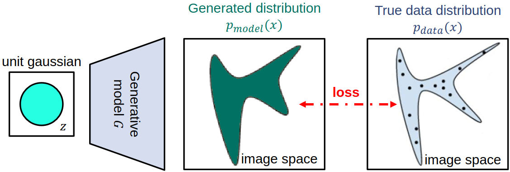
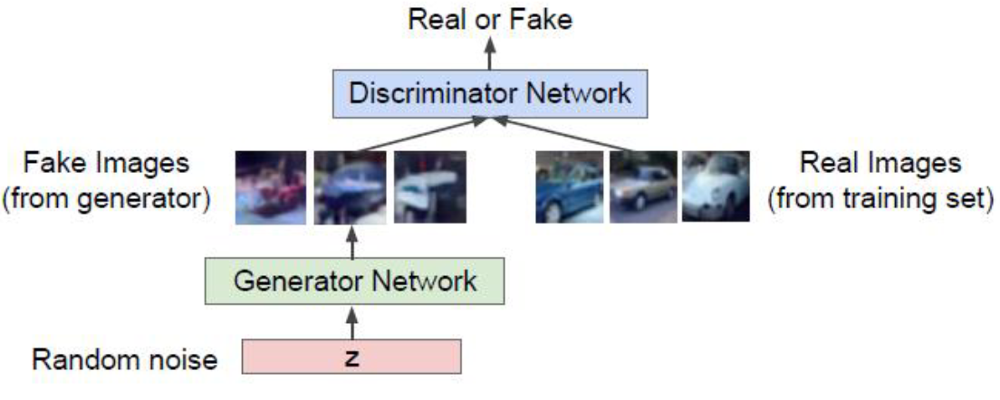
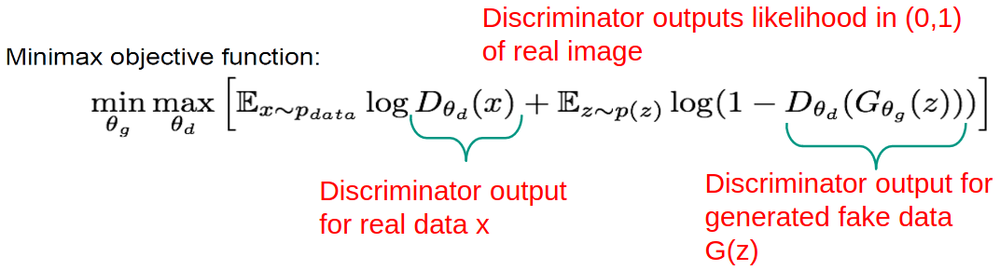

mage](/image](images//
# Generative Models
mage](/image](images//
1. Goal: Given training data: generate new samples from the same distribution
mage](/image](images//
1. Density estimation
mage](/image](images//
    - A core problem in unsupervised learning
mage](/image](images//
    - Explicit: define and solve for Pmodel(x)
mage](/image](images//
    - Implicit: learn model that can sample without learning it
mage](/image](images//
        * Train a network which models the distribution
mage](/image](images//
        * The generated distribution should be close to the target one
mage](/image](images//
        * General idea
mage](/image](images//
            + Sample a code vector from a fixed, simple distribution (e.g. spherical Gaussian or uniform distribution)
mage](/image](images//
            + The network computes a differentiable function which maps the vector to an instance in data space (a similar image)
mage](/image](images//
            + Training data: samples which originate from the true data distribution
mage](/image](images//
            + Loss function: how likely is the output to the true data distribution
mage](/image](images//
        * 
mage](/image](images//
        * Advantage
mage](/image](images//
            + we have a criterion for evaluating the quality of the output => gradient can be computed
mage](/image](images//
            + this allows for network parameters to be updated to generate better samples
mage](/image](images//

mage](/image](images//

mage](/image](images//

mage](/image](images//
# Generative Adversarial Networks (GANs)
mage](/image](images//
1. Idea
mage](/image](images//
    - Train two different neural networks
mage](/image](images//
    - The generator network tries to produce realistic-looking samples
mage](/image](images//
    - The discriminator network tries to distinguish between images from the training data and the generator network
mage](/image](images//
    - Aka: the generator tries to fool the discriminator
mage](/image](images//
    - 
mage](/image](images//
1. Training
mage](/image](images//
    - Train jointly in minmax game
mage](/image](images//
    - Discriminator tries to maximize its objective (real = 1, from generator = 0)
mage](/image](images//
    - Generator tries to minimize its objective (output to discriminator leads to 1)
mage](/image](images//
    - Alternating between gradient ascent and descent
mage](/image](images//
    - 
mage](/image](images//
    - Notes
mage](/image](images//
        * In practice, optimizing the generator does not work well
mage](/image](images//
        * The gradient signal is dominated by good samples => cannot improve bad samples
mage](/image](images//
        * **Better solution**:
mage](/image](images//
            + Generator goal = maximize likelihood of discriminator being wrong
mage](/image](images//
            + Gradient ascent on generator too
mage](/image](images//
            + Same objective of fooling, but with higher gradient signal for bad samples => works better
mage](/image](images//
1. Evaluating GANs
mage](/image](images//
    - If used for some downstream task - use the metrics in the task (e.g. classification accuracy)
mage](/image](images//
    - What we want from the model
mage](/image](images//
        * Sample quality (generated images should look real)
mage](/image](images//
        * Diverse samples (model should generate a variety of images)
mage](/image](images//
        * Generalization (model should generate new stuff, but just sample data)
mage](/image](images//
    - Inception Score
mage](/image](images//
        * Classify samples using pre-trained classifier model
mage](/image](images//
        * Compare the label distributions of the dataset and the generated output
mage](/image](images//
        * Bad score means
mage](/image](images//
            + the GAN does not generate images of a certain class (no class diversity)
mage](/image](images//
            + the GAN produces bad samples => classification data is useless (bad sample quality)
mage](/image](images//
        * Problem
mage](/image](images//
            + Catches class diversity, but not sample diversity (1 image from a class is enough)
mage](/image](images//
        * Frechet Inception Score
mage](/image](images//
            + Generate features using a pre-trained model
mage](/image](images//
            + Compare them using the Frechet distance
mage](/image](images//
            + Compare the feature distributions of the dataset and the generated output
mage](/image](images//
            + Should solve sample diversity
mage](/image](images//
    - Nearest neighbor
mage](/image](images//
        * Compute features using a pre-trained model
mage](/image](images//
        * Find closest neighbors of the generated images in the training data
mage](/image](images//
            + closest in feature space
mage](/image](images//
        * Should test whether the model memorizes training data
mage](/image](images//
1. Deep Convolutional GANs (DCGANs)
mage](/image](images//
    - Training traditional GANs resulted in 2 pathological behaviors
mage](/image](images//
        * The loss oscillates without converging
mage](/image](images//
        * "mode collapse": the model concentrates on a small subset of the data
mage](/image](images//
    - Performance is hard to assess
mage](/image](images//
    - Radford et al. to solve convolution
mage](/image](images//
        * Replace pooling layers with
mage](/image](images//
            + in Discriminator: strided convolutions
mage](/image](images//
            + in Generator: strided transposed convolutions
mage](/image](images//
        * Use Batchnorm
mage](/image](images//
        * Remove FC hidden layers
mage](/image](images//
        * ReLU in Generator + output uses Tanh
mage](/image](images//
        * LeakyReLU in Discriminator for all
mage](/image](images//
    - Interpretable Vector Math
mage](/image](images//
        * Can add and subtract images to produce outcome (man with glasses - man + woman = woman with glasses)
mage](/image](images//
1. Conditional GANs
mage](/image](images//
    - Until now: model density in high dimension and allow sampling => only useful for synthesis
mage](/image](images//
    - Most use cases require sampling from conditional distribution
mage](/image](images//
        * Examples: next frame prediction, image in-painting, semantic segmentation, image-to-image translation
mage](/image](images//

mage](/image](images//

mage](/image](images//

mage](/image](images//
# Image-to-image Translation
mage](/image](images//
1. Pix2Pix
mage](/image](images//
    - Translates: edges -> realistic photo, image -> segmentation map, gray-scale image -> color image
mage](/image](images//
    - Generator: DCGAN architecture with skip connections (concatenate channels)
mage](/image](images//
    - Discriminator: convnet which scores overlapping patches and averages the final one
mage](/image](images//
1. Cycle GAN
mage](/image](images//
    - Motivation
mage](/image](images//
        * Pix2Pix requires pairs of samples with pixel correspondence
mage](/image](images//
        * Often want to translate between 2 samples (e.g. image of apples -> image of oranges)
mage](/image](images//
        * If we have paired data -> supervised learning. Paired data is hard to find
mage](/image](images//
    - This learns to do that from unpaired data
mage](/image](images//
        * Train 2 generators (1 for each direction)
mage](/image](images//
            + The output of each should be indistinguishable from its real life equivalent
mage](/image](images//
            + => use 2 discriminator networks too
mage](/image](images//
        * Generators should be cycle-consistent
mage](/image](images//
            + mapping A -> B -> A should return the original image
mage](/image](images//
        * Total loss = discriminator loss + reconstruction loss (squared error between original and reconstruction)
mage](/image](images//
1. Advanced GANs (recent development)
mage](/image](images//
    - BigGAN
mage](/image](images//
        * Brock et al.: How do you scale up models?
mage](/image](images//
            + Batch size 2048 => better performance, but unstable in later iterations
mage](/image](images//
            + Models with 160M parameters
mage](/image](images//
            + Sth with noise
mage](/image](images//
        * Able to synthesize diverse 512x512 images
mage](/image](images//
        * In training: class leakage => mix properties of different classes (dog + ball = dogball)
mage](/image](images//
    - SPADE
mage](/image](images//
        * Goal: Semantic Image Synthesis (generate an image which follows a semantic structure)
mage](/image](images//
            + Pix2Pix washes away semantic information
mage](/image](images//
            + encode the semantic mask and then decode the natural image
mage](/image](images//
        * Explanation
mage](/image](images//
            + omit the encoder, inject the semantic mask at different scales into the generator
mage](/image](images//
            + spatially-adaptive (de)normalization (use semantic map to modulate the activations)
