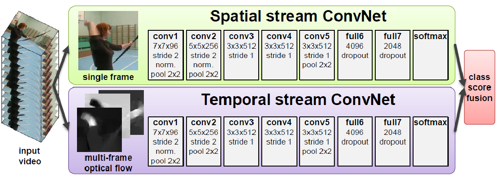

mage](/image](images//
# Activity Classification
mage](/image](images//
1. CNN Models (temporal connectivity patterns)
mage](/image](images//
    - 
mage](/image](images//
    - Single Frame
mage](/image](images//
        * No temporal information
mage](/image](images//
    - Late Fusion
mage](/image](images//
        * Look at 2 frames, separated by F frames
mage](/image](images//
        * Both frames go into separate paths
mage](/image](images//
        * Last layers see the temporal connection
mage](/image](images//
    - Early Fusion
mage](/image](images//
        * Convolutional filters also include temporal context
mage](/image](images//
    - Slow Fusion
mage](/image](images//
        * Higher layers have access to more context
mage](/image](images//
        * Learn motion patterns at different scales
mage](/image](images//
        * Frames overlapping in time
mage](/image](images//
    - Multiresolution
mage](/image](images//
        * Two paths: center and whole image
mage](/image](images//
        * 
mage](/image](images//
    - Evalutation
mage](/image](images//
        * Not much better than just using single images
mage](/image](images//
1. Two-stream ConvNet
mage](/image](images//
    - 
mage](/image](images//
    - Spatial stream = one image
mage](/image](images//
    - Temportal stream
mage](/image](images//
        * Optical flow = info about movement, movement vectors used (works with controlled background)
mage](/image](images//
    - Not as good yet, because not enough annotated data
mage](/image](images//
1. P-CNN (Pose-based CNN)
mage](/image](images//
    - 
mage](/image](images//
    - Focus on the people in the video
mage](/image](images//
    - Try to detect their posture
mage](/image](images//
    - Constructing features
mage](/image](images//
        * Use RGB for appearance ones and estimated optical flow for motion ones
mage](/image](images//
        * Extract RGB and optical flow from frame given corresponding body joints => use as input for the two CNN
mage](/image](images//
1. C3D (3D Convolutional Networks)
mage](/image](images//
    - 
mage](/image](images//
    - 2D with space = stack frames and then convolute
mage](/image](images//
    - 3D kernels which also convolute deeper into the input (also learns weights of temporal changes) => many more parameters
mage](/image](images//
        * kernel depth < frame count
mage](/image](images//
1. CNN-RNN (Recurrent ConvNet)
mage](/image](images//
    - Feature extract with CNN & Sequence Learning with RNN
mage](/image](images//

mage](/image](images//

mage](/image](images//

mage](/image](images//
# Classification vs Detection
mage](/image](images//
1. Detection
mage](/image](images//
    - Extract parts which correspond to action X
mage](/image](images//
    - 
