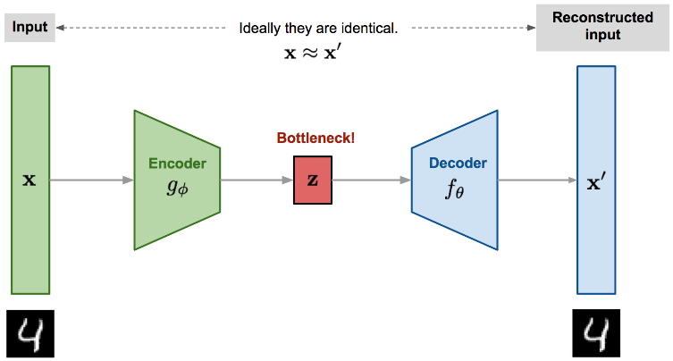
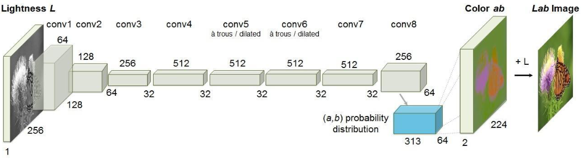
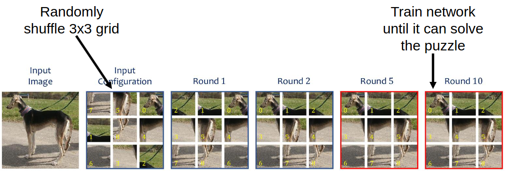

mage](/image](images//
# Problem
mage](/image](images//
1. Motivation
mage](/image](images//
    - Supervised learning requires x and y for forward pass and loss
mage](/image](images//
    - labels y can be very expensive
mage](/image](images//
    - Enormous amount of unlabeled data on the internet
mage](/image](images//
1. Idea
mage](/image](images//
    - Data = supervision
mage](/image](images//
    - Use the inherent structure of the data
mage](/image](images//
    - Give the network dummy tasks which help it understand the data
mage](/image](images//

mage](/image](images//

mage](/image](images//

mage](/image](images//
# Possible proxy objectives
mage](/image](images//
1. Reconstruction
mage](/image](images//
    - Autoencoders (encoder/decoder structure)
mage](/image](images//
        * 
mage](/image](images//
        * Goal: reconstruct the input image
mage](/image](images//
        * Loss = error between input and output
mage](/image](images//
        * The network is forced to learn a compact representation of the image
mage](/image](images//
        * Advantages
mage](/image](images//
            + Free labels (every input)
mage](/image](images//
            + No need for special setup
mage](/image](images//
        * Disadvantages
mage](/image](images//
            + Difficult for large images with small details
mage](/image](images//
            + Proxy losses often cannot model the real objective (lead to trivial outputs)
mage](/image](images//
    - Colorization
mage](/image](images//
        * 
mage](/image](images//
        * Similar, but input != label
mage](/image](images//
        * Input = grayscale version of an image
mage](/image](images//
        * Target = original colored version
mage](/image](images//
        * The network has to learn a meaningful representation to fill in the colors
mage](/image](images//
1. Context and Positioning
mage](/image](images//
    - 
mage](/image](images//
    - Take segments of the image and train the network to know how they best fit together
mage](/image](images//
    - General: think of a task which teaches the network the structure of the image without needing explicit labels
mage](/image](images//
    - Task setup: take 2 cropped parts of an image and try to see how the second one fits in (formulated as classification problem)
mage](/image](images//
    - Important to avoid trivial solutions through context abuse
mage](/image](images//
        * Example: connect lines and continue patterns
mage](/image](images//
        * Prevented by inserting gaps or making sure no 2 crops are next to each other
mage](/image](images//
    - Other Ideas:
mage](/image](images//
        * Give a bunch of rotations of an image, guess the correct one
mage](/image](images//
1. Temporal order of video frames
mage](/image](images//
    - What is a video?
mage](/image](images//
        * Temporal sequence of frames
mage](/image](images//
        * Inherent information: frame order
mage](/image](images//
            + Long-term: events
mage](/image](images//
            + Short-term: motions
mage](/image](images//
        * Neighboring frames are similar
mage](/image](images//
        * Has to be logically consistent (hold -> drop -> bowl)
mage](/image](images//
    - Shuffle and Learn (Misra et al. 2016)
mage](/image](images//
        * Extract short clips with high motion from video
mage](/image](images//
        * Generate positive and negative tuples (in-order and out-of-order)
mage](/image](images//
        * Classify data
