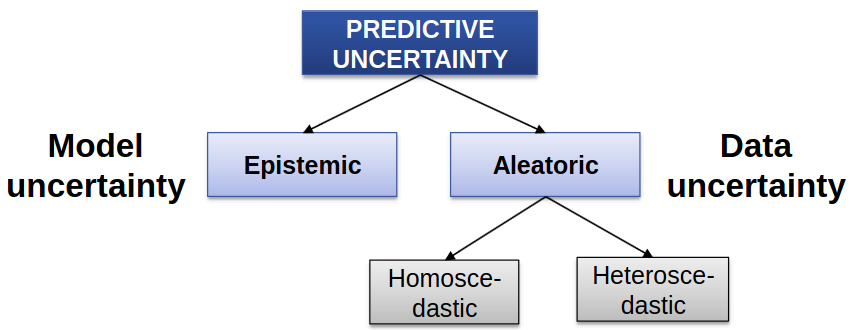

mage](/image](images//
# Challenges in Deep Learning
mage](/image](images//
1. Can we show the model's uncertainty?
mage](/image](images//
    - What is uncertainty?
mage](/image](images//
        * How does the model react to new data (not seen in training)
mage](/image](images//
        * What happens when data is noisy or the sensors are malfunctioning (imprecise measurements)
mage](/image](images//
    - Why do we need this?
mage](/image](images//
        * Dealing with breaking Deep Learning components (prevent, detect)
mage](/image](images//

mage](/image](images//

mage](/image](images//

mage](/image](images//
# Uncertainty
mage](/image](images//

mage](/image](images//
1. Types of uncertainty
mage](/image](images//
    - Aleatoric (data uncertainty)
mage](/image](images//
        * from Latin: dice player's
mage](/image](images//
        * Inherent noise
mage](/image](images//
        * Irreducible, but can be learned
mage](/image](images//
        * Homoscedastic: same for all inputs (e.g. imprecise sensors)
mage](/image](images//
        * Heteroscedastic: varies with input (e.g. far vs close objects)
mage](/image](images//
    - Epistemic (model uncertainty)
mage](/image](images//
        * from Greek: knowledge
mage](/image](images//
        * Reducible
mage](/image](images//
        * What does the model not know?
mage](/image](images//
1. Quantifying Epistemic Uncertainty
mage](/image](images//
    - Bayesian Neural Network (TODO: explain)
mage](/image](images//
        * Sample T times with Bernoulli distribution and average
mage](/image](images//
    - Confidence Calibration (TODO: explain)
mage](/image](images//
    - Ensemble (TODO: explain)
