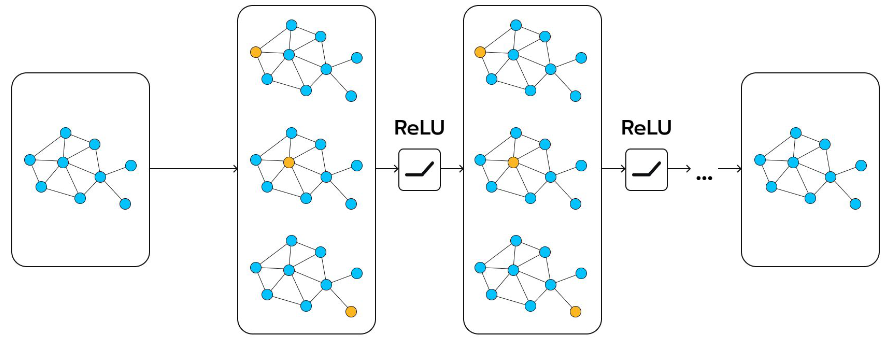

# Graphs
1. Each node contains a feature embedding (vector)
1. Graph-like Structures
    - Molecules
    - Connections in a social media
    - Words in a natural language
    - Pixels in an image
1. What can be solved with them?
    - Node classification
    - Link prediction
    - Graph classification
    - Community detection
    - Anomaly detection
1. Can't we just use NN to process graphs?
    - MLPs don't scale for large graphs
    - CNNs rely on spatial locality and ordered input
    - We need an approach which uses permutation-invariant functions to propagate the graph data

# Graph Neural Networks (GNNs)

1. What?
    - Do inference on the graph
    - Do stuff on single nodes of the graph
    - Pass information between nodes and repeat
1. Message Passing (MP)
    - Each node gathers messages (embeddings) from its neighbors
    - Messages are aggregated using a permutation-invariant function (e.g. sum)
    - Pass the result through a learnable function (e.g. MLP)
1. Notes
    - Having too many layers has a negative effect on performance

