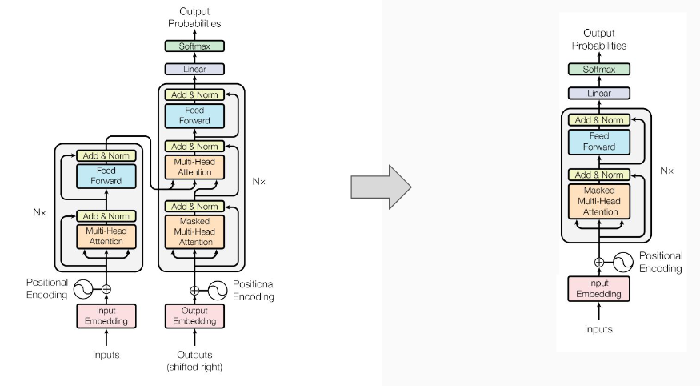
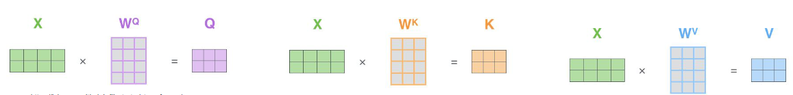
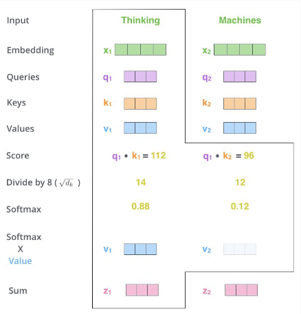
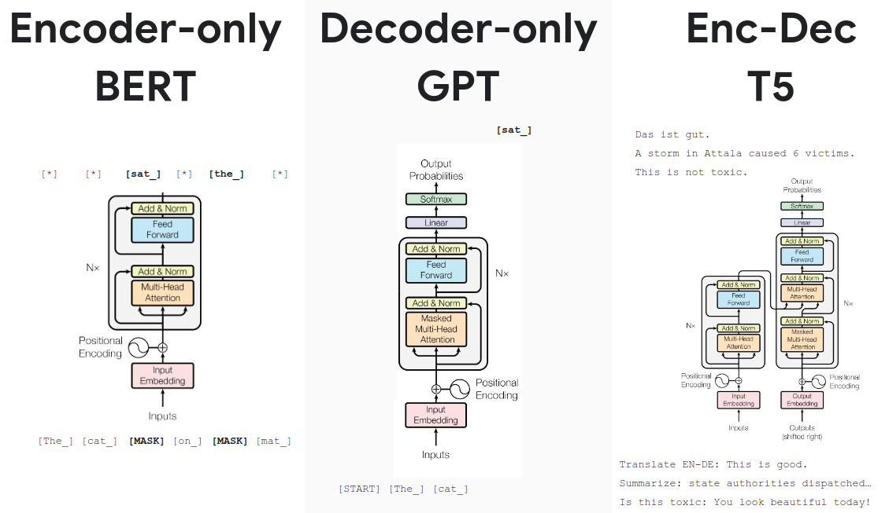
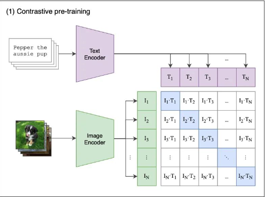

# Transformers
1. Pre-transformers era
    - Sequence prediction => RNNs
    - LSTM and GRU
    - Problems with RNNs
        * Sequential processing of inputs: slow computation
        * Localization: state mostly influenced by recent tokens
        * Single direction context: either left -> right or right -> left (partially solved by BiLSTM)
1. Transformers intro
    - Combines the attention mechanism of pre-existing Resnet-like MLPs
    - 
1. Attention mechanism
    - Intro
        * Initially used to enhance RNNs
        * Attention is all you need => remove recurrence & focus on attention
    - Used to create a contextualized representation of each token
    - Intuition
        * Similar to searching in a database
        * Each token "searches the DB" for relevant tokens
        * Query (Q) = represents what an input token is searching for
        * Key (K) = the public image of the token (helps others find it)
        * Value (V) = information that a token wants to share with others
        * Each token's representation is updated based on the most relevant tokens in the sequence
        * Q, K, V are acquired by multiplying the true value X to 3 linear projection matrices
            + 
1. Computing attention
    - 
    - Step 1
        * Calculate the attention score for each attention head (dot product of keys and queries)
            + influences amount of context transferred from others
        * Normalize individual scores (divide by sqrt of dimensions)
        * Normalize all scores (softmax => they add up to 1)
    - Step 2
        * Weight the values by the attention score
        * Result = contextualized representation of each token
            + each token becomes a convex combination of other ones in the context
1. Input tokenization (first pink in diagram)
    - Split the input into tokens (crucial for success)
    - Depending on modality (text, audio, images etc.)
        + Simple linear layers
        + Pre-trained token embeddings (NLP)
1. Positional encoding (yin-yang in diagram)
    - Attention is permutation invariable (order doesn't matter)
    - => Need to tell the network where words are
    - Encoding = smart way of adding a number to each token to preserve the order
1. Multi-header Self-attention (orange in diagram)
    - Communitation phase
    - Creates Contextualized Embeddings (take the entire context into account)
    - Uses Self-Attention Mechanism: scores computed for all tokens in the same context
    - Multiple Attention Heads: calculate multiple scores => captures different aspects of relationships
    - Weighting with Linear Layer: scores are combined and weighted using a linear layer
1. Token-wise MLPs (blue in diagram)
    - Computation phase
    - Every token is updated individually using GeLU 
        * GeLU = Gaussian error Linear Unit (fancy activation function)
    - Focus on individual features of the tokens
    - Store knowledge (in LLMs)
    - Contain the bulk of parameters
1. Residual Updates (add & norm in diagram)
    - Similar to ResNet
    - Add MLP residual to original input
    - Stabilizes training and enables deeper networks
1. Layer Norm (add & norm in diagram)
    - Normalizes the distribution and stabilizes training
    - Often before attention and linear layers, but open for debate
1. Stack N times (Nx in diagram)
    - Commonly 6-12 layers
    - More layers => can learn better abstractions
1. Output layer
    - Flexible depending on application
    - Commonly a linear layer
    - Can use arbitrary activation function
        * Softmax for class prediction
        * No activation for regression tasks
    - Don't need to use all output tokens
1. Types of attention
    - 
    - Self-Attention (encoding)
        * Keys & Values are from the same input sequence
    - Cross-Attention (decoding)
        * Keys & Values are from different sequence than Queries
    - Masked Attention (decoding)
        * Token 3 can only see 2 and 1

# Multimodal Machine Learning with Transformers
1. Idea: tokenize the input modalities and feed them as a joint stream to the model
1. Contrastive Language-Image Pre-Training (CLIP)
    - Vision and language foundation model
    - Contrastive pre-training with 400 Million image-text pairs
    - Encoders
        * 
        * Text = text transformer
        * Image = Resnet or vision transformer
        * Map the inputs into a shared latent space
        * Use cosine-similarity co compare inputs in the latent space
        * Self-supervised training
            + Sample a batch of (image,text)-pairs from the dataset
            + Encode separately and project onto the latent space
            + Compute the cosine-similarity of all pairs in the batch
            + Train using contrastive loss (if similar => should be close, if dissimilar => should be far)
