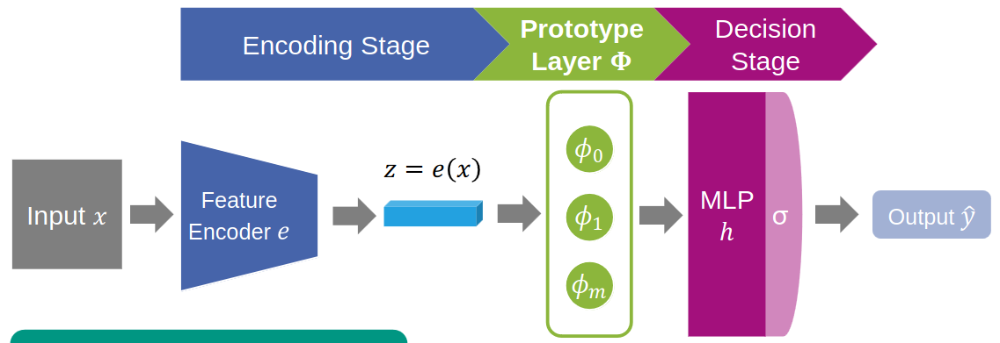
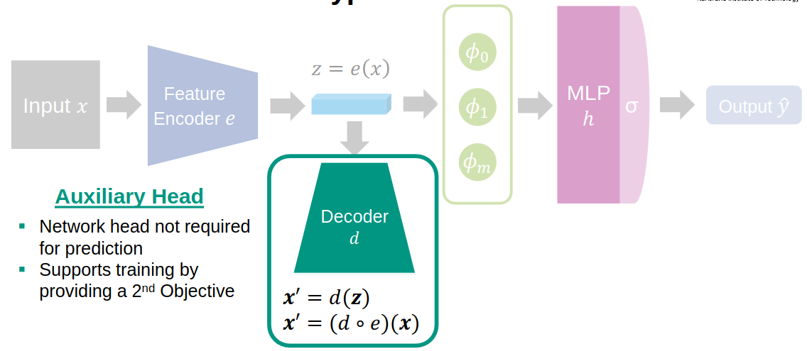
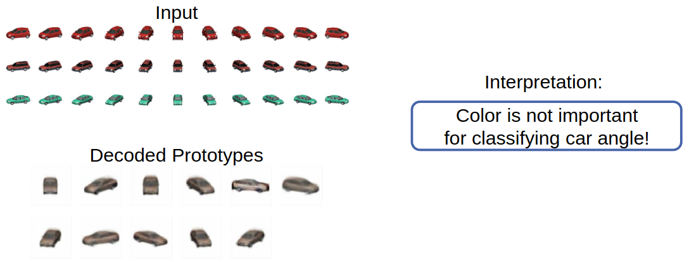
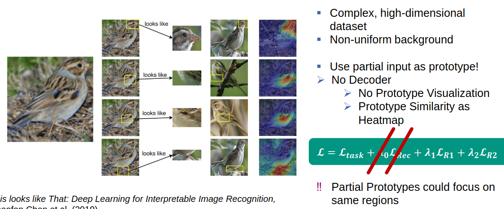
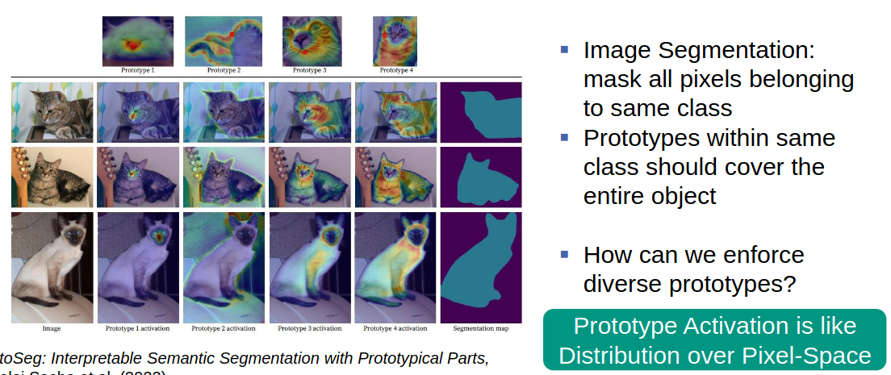
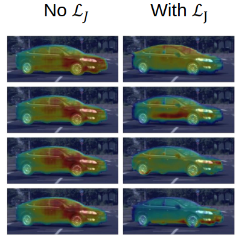
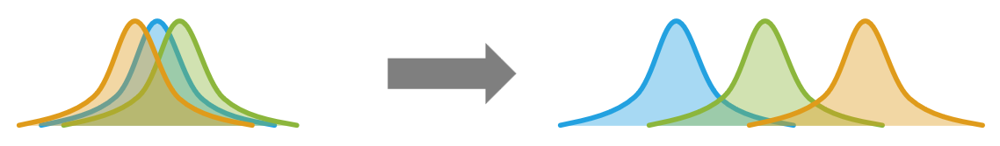
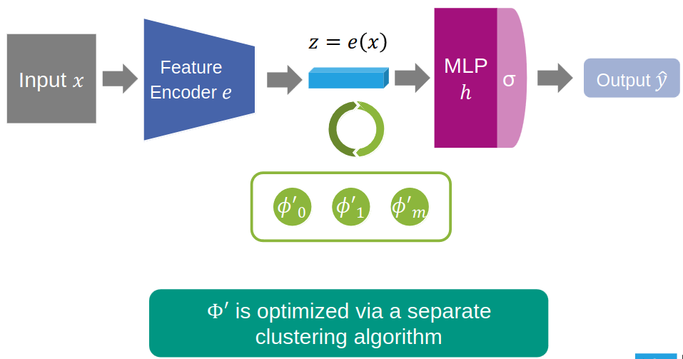

# What?
1. Directly Learning Interpretable Features
1. What are Prototypes?
    -  The most predictive representation
1. Approach
    - Before DL: Extract keypoints -> Cluster -> Compare with center
    - Computer Vision architecture: Input -> Feature encoder -> MLP -> Output
    - Idea: try to combine both approaches

# Learnable Prototypes
1. Properties
    - Optimized for Backpropagation
    - Fixed in number
    - Push embedding towards prototypes

1. Prototype layer
    - Each node represents a prototype

# Visualizing Prototypes
1. Can be done, but turns into nonsense
1. Idea: try to force the network to learn interpretable prototypes
1. Autoencoder
    - Limit number of nodes in hidden layer
    - Creates a bottleneck => learns relevant information (encourages latent representation)
    - Train with reconstruction loss
1. Reconstructable prototypes
    - 
    - Multiple loss functions
        * Main task loss
        * Reconstruction loss
        * LR1 loss = Each prototype is as close as possible to at least 1 training sample
        * LR2 loss = Each training sample is as close as possible to at least 1 prototype
    - Total loss = weighted sum of previous losses
    - Example: Cars (simple example)
    - 
    - Example: Bird species (partial prototypes)
    - 
    - Example: Cats (diverse prototypes)
    - 

# Diverse Prototypes

1. Kullback-Leibler (KL) Divergence
    - Similarity measure between two distributions
1. Jeffrey's Divergence
    - Uses KL Divergence
1. Try to force max divergence
    - 

# Non-Learnable Prototypes

