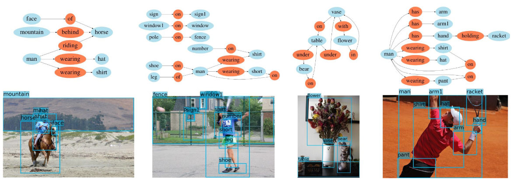
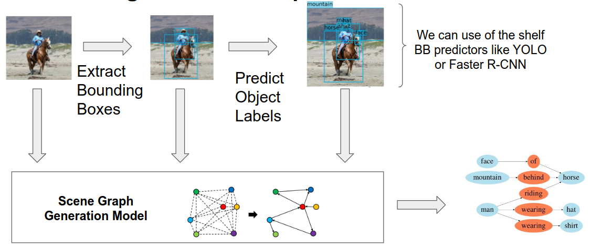

# Scene Graph Generation (SGG)
1. What?
    - Graphs which describe images in a compact way
    - In the context of explainability and interpretability
        * Graphs are generally interpretable (depending on size)
        * Explainability and interpretability of GNNs depends on the NNs used
        * Examples
        * 
1. How?
    - 
    - Main aspect: predicting relations between objects
        * Naive: connect all objects and predict => O(n^2) relations
        * More efficient: prune connections and predict
    - Pruning edges
        * Relational Proposal Network
            + Two learnable networks (asymmetric kernel functions)
            + Two projections and a multiplication
        * Statistical co-occurrence probabilities
            + Use class distributions of data
            + Data pre-processing needed + non-learnable
1. Why not use GNNs?
    - Message Passing usually done to do inference, not to change graphs
    - Graphs are a discrete data structure without a continuous underlying model
        * A grid is a discretization of a plane

# Graph Neural Diffusion (GRAND)
1. What?
    - GNNs relate to (heat) diffusion equations (form of Partial Differential Equations (PDEs))
    - PDEs tell us how a value changes in relation to position and also time
1. Spatial Diffusion Equations for Graphs
    - 
