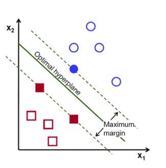
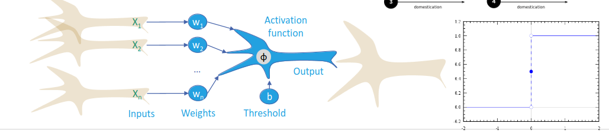
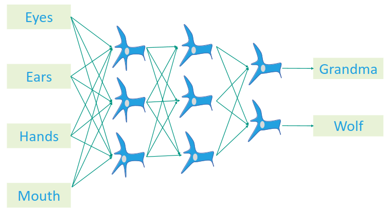

# What are Classifiers?
1. Goal: create a classifier from data
    - Optimize the function which assigns classes to data
1. Classes = contexts in which data was observed
1. Step 1 = Sample Windows
    - Specify period of time to be classified
    - Split data into windows of that size
    - Problem: window size affects classification results
    - Solution: choose empirically
1. Step 2 = Feature Extraction
    - Goal: Extract important info from context
    - What's important??? -> depends on context and sensors
    - Bad Features
        * Don't actually separate stuff
        * Example: Weight or roundness to separate apples from oranges
    - Good Features
        * Example: Color for apples and oranges
1. Step 3 = Classification
    - Append selected features to a feature vector
    - Training = feature vector + label
    - Classification = guess label based on vector

# Finding the optimal window size
1. Grid Search
    - Create a grid of all combinations of hyperparameters and their values (search space
    - Pros
        * Guarantees it will explore the whole search space
    - Cons
        * Can be expensive for large sizes
        * Hard to use on continuous values
1. Random Search
    - Randomly samples hyperparameters in the specified ranges of values
    - Pros
        * Time efficient and still finds near-optimal solutions
        * Handles continuous values more naturally
    - Cons
        * Might miss important combinations
        * In practice often more effective
1. Bayesian Optimization
    - Probabilistic approach
    - Surrogate model tries to model the objective function as a probability distribution
        * Surrogate models = Gaussian processes or Random Forests
        * Objective function = the model performance
    - Tries to maximize the an acquisition function 
        * acquisition function = chooses between exploitation and exploration
        * exploitation = sample where the objective function is likely to improve
        * exploration = sample new values
    - Pros
        * Efficient (less calculations) to get to near-optimal values
        * Adapts and learns from previous calculations
        * Provides uncertainty
    - Cons
        * Complex for many hyperparameters and expensive objective function
        * Adds hyperparameters (acquisition function)
    - Gaussian Processes (GPs)
        * Model a function as probability distribution in an infinite-dimensional space
        * Provides not only predictions, but also uncertainty
    - Random Forests (RFs)
        * Ensemble Learning using decision trees (bagging)
        * Train on random subset of data and features
        * Less prone to overfitting, because the trees are small

# Naive/Greedy Classifier Building
1. k-nearest neighbors (KNN) = simplest classifier
    - make a db of all the input data (vectors and labels)
    - use distance function to find k most similar points from the db to what we see
        * most often Euclidean distance (see image)
    - Pros
        * Choice/Existence of appropriate metric: Manhattan, Hamming, ...
        * Easy to implement
        * Storage in tree speeds up search
    - Cons
        * Low recognition rates
        * Susceptible to normalization???
        * lazy => computational intensity at classification time
        * High memory consumption (vector storage)
1. Naive Bayes 
    - learn probabilistic distribution of data and use it to infer context
        * = probabilities of a given data point occurring
    - Bayes' theorem (see image)
    - => calculate probability of class given sensor data (see image)
    - Random trick
        * We only care about the most probable class
    - usually uses log-scores instead of probabilities?
    - Example: spam filter
        * give scores based on frequency of words in data
    - Pros
        * good results, computationally simple
    - Cons
        * assumes uncorrelated data
        * over-simplification of distributions when using non-categorical inputs
            + non-categorical = on a continuous scale
1. Decision Tree (see image)
    - Tree where nodes = decisions over elements of the vector, leaves = labels
    - Linear split possible depending on features
    - Metrics for splits
        * Information Gain = reduction in entropy if data is split a certain way
        * Entropy = impurity of a set (uncertainty)
        * G(PlayGolf, Forecast) = E(PlayGolf) - E(PlayGolf, Forecast)
    - Approach: choose split which best separates the data
    - Descretation
        * Test every value as a potential split point
        * Optimization
            + random uniform subsampling
            + dynamic programming (recursively simplify complex problem)
    - Pruning
        * Reduced error pruning
            + iteratively replace leaf nodes with most popular class
            + if classification accuracy not affected - keep the change
        * Cost complexity pruning
            + remove subtrees that minimize some error metric

# More advances techniques
1. Support Vector Machines (SVM)
    - Create hyperplanes with max margin which separate data
    - 
    - Finding optimal kernel = convex constraint optimization problem with defined solution
    - Support vectors = vectors to the points that touch the boundary
    - Kernel trick for non-linear class
        * keep increasing dimensions until the set is separable
        * allows linear classification of non-linear data
    - Disadvantage
        * Choosing the kernel function and the parameters is critical
1. Perceptron
    - 
    - Simplest feed-forward neural network
        * connections between nodes don't form cycles
        * information gets passed forwards into the network
    - Simple activation function
        * the function which each node uses to create output given an input
        * linear := f(v) = a + v-b
        * ReLu := f(v) = max(0, a + v-b)
    - Learning (optimization) straight forward using least squares
    - Multi-layer perceptron
        * 
        * Neural Network Basics
            + neurons which weight input
            + weights define what pattern the neuron is matching
            + bias = min value for neuron to become really active
            + calculating weighted sum = weights (matrix) - activation (vector) + biases (vector)
            + activation = a value within a range, NOT a boolean
        * hidden layers
            + each layer contains neurons
            + layer activation = sigmoid (weighted sum) (see image)
            + each layer is supposed to pick up on a specific feature
            + learning = finding the optimal combination of weights and biases to achieve our task
        * typically only learnable through gradient decent (see image)
            + cost / loss function
                - evaluates the output of the neural network (which neurons are active)
                - sum of squared differences between expected value and result for each neuron
                - small sum = correct classification, large sum = bad classification
                - take average of all sums of training data
                - input = values of all neurons
            + Goal of gradient descent
                - we want to minimize the cost function
                - usually: look at slope, move until you find local minimum
                - steeper slope = bigger steps
            + Gradient descent
                - going in the opposite direction of the function's gradient at the current point
                - gradient (vector) of a function = direction of steepest ascent
                - trying to optimize the steps to finding a global minimum
                - negative gradient = steepest descent
                - put all weights and biases in a vector
            + Gradient descent in neural networks
                - negative gradient of cost function = vector
                - decreasing the cost function = adjust parameters given negative gradient
        * backpropagation (intuitive)
            + A way of computing the negative gradient of the cost function
            + the algorithm should adjust the neuron values proportionally to how far they are off from their expected values
            + How do you influence activation?
                - change the bias
                - change the weight
                - change the activation from the previous layer (indirectly)
            + The adjustment is different for each neuron in the layer
                - the desired changes are added up to come up with the final adjustment
            + Propagating backwards = calculating and applying the changes to the previous layer recursively
            + This needs to be done for all training examples => average the adjustments
                - the result of this is something proportional to the negative gradient of the cost function
            + This is very expensive, so we do Stochastic gradient descent
                - you shuffle the data
                - split it into mini batches
                - compute gradient decent with backprop step for each batch
        * backpropagation (technical)
            + We want to find out how sensitive the cost function is to the various weights and values)
                - ratio between the derivative of the cost function and each component (weight, bias)
                - each ratio is averaged between all training examples
1. Artificial Neural Networks (ANN)
    - Approach 1
        * 1 neural network 
        * 1 input per feature
        * 1 output per class
    - Approach 2
        * 1 network per class
        * 1 input per feature
        * 1 binary output for the class
    - Decision Function Block converts ANN output to classification

# Hyperparameters
1. Parameters
    - weights, thresholds, etc.
    - chosen by the machine learning mechanism
1. Hyperparameters
    - things that determine the model
    - type of model, feature subset, model depth/width, learning rate, activation function
1. Strategy
    - data set preparation, test/train splits, parameter initialization
1. Types of strategies
    - Metric-based
        * KNN: needs a good metric in the feature space
    - Greedy
        * Decision Tree: sensitive to data
    - Quadratic Optimization
        * SVM: "globally optimal" at the margin, requires Kernel for non-linear case
    - Gradient Descent
        * ANNs: prone to local minima, hyperparameters are critical
    - Blackbox
        * random / heuristic search: no assumptions

# Pros of neural networks
1. Optimization scheme well fit for GPUs/TPUs
1. Can learn embeddings
    - feature engineering = part of learning
1. Can be easily adapted
    - many hyperparameters

# Cons of neural networks
1. Real learning effort often not reported
    - many hyperparameters
1. Very complex
    - often easier ways to construct features
1. Difficult to improve using domain knowledge
