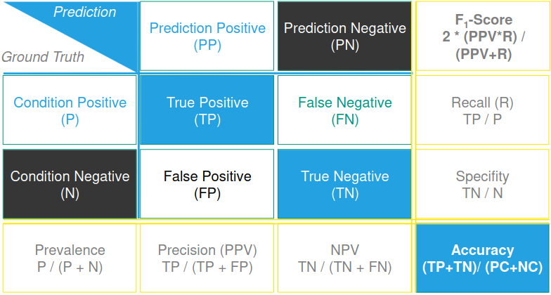

# Training and Testing
1. Goal: Evaluate / Improve model by testing
    - User test for each model not possible
    - Want to predict the realistic error of the model
    - Assumption: Model metric (accuracy) proportional to improvement

# Error measurements
1. Error rate
    - Positives = class is predicated correctly
    - Negatives = ... incorrectly
    - Accuracy  = proportion of correctly positives over whole set (P / (P + N)
1. Re-substitution
    - Use *training* data to test if the model works at all
    - See if model / function can be approximated
    - Look at effect of model complexity
    - Error Rate
        * Usually very close to 0%
        * Why not 0%?
            + The algorithms contain statistical decisions
            + The features don't clearly discriminate a class (even if the classifier were perfect)
        * Not a good indicator of performance on new data
        * Only shows how good the results are for the training data
    - Solution
        * Split data into training and test sets
        * Sets are selected randomly
        * Statistically independent sets (something with light sensors during the day and at night)
        * For context-sensitive systems
            + Sets may differ in passive context (data from different countries)
            + A testing strategy should reflect the test scenario (train on A, test on B and vice versa)
        * Assumptions:
            + both sets are representative of the problem we are trying to solve
            + larger training set = better classifier
            + larger test set = more accurate error estimation
            + low set independence = better test score
            + only tells us if the algorithm is applicable or not
1. Holdout
    - Split all data into training and test
    - Usually 1/3 test and 2/3 training
    - Basic: train-test-repeat
    - Ideally: train-validate-tune-train-validate-tune-...-test
    - When done: use all data for training (real life is the test)
    - Performance measurement tools
        * Confusion matrices
            + Summary of the model's predictions compared to the actual labels
            + 
        * Area Under Curve (AUC)
            + Aggregated metric
            + Plot the Receiver Operating Characteristic (ROC) curve (true positives (TP) x false positives (FP)) at various threshold values
            + AUC = area under ROC curve (0 - 1)
            + 0.5 = random guesses, model has no discriminatory power
            + >0.5 = model has some discriminatory power
            + 1 = perfect classifier, which perfectly distinguishes
            + robust to dataset imbalance (more examples of a given class)
        * Singular metrics
            + F-score (F1-score): harmonic mean between precision and recall
                - precision = ratio between TP and (TP + FP) (measures how well the model identifies positives)
                - recall (true positive rate) = ratio between TP and (TP + FN) (measures how well the model classifies all positives correctly)
                - harmonic mean
                    * Useful when dealing with ratios, rates and values with reciprocal relationships
                    * = n * (multiplication / sum)
                    * Gives more weight to smaller values => sensitive to outliers or extremes
                - Between 0 and 1, 1 = high accuracy in positive prediction and high coverage of positive instances
                - Especially useful when there is class imbalance
                    * Accuracy alone could be misleading (high accuracy by guessing majority class)
                - There are variations which weight the precision and recall (F1 means beta = 1)
            + G-score (Fowles-Mallows index): geometric mean of precision and recall
                - better than F-score when class imbalance & negative class is of interest
                - = sqrt(precision * recall)
    - Repeated Holdout
        * More reliable holdout by repeating
        * Randomly select training and test sets in each iteration
        * Average error rates for final error rate
1. x-fold Cross-validation
    - repeated holdout not optimal (different test sets cause overlap)
    - this avoids the overlap
    - What is it?
        * Split the data into x subsets of equal size
        * In each iteration use a different subset for testing and rest for training
        * Average the error estimates
        * Usually x = 10, because it works well :)
    - Improvement of cross-validation
        * Repeated Cross-validation
            + Repeat and average results
    - leave-one-out cross-validation (LOOCV)
        * Special case of x-fold cross-validation
        * x-fold = (N-N/x; N/x)
            + N-N/x training
            + N/x validation
        * x = N => (N-1; 1)
        * Foreach record in the dataset: train on the rest and test on it
        * Procedure
            + Train on everything but record x_i
            + Evaluate on x_i and see if correct or in error
            + Repeat for all i (1 - N)
            + Total error = proportion of incorrectly classified x_i
        * Features
            + Makes good use of (small) datasets
            + Does not involve random subsampling
            + Stratification (even distribution of classes in sets) not possible 
                - Since each instance is used for training/validation
            + Computationally expensive
        * leave-one-subject-out cross-validation (LOSO-CV)
            + Best when data is organized in subjects/individuals
            + Problem: cross-validation assumes statistical independence of data
            + Solution: leave a whole subject out for validation
                - measure inter-subject performance
            + Divide data by subject
            + Do cross-validation (ensure each subject is used for validation once)
        * timeseries cross-validation
            + Tries to catch temporal connections between data
            + Rolling window: train on data in the window
1. The 0.632 bootstrap
    - Sample of size N (bootstrapping sample)
    - The rest is test
    - err = 0.632 * err_test + 0.368 * err_train
    - Accounts for pessimistic testing error

