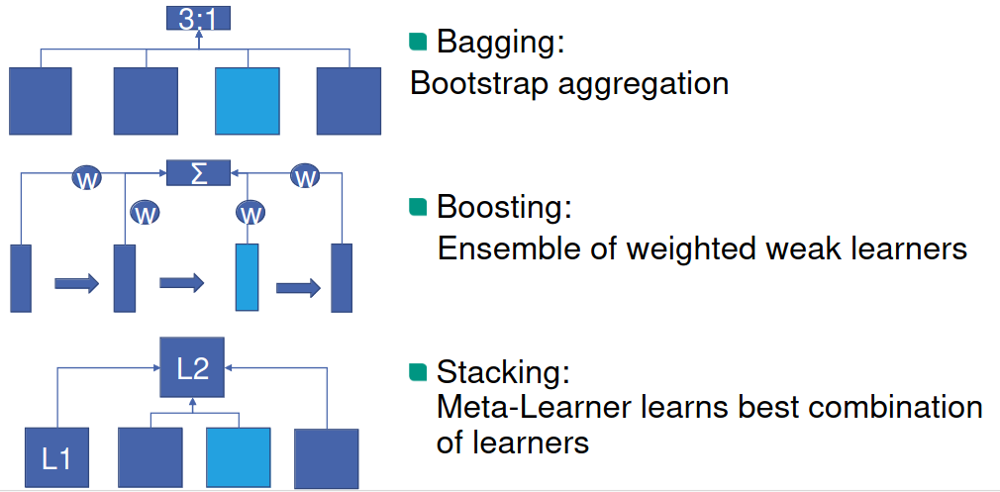

# Realistic Metrics
1. Cost-sensitivity
    - Classification
        * Take into account the different costs of errors in case of a misclassification
        * Tries to classify high-cost class only when very confident
        * Cost matrix = stores the costs of various kinds of misclassifications per class
    - Learning
        * Resampling / Weighting of instances according to costs
    - Ocram's Razor
        * Best model is the simplest one which describes all data
        * An overly complex model can cause overfitting
1. Ensemble Learning
    - What?
        * Combining multiple Models
        * Build different simple models and let them decide together
        * Advantage: often improves predictive performance
        * Disadvantage: output usually hard to analyze
    - 
    - Bagging
        * Combines predictions by voting / average (less variance, more classifiers = better)
        * Idealized version: train a classifier for each training set and combine their results
        * Unstable learning scheme -> small changes in data make big changes in model
        * With cost: use confidence and weight
    - Decision trees (Forests) (TODO: image)
        * Bagging = multiple trees in the forest
        * Bagging -> Bootstrap Aggregation
        * Resample 63.2% of data N times with replacement as training
        * Decision trees sensitive to data (good when training independent classifiers)
        * Rest is test data (Out of Bag Error)
            + Find all models which aren't trained on a sample
            + Compare majority vote with ground truth
            + Calculate the error over all instances
        * Forests implicitly show confidence of prediction (number of trees which share the prediction)
        * Randomization
            + Use random parameters or initial weights for different classifiers
            + Typically randomizes features
    - Boosting
        * Intuition: models should be experts that complement each other
        * Use previous models' performance to influence current one
        * Current model becomes expert for instances miclassified by earlier ones
        * Final result = weighted sum of all results
        * Examples: AdaBoost, LogitBoost, OptionTrees
    - Stacking
        * No voting, meta learner combines the predictions
        * Predictions of base learners = input to meta learner
        * Black magic? (Hard to analyze)
        * Can be used as initialization for automatic model selection

# Features
1. Feature Extraction
    - Goal: extract important information for context differentiation
    - What's important? Depends on context and sensors
    - Features in time and frequency domain
    - Sample windows
        * Segment data into windows of size X (period of time to be classified)
        * Window length greatly affects results
        * In practice: empirically evaluated per application
1. Types of Features
    - By Context
        * Location (GPS, WIFI/BlueTooth fingerprint)
        * Walking speed (Variance in accelerometer)
        * Group affiliation (Corss-correlation, Kullback-Leiber divergence)
        * At work (calendar information)
    - By Sensor
        * Wearable context (activity) recognition
            + Time: mean, root mean square, magnitude area (AUC), variance, standard deviation, correlation (between sensors)
            + Frequency: FFT peak(s)
        * Audio context recognition
            + Time: zero crossing rate, amplitude fluctuation, ...
            + Frequency: frequency centroid, bandwidth, spectral roll-ff point, fluctuation of amplitude-spectra
        * Video: out of scope
        * Others: social networks, radio signals, EEG, Motion capturing (kinect)
        * Radio Frequency Sensor: mostly same as audio
    - How to find the right ones?
        * Look at related work for similar applications
        * If not - empiricism and heuristics
        * Brute force: try out all combinations
        * Optimized: feature subset selection algorithms

# Feature Subset Selection
1. Feature selection
    - Correlations of sensors typically seen in many applications
    - Find best classifier by turning off features and testing
    - Filters
        * Rank individual features based on statistical significance to the output variables (classes)
        * Select variables regardless of model
        * E.g. remove correlated features or least significant component
        * Use mutual info, correlation or distance/similarity scores for ranking/selection
        * Tradeoff between redundancy and relevance: minimum-Redundancy-Maximum-Relevance
    - Wrappers
        * Evaluate subsets of features (train and test models)
        * Good performance, risk of overfitting
        * Computationally complex
    - Embedded Methods
        * Coupled with learning mechanisms (to see which features are least important)
        * Recursive Feature Elimination algorithm: repeatedly construct model with SVM and remove features with low weights
        * Computationally between filters and wrappers
    - Adding features can increase or decrease accuracy (regardless of information gain)
1. Recursive Feature Elimination
    - Recursively eliminate n least important features until accuracy goes down (significantly)

# Feature Learning
1. Clustering: K-Means
    - Algorithm
        * Randomly select k initial centroids
        * For each data point: calculate distance from the centroids and assign to closest one
        * Update each cluster's centroid by calculating the mean
        * Repeat until convergence: no changes in assignment or max iterations reached
    - Minimize variance within clusters using simple heuristic approach
    - Feature = Vector Quantization (map the original, continuous, feature vector to its corresponding centroid)
1. Density-based clustering: DB-Scan
    - Finds dense areas of data points (separated by sparser ones, aka noise)
    - Algorithm
        * Define parameters:
            + Epsilon: max distance between two points to be considered neighbors
            + MinPts: min number of points needed to form a dense region
        * Identify points:
            + Core points: point with at least MinPts others within its epsilon-distance neighborhood
            + Border Point: point which has fewer than MinPts in epsilon-distance, but is close enough to a core point
            + Noise Point: none of the above
        * Find all core and border points and their clusters
        * Everything else is noise
    - No need to specify number of clusters
    - Finds clusters of arbitrary shape
    - Robust to outliers
    - Choosing Epsilon and MinPts is black magic (need understanding of data)
1. Deep Learning (each layer learns more sophisticated features)
1. Autoencoders (learn a compact representation of the data => dimensionality reduction)
