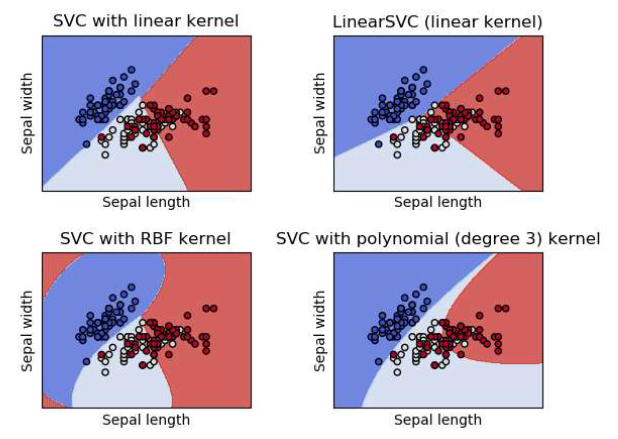
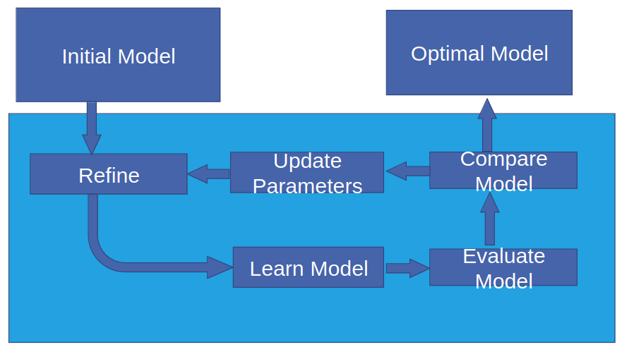
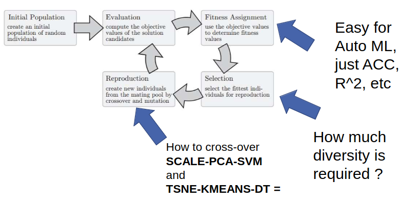

# Choosing the best SVM Kernel

1. TODOs
    - Always do crossvalidation (performance on unseen data)
    - Tune hyperparameters (c, gamma, degree)
    - Data size and complexity also plays a role (use computationally efficient kernels when complex)
1. Linear SVM
    - Use when data is linear (can be separated by a straight line / plane / hyperplane)
    - Computationally efficient, work well when number of dimensions is larger than data points
1. Radial Basis Function (RBF) SVM
    - Useful when data non-linearly separable
    - Requires careful tuning of hyperparameters, else - overfitting
1. Polynomial SVM
    - Use when data separable by polynomial boundary (quadratic, cubic)
    - Useful when decision boundary has a curved shape
    - Requires hyperparameter tuning (degree)

# General info on optimization
1. Blackbox optimization
    - 
1. Requirements
    - Must haves
        * General search method or blackbox (no Gradients needed)
    - Should haves
        * Flexible searchspace definitions
        * Scalable search
    - Could haves
        * Constraints

# Bayesian Optimization
1. 
1. Basics
    - Useful when function evaluations are expensive and gradients are not available
    - Uses a surrogate model to approximate the process
    - Aims to maximize the acquisition function (improving objective vs approximation)
1. How it works
    - Initial Sample points
        * Pick a set of initial values
        * Evaluate the objective function on the values to get the initial data points
    - Surrogate (Probabilistic) Model
        * Idea: capture the underlying behavior of the objective function
        * Common choices: Gaussian Processes (GP), Random Forests, etc.
    - Acquisition Function
        * Chooses where to sample next
        * Exploration = sample in uncertain regions
        * Exploitation = sample in regions where the function will be optimal
    - Update Surrogate Model
        * Evaluate the objective function on the new sample
        * Update the model with the data point and its uncertainty
    - Repeat until stop
    - Stopping criteria
        * Max number of iterations
        * Time budget
        * Acquisition function converges
1. Pros
    - Can leverage prior knowledge (choice and initialization of surrogate model)
    - Data efficiency
1. Cons
    - Inherently sequential (no parallelization)
    - Not obvious how to achieve variable output lengths

# Evolutionary Algorithms
1. 
1. Tree-based Pipeline Optimization Tool (TPOT)
    - AutoML tool (automate data preprocessing, model selection, hyperparameter tuning)
    - Helps with building and optimizing ML pipelines
    - Uses genetic programming: Searches a set of pipelines for the one best suited for a given task
1. Neuro Evolution
    - Mutates neural nets instead of general ML-pipelines
    - Everything is built out of homogeneous structures (neurons)
    - Existing good crossover strategies (NEAT)
    - Gradually increasing search space size
    - Prefers small models (=> complex)
1. Pros
    - Utilize prior knowledge (initialization)
    - Can evaluate individuals in parallel
    - Varied output length (increase genome length)
1. Cons
    - Bad data efficiency (a lot of randomness)

# Reinforcement Learning
1. What is it?
    - Not comparable to supervised or unsupervised learning
    - An agents tries to maximize their reward by influencing the environment with actions
    - Usually modeled with Markov Decision Processes (MDPs)
    - Use a NN to train another NN
1. Monte Carlo Tree Search for Feature Sub-Set Selection
    - Select
        * Navigate from the root to a leaf node of a decision tree
        * Balances exploration and exploitation
    - Expand
        * Add nodes which represent potential decisions (features)
    - Simulate
        * Simulate the remainder of the game using the new nodes
        * In our case: kNN classifier (because doesn't need retraining)
    - Backpropagate
        * Update results back up the tree (visit counts, rewards)
1. Pros
    - Output variability (using sequence models like RNNs)
1. Cons
    - Unclear how to use prior knowledge
    - Can be parallelized, but not as easily as EAs
    - Data efficiency: search is guided by reward, but converges slowly

