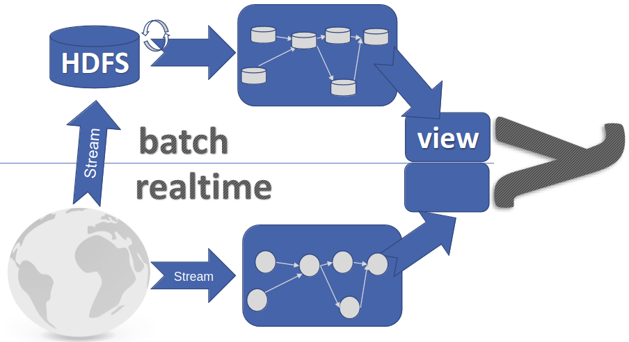
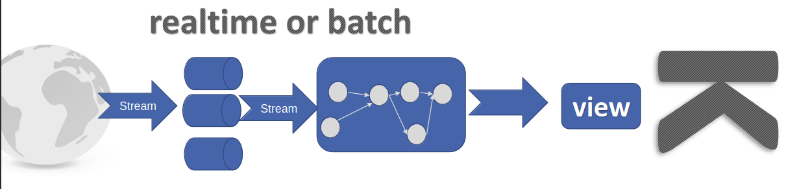
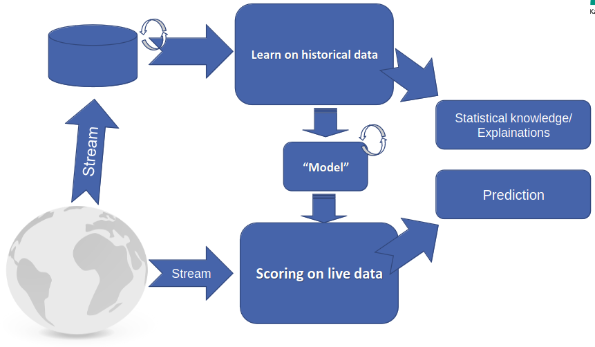
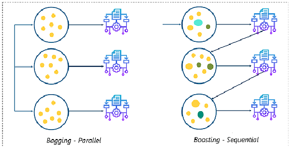

# Parallelization
1. Challenges to distributed machine learning
    - Optimization algorithms are often sequential
    - Complex functions & feature spaces require iterative training control
    - Most algorithms keep a lot of state
    - The state variables are strongly depended, so they need to be synchronized
1. Lambda Architectures (Function composition)
    - 
    - Combines batch and real-time data processing
    - Consists of 3 layers
        * Batch layer
            + Managing historical data and batch processing
            + Stores the whole dataset and periodically processes batches
            + Often uses distributed data processing frameworks for large-scale batch computations
            + Can be used for training the model on historical data
        * Speed layer
            + Processes real-time data
            + Low-latency processing, suitable for processing data as it arrives
            + Can be used for real-time predictions or anomaly detection
        * Serving layer
            + Serves query results to end-users or downstream apps
            + Combines the results of the previous layers
            + Can serve model predictions to apps and services
1. Kappa Architectures
    - 
    - Tries to handle real-time data in a more streamlined and efficient way
    - Simpler, since everything is a stream (no more batches + streams)
    - Has 3 layers
        * Stream Ingestion layer
            + Similar to the Speed layer in the Lambda architecture
            + Collects and ingests real-time data streams from multiple sources
        * Stream Processing layer
            + Processes and Analyzes the incoming data in real-time
            + Can do data enrichment, aggregation, filtering, even ML model inference
        * Serving layer
            + Same as in Lambda architecture
1. ML-Architectures
    - 
1. Scoring
    - Predictive Model Markup Language (PMML)
        * A way to export the model to XML
        * Pass it to a scoring model to get a result
    - Open Neural Networks Exchange (ONNX)
        * A more modern approach
            + Computational graph representation
            + Nodes = operations (convolution, activation, etc.)
            + Edges = data flow
1. Batch / Parallel Learning
    - Hadoop
        * = HDFS + MapReduce
        * Map: turns data into key-value pairs (e.g. sorting)
        * Reduce: collects all the outputs and merges them
            + Receives one key with all values (k, list(v))
        * Properties
            + Scalable (reliably processes petabytes)
            + Economical (distributes data and processing across clusters)
            + Efficient (processes data on nodes where it is located)
            + Reliable (automatically does data redundancy and redeploys failed tasks)

# Parallelizing classification
1. Challenges
    - Problem while learning: Many models work on a single in-memory model (R/W dependencies hinder parallelization)
    - Classification is usually high-dimensional (hadoop works in on dimension => need transformations)
    - Need real-time scoring (hadoop built for batch processing => only use for learning and score elsewhere)
1. Bagging vs boosting
    - 
1. TODO: look at more

# Batches in Gradient Descent
1. Useful for parallelization
    - Initially: batches improve performance
    - Parameter server = split data in batches and calculate in parallel
1. Parameter servers
    - Duplicate nodes and push the mini batches through (TODO: image)
    - Trends
        * Data parallelism more common than model
        * Models often too big for a single GPU
        * Pipelining
            + Similar to process optimization (TODO: image)
            + Ideally: different nodes/workers can process different batches
1. PipeDream
    - Forward and backwards passes (next layer - on next system)
1. Parameter Servers
    - Classical
        * Everyone sends their result to one machine
        * It calculates a result and sends it back to everyone
    - All Reduce
        * Everyone sends to everyone
        * Each machine calculates for itself
    - Ring reduce (Aggregation)
        * Iterate in a circle: Send to next and average

