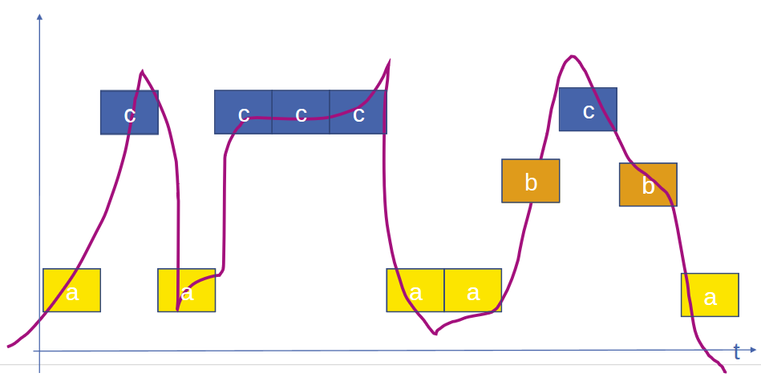
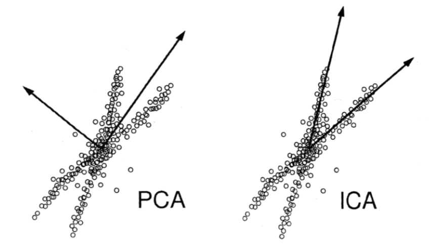

# Finding good features
1. Feature sub-selection
    - Finding the best classifier by turning off features
    - Filters
        * All features -> Select best subset -> Learning algorithm -> Performance
        * E.g. eliminate correlated features or least significant component
    - Wrappers
        * Evaluate subsets of features
        * High computational complexity
        * Good performance with overfitting risk
    - Embedded Methods
        * Coupled with learning mechanisms
        * Recursively create models and remove features with least weight
        * Computationally in between
1. Minimum-Redundancy-Maximum-Relevance
    - Best k features
        * Select top k features based on criteria (information gain, importance score, mutual information, etc.)
        * Try to retain the k features which most contribute to the current task
        * Usually involves ranking all and getting the top k
    - K best features
        * Need exactly k features, so want the best ones
        * Choosing most suitable of all instead of ranking and prioritizing
        * Most often used where there is a constraint on the number of features
    - Usually trade-off between relevance and redundancy

# Feature Learning
1. Sample sensor data and use windowing
1. Unsupervised Feature Learning
    - K-Means
    - Density-based clustering: DB-Scan
    - Symbolic Aggregate approXimation
        * 
        * Convert continuous data into discrete symbols (each symbol is a range of values)
        * Symbols are chosen based on statistical properties of the data distribution (e.g. Gaussian)
    - Principal Component Analysis
        * Aims to reduce dimensionality while preserving variance
        * Principal components = orthogonal (uncorellated) axes around the data
            + First = most variance, second = second-most, etc. (helps preserve information)
        * Linear combination of features
    - Independent Component Analysis
        * Seeks to find statistically independent components
        * Separates a multivariate signal into additive, independent components
        * Non-linear: assumes that the data is a linear combination of non-Gaussian, independent source signals
        * Useful for source separation (split audio signals into speech, music, etc.)
    - 
    - Self-organizing maps (Kohonen maps)
        * Topology preservation = similar points in the high-dimenional input are similar in the low-dimensional output
        * Units with weight vectors which are fitted to the input data
1. Neural Networks
    - Compression and Encoding
        * Input -> Hidden -> Output
            + Input and Output have same number of neurons
            + Hidden layer usually has fewer neurons
        * Goal: Minimize error between input and output
    - Autoencoders
        * Encodes the input into the hidden layers
        * Decodes the hidden into an output
