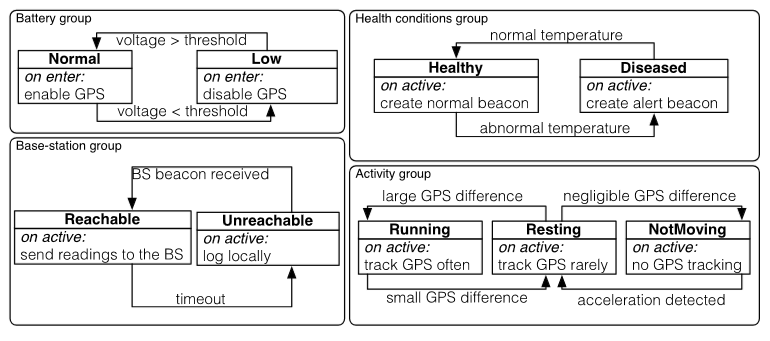
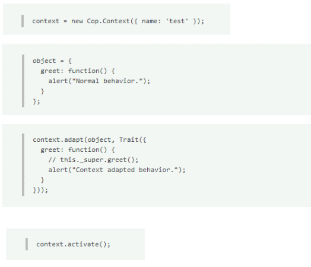

# Hadoop, Parallelization, Kappa-Architectures

# Context-aware Software
1. Adaptation
    - Automatically disable phone sound in quiet areas
    - Show parking spots and gas stations while driving
    - Decrease playback quality when battery is low
1. Recap: Schilit
    - Proximate Selection
        * UI technique where contextually-relevant objects or highlighted or made easier to choose
    - Automatic Contextual Reconfigurations
        * Rewiring components and presentation based on context
    - Contextual Information and Commands
        * Produce different results based on the context
    - Context-Triggered Actions
        * IF-THEN rules which specify how a context-aware system should behave
1. Adaptation of phone given context
    - Option 1: if-else based on status
        * Tangled, Scattered, Fixed
    - Option 2: Strategy pattern with different implementations
        * Infrastructural burden
        * Anticipated adaptation points
1. Reasons for non-adaptation
    - Software rigidness
        * Variability is hard-coded in the architecture
        * Difficult to add new variants non-invasively
    - Lack of modularity
        * Tight coupling between core business logic and infrastructural code
        * Makes it hard to maintain and evolve
    - Mindset mismatch
        * Programmers should know the context of the app to make it adaptable
1. Hypothesis: need more context-aware tools (languages, frameworks)

# Context-oriented Programming
1. Basics
    - Context
        * Represents a specific environment
        * Contains variables, properties and conditions
        * Are dynamic: can be created or removed during program execution
    - Layers
        * Can introduce or override variables or behavior
        * Can be (de)activated based on program behavior
        * Organized in a stack (higher takes precedence)
    - (De)Activation
        * Useful for reverting to state of lower layers
        * Helps manage changing of context
    - Behavioral Adaptation
        * Program behaves differently based on context
        * Code can change based on context
    - Dynamic Composition
        * Layers can be added on removed at runtime
    - Context-Awareness
        * Designed to recognize and adapt to current context
    - Challenges
        * Complexity of managing layers and resolving conflicts
    - 
    - 
