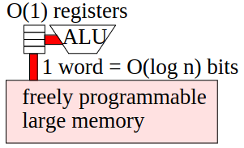
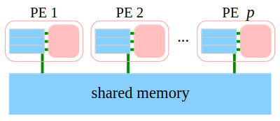
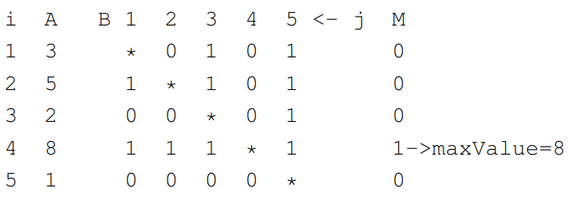

# Sequential Algorithms
1. RAM Architecture (von Neumann)
    - 
1. Algorithm Analysis
    - I = problem instance
    - T(I) = count computer cycles
    - T(n) = Worst case (depends on problem size) = max T(n), n = |I|
    - avg T(n) = Average case = sum T(I) / count I
        * Example: Quicksort
            + avg = O(n logn)
    - Randomized algorithms
        * T(n) is a random variable
        * We care about the expectation
        * Don't mix up with avg case
        * Example: Quicksort with random pivot
            + E[T(n)] = O(n logn) = expected value
    - O(.) lets us ignore constants
    - Secondary goal: memory
    - Execution time depends on parameters
        * Example: Dijsktra
            + Depends on n and m (nodes and edges)

# Parallel Algorithms
1. PRAM Model (Parallel RAM)
    - 
    - Idea: change RAM as little as possible
    - Processing Elements (PEs)
        * p of them, numbered 1..p OR 0..p-1
        * every PE knows p and its own number
    - One machine instruction per clock cycle
    - PE are synchronous
    - Shared global memory
1. Memory Access Conflicts
    - EREW = Exclusive Read Exclusive Write
        * Concurrent access is **forbidden**
    - CREW = Concurrent Read Exclusive Write
        * only **one PE can write**, every else can read
        * = broadcast
    - CRCW = Concurrent Read Concurrent Write
        * Everything is possible
        * Types:
            + common: all writers have to agree on the value (e.g. OR)
            + arbitrary: someone succeeds (NOT random)
            + priority: PE with smallest ID writes
            + combine: values are combined (e.g. SUM)
1. Pseudocode
    - Explicitly Parallel loops (see max below)
    - Single Program Multiple Data (SPMD)
1. Examples
    - Global OR
        * Input in array x[1..p]
        * Initialize memory[result] = 0
        * Run in parallel
            + if x[i] then memory[result] = 1
    - Global AND
        * memory[result] = 1
        * if not x[i] then memory[result] = 0
    - Maximum on Common CRCW PRAM
        * 
        * Input: A[1..n]                            // distinct elements
        * Output: M[1..n]                           // M[i] = 1 iff A[i] is max
        * forall (i,j) in {1..n}^2                  // create a nxn matrix
        *     dopar B[i,j] = A[i] >= A[j]           // each entry = 1 if >=, 0 otherwise
        * forall i in {1..n}                        // for each row
        *     dopar M[i] = AND B[i, j], j in {1..n} // = AND of all values in the row
        * O(1) time
        * Theta(n^2) PEs (a lot!)
1. Algorithm Analysis
    - Basically one extra parameter: p
    - T(I, p) = execution time
    - Problem: interpretation
    - W = p*T(p) = Work: cost measure
    - T inf = infp T(p) = Span: measures parallelizability
    - S = Tseq / T(p) = (absolute) Speedup
        * Use best known sequential algorithm!
        * Srel = T(1) / T(p) = Relative Speedup: is usually different
    - E = S / p = Efficiency
        * Goal E = 1 or at least Theta(1)
