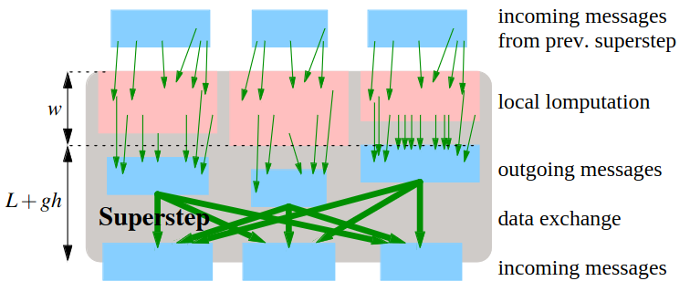

# Shared Memory
1. TODO: models
    - 
1. TODO: atomic operations

# Complex Memory Hierarchies
1. TODO: explain

# Interconnection Networks
1. TODO: explain
1. Fully Connected
    - Point-to-Point
        * E = VxV
        * Single-ported (but may be bidirectional)
        * Tcomm(m) = alpha + m*beta
            + m = message length (machine words)
            + alpha = 
            + beta = 
        * hand waving = not very precise
    - Variants
        * Half Duplex = send OR receive (aka simplex)
        * Telephone = send AND receive from one PE
        * (Full) Duplex = send AND receive to/from anywhere
        * Tduplex <= Ttelephone <= Tduplex/2 <= 3*Tduplex
1. Bulk Synchronous Parallel (BSP)
    - Machine described by p, L, g
    - L = Startup overhead for one collective message exchange (involving all PEs)
    - g = gap = computation speed / communication bandwidth
    - SuperStep = Work locally, then collective global synchronized data exchange with arbitrary messages
    - Time = w + L + g*h
        * 
        * w = max. local work (in work cycles)
        * h = h-relation = max. number of machine words sent or received by a PE
    - BSP vs Point-to-Point
    - BSP*
    - BSP+
    - TODO: describe above

# MapReduce
1. 
