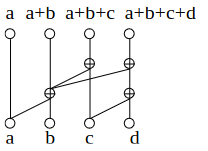
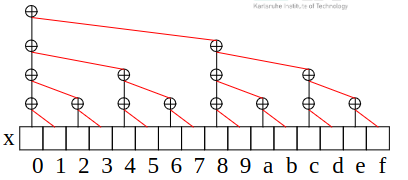
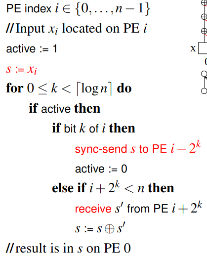
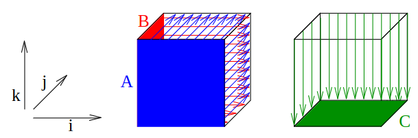
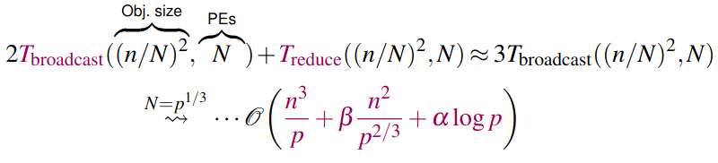

# Graph- and Circuit Representation of Algorithms
1. Many algorithm can be represented as a directed acyclic graph
    - 
    - Indegrees are bounded by a small constant
    - Input nodes have
        * Indegree = 0
        * A fixed output
    - Output nodes have
        * Indegree = 1
        * Outdegree = 0
    - Inner nodes compute functions (which can be computed in constant time)
1. Circuits
    - Variant of graph
    - Constant number of bits is processed as opposed to machine words
    - Depth = d(S) of a computation-DAG = number of nodes on the longest path between an input and an output
        * ~= time
    - Circuit family = all circuits with a given input size

# Associative Operations (= Reductions)
1. Definition
    - + = associative operator which can be computed in constant time
        * => +xi = ((((x0 + x1) + x2) + ...) + xn-1)
    - Can be computed in O(log(n)) time on a PRAM
    - Examples: +,\*,max,min, ...
1. Algorithm
    - 
    - PRAM Code
        * i in {0,...,n-1} // PE index
        * active = 1
        * for 0 <= k < round(log(n)) do // iterate to calculate indices
        *   if active then
        *       if bit k of i then      // k = 0 => PE has odd index
        *           active = 0
        *       else if i+2^k < n then  // check if there is a value to take
        *       // makes sure this works when n is not a multiple of 2
        *       // if n=5, PE 4 doesn't have anyone to take a value from (i in 0-4)
        *           xi = xi + x(i+2^k)  // add my value to that of the next PE
        * // Result is in x0
    - Analysis
        * Time = O(log(n))
        * Speedup = O(n/log(n)) (Tseq = linear = n)
        * Efficiency = O(1/log(n))
1. Brent's Principle (Less is More)
    - Inefficient algorithms get efficient by using less PEs
    - Idea: p PEs, each adds a subset of the elements (size = n/p) -> parallel sum
    - Time = Tseq(n/p) + Theta(log(p))
    - Efficiency = 1 - Theta((p*log(p)) / n)
    - => less PEs better if n >> p*log(p)
1. Distributed Memory Machine Code
    - 
    - Analysis
        * Fully connected: Theta((alpha + beta) * log(p))
        * Linear array: Theta(p) (step k needs 2^k)
        * Linear array with router = Fully connected, since edge congestion is 1 in every step
        * BSP: Theta((L + g) * log(p)) = Omega(log(p)^2)
            + arbitrary n > p: additional time Tseq(n/p)
1. Discussion
    - Graph = binary tree => logarithmic running time
    - Useful for most models
    - Brent's Principle

# Matrix Multiplication
1. Problem Definition
    - A,B = matrices in R^(nxn)
        * A = ((aij)), B = ((bij))
    - R = semiring
    - C = ((cij)) = A * B
        * cij = Sum(aik * bkj), k in [1, n]
        * = row * col
    - Work: Theta(n^3) arithmetical operations
        * Better algorithms if R allows subtractions (Ring or Körper)
1. Basic PRAM Algorithm
    - Basics
        * n^3 PEs, one for each sum cikj
    - Code
        * for i in [1, n] dopar
        *   for j in [1, n] dopar
        *       cij = Sum(aik * bkj), k in [1, n] // n PE parallel sum
    - Analysis
        * Time = O(log(n))
        * Efficiency = O(1 / log(n))
1. Distributed Implementation I
    - Basics
        * p <= n^2 PEs
        * Assign n^2 / p of the cij to each PE
    - Code = same
    - Analysis
        * Limited scalability
        * High communication volume (Time = Omega(beta * (n^2 / sqrt(p))))
1. Distributed Implementation II
    - Basics
        * n is multiple of N
        * Idea: view A,B,C as NxN matrics
            + each element is an n/N x n/N matrix
            + Example: n = 9, N = 3, each element is a 3x3 matrix
        * p = N^3 => 1 PE for each mini-matrix multiplication (cikj = aik * bkj)
    - Intuition
        * Imagine communication as a cube, where matrices are on the side and result is at the bottom
        * 
        * Storing A:
            + Store A on the front (aik in PE (i,k,1))
            + Broadcast A depth-wise (for j in [1,N]: PE (i,k,1) broadcasts aik to PEs (i,k,j)
        * Storing B:
            + Store B on the left side (bik in PE (1,k,j))
            + Broadcast B width-wise (for i in [1,N]: PE (1,k,j) broadcasts bik to PEs (i,k,j)
        * Computing C:
            + Compute mini-matrix multiplications locally cikj (inside the cube = PE (i,k,j))
            + Sum up ^ vertically (for k in [1,N]: PEs (i,k,j) compute cij = Sum(cikj), k in [1,N] and store in PE (i,1,j)
    - Code = same, but iterate until N
    - Analysis: fully connected
        * Storage = cheap
        * Compute mini-matrix multiplications: Tseq(n/N) = O((n/N)^3)
        * Communication:
        * )
1. Discussion
    - PRAM algorithm is a good starting point
    - Distributed 2 saves communication, but needs Theta(sqrt3(p)) more space
        * => good for small matrices (communication is irrelevant for big ones)
    - Pattern for dense linear algebra:
        * Local Ops on submatrices + Broadcast + Reduce
        * Example: matrix-vector-product, solve linear equation system, etc.
