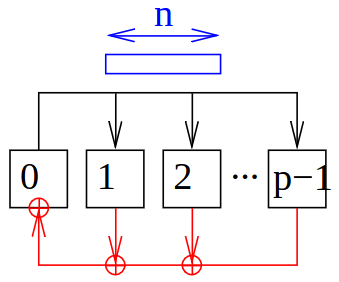
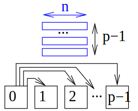
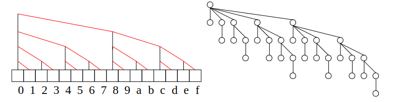
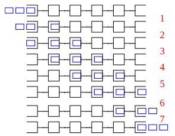
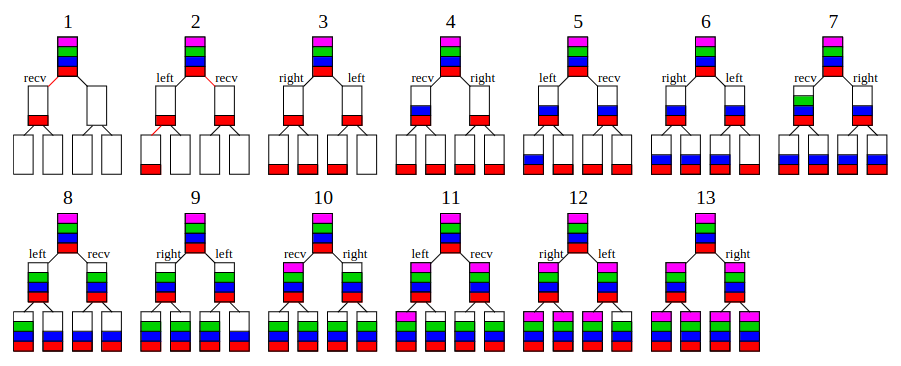

# Introduction
1. 
1. Broadcast (one to all)
    - 1 PE sends a message of length n to ALL other PEs
1. Reduction (one to all)
    - 1 PE receives the sum of p messages of length n
1. Convert broadcast to reduction
    - Reverse direction of communication
    - Add messages
1. Notes on broadcast algorithms
    - Yield reductions for commutative and associative operations
1. Assumptions
    - Fully-connected, Full Duplex


# Broadcast
1. Naive Broadcast
    - 
    - Idea: one sends to all others individually
    ```
        Procedure naiveBroadcast(m[1..n])
        PE 0: for i in [1 -> p−1] do send m to PE i // send to all others
        PE i > 0: receive m // all others - receive
    ```
    - Time: (p − 1)(nβ + α) 
        * Send p-1 messages
        * Cost of send = nβ + α
    - Nightmare for implementing scalable algorithm
1. Binomial Tree Broadcast
    - 
    - Idea: each sends in a binomial tree pattern
    ```
        Procedure binomialTreeBroadcast(m[1..n])
            PE index i in [0 -> (p−1)]
            // Message m located on PE 0
            if i > 0 then receive m
            count = min(ceil(log(p)), trailingZeroes(i))
            for k in [count−1 -> 0] do
                send m to PE i + 2k // noop if receiver ≥ p
    ```
    - Analysis
        * Time: ceil(log(p)) * (nβ + α)
        * Optimal for n = 1
        * Embeddable in linear array
    - Notes
        * trailingZeroes = to how many processors should we send
        * Use min, because sometimes too big? (bzw. infinite if i=0)
        * iterating downwards, because more efficient
            + child with highest index has the most kids (binomial tree)
1. Linear Pipeline Broadcast
    - 
    - Idea: send pieces of the message in a linear pipeline
    ```
        Procedure linearPipelineBroadcast(m[1..n], k)
            PE index i ∈ {0, . . . , p − 1}
            // Message m located on PE 0
            // k = pipeline size
            // assume k divides n
            define piece j as m[(j−1)(n/k)+1 -> j(n/k)]
            for j in [1 -> k+1] do
                receive piece j from PE i−1 // noop if i = 0 or j = k + 1
                and, concurrently,
                send piece j−1 to PE i+1    // noop if i = p − 1 or j = 1
    ```
    - Analysis
        * Time: (n/k)β + α per step
        * p-1 steps until first packet arrives
        * then 1 step per packet
        * T(n,p,k) = ((n/k)β + α) * (p + k − 2)
        * optimal k = sqrt(n(p−2)β / α)
    - Discussion
        * optimal for fixed p and n -> infinity
        * for large p -> need large messages
1. Binary Tree Pipelined Broadcast
    - 
    ```
        Procedure binaryTreePipelinedBroadcast(m[1..n], k)
            // Message m located on root, assume k divides n
            define piece j as m[(j−1)(n/k)+1 -> j(n/k)]
            for j in [1 -> k] do
                if parent exists then receive piece j
                if left child l exists then send piece j->l
                if right child r exists then send piece j->r
    ```
    - Analysis
        * Time: (n/k)β + α per step
        * 2j steps until first package reaches level j (because each has 2 children)
        * d levels (down(log(p))) (because binary tree)
        * Then 3 steps for each further packet (receive, send, send)
        * Overall: T(n,p,k) = (2d + 3(k−1)) * ((n/k)β + α)
        * optimal k = sqrt(n(2d−3)β / 3α)
1. Disadvantage of Tree-based broadcasts
    - Leaves only receive (apart from that - unproductive)
    - Inner nodes send more than they receive => full-duplex is not fully exploited
