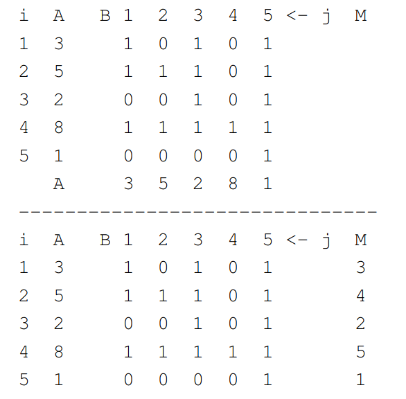
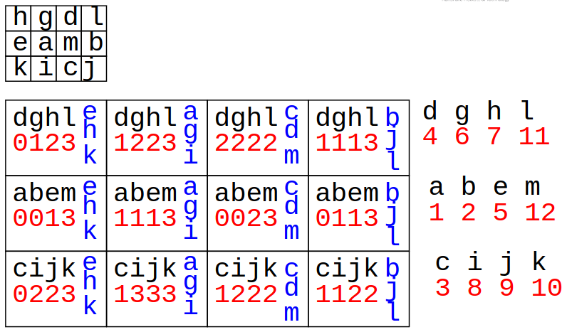
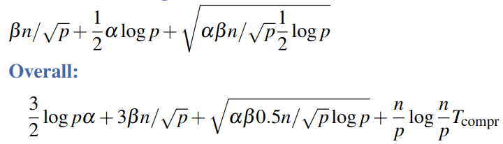

# Fast Inefficient Ranking
1. Algorithm
    - 
    - Idea: compare each element with all others
    - Rank of A[i] = number of elements which are smaller
    ```
        // n Elements, n^2 processors
        // Input: A[1->n] = distinct elements
        // Output: M[1->m], where M[i] = rank of A[i]
        forall (i,j) in [1 -> n]^2
            dopar B[i,j] = A[i] ≥ A[j]  // compare each pair of elements and store in a matrix
        forall i in [1->n]
            dopar M[i] = sum(B[i,j])    // calculate rank: parallel subroutine, sum each row (j in [1->n])
    ```
    - Analysis
        * Running time: Tbroadcast(1) + Treduce(1)  = O(αlog(p))
1. Sorting Larger Datasets
    - if n > p, split data among processors (n/p per PE)
    - output = sort processors (all elements are smaller than all in previous PEs)
1. Fast Ranking Again
    - Idea: PEs ordered in an a\*b matrix
    - 
    ```
        // Assume p = a*b PEs, PE index is (i,j)
        Procedure matrixRank(s)
            sort(s) // locally
            r = all-gather-by-rows(s, merge) // get all elements from row and merge (sort)
            c = all-gather-by-cols(s, merge) // get all elements from col and merge (sort)
            ranks = [count(x <= y) for x in col and y in row]
            reduce-by-rows(ranks) // sum ranks in row (global rank)
    ```
    - Local Ranking Notes
    ```
        // Input = 2 sorted arrays r and c
        // Output = ranks
        j = 1
        foreach y in r do
          while y <= c[j] do j++ // increment until we find a bigger element
          output j-1
    ```
        * Time = O(|r| + |c|) = linear time
    - Analysis
        * 


# Quicksort
1. Sequential
    ```
        Procedure qSort(d[], n)
        if n = 1 then return
        select a pivot v
        reorder the elements in d such that:
        d0...dk−1 <= v < dk...dn−1
        qSort([d0 -> dk−1], k)
        qSort([dk+1 -> dn−1], n−k−1)
    ```
1. Beginner Parallelization
    - parallelize the recursive calls
    - Tpar = Omega(n)
    - Analysis
        * Limited speedup
        * Bad for distributed memory
1. Parallelization for Theoreticians
    - Simplification: n = p
    - Idea: parallelize partitioning
    - Steps
        * One PE provides the pivot (e.g. random choice).
        * Broadcast
        * Local comparison
        * Enumerate "small" elements (prefix-sum)
        * Redistribute data
        * Split PEs
        * Parallel recursion
1. Algorithm
    ```
        Procedure theoQSort(d, i, p)
        // d = local value, i in [0->p−1] = local PE index, p = partition size
        if p = 1 then return
        j = random element from 0->p−1 // index of pivot picker for current partition
        v = d@j      // get pivot (broadcast)
        f = d <= v   // compare local element to pivot
        j = sum(f@k), k in [0->i] // count smaller than pivot to the left
        p' = j@(p−1) // get count of smaller than pivot (broadcast)
        if f then send d to PE j // smaller or equal => send to pivot picker
        else send d to PE p'+i−j // bigger => send past pivot: i−j = sum(d@k) > v
        receive d
        if i < p' then join left partition; qsort(d, i, p')
        else join right partition; qsort(d, i−p', p−p')
    ```
    - Analysis
        * Per recursion level:
            + 2x broadcast
            + 1x prefix sum
            + Time = O(α * log(p))
        * Expected recursion depth = O(log(p))
        * Expected overall time = O(α * log^2(p))
1. Generalization for n >> p
    - Generally, each PE has large and small elements
    - Not multiples of n/p ???
    - Prefix sum still useful
    - OK on PRAMs, bad for distributed memory (lots of elements get moved)
