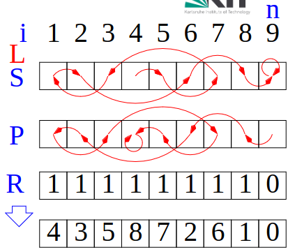
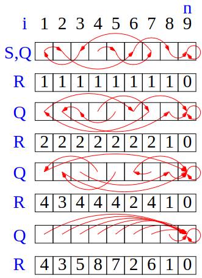
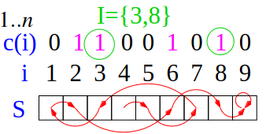

# Motivation
1. Basics
    - We can do a lot of parallel stuff with an array a[1 -> n]
        * PE i processes elements a[(i-1)(n/p)+1 -> i(n/p)]
        * Prefix sums
        * What about linked lists?
            + Convert to array
    - Lists are simple graphs
        * Warm up for graph algorithms
        * Long paths are a main obstacle for parallelization
1. List Ranking
    - 
    - L = list of n elements
    - S(i) = successor of i
        * for last element: S(i) = i
    - P(i) = predecessor of i
        * Can compute in constant time for PRAM with n PEs
    - R(i) = Rank = distance to the end (following the chain)
        * Initially 1
        * For last element: R(i) = 0
    - Converting to an array: store i at a[n - R(i)]


# Techniques
1. Pointer Chasing
    - Algorithm
    ```
        // find i so that S(i) = i (parallelizable)
        for r in [0 -> n-1] do
            R(i) = r
            i = P(i)
        // Inherently sequential???
    ```
    - Analysis
        * Work = O(n)
        * Time = Theta(n)
1. By Doubling using CREW PRAM, n = p
    - 
    - Algorithm
    ```
        // PE index i, SPMD (Single Program Multiple Data)
        Q(i) = S(i)

        // invariant: sum(R(j), j in Qi) = rank of item i
        //      Qi = list of positions if we followed Q(i) until the end
        //      This is only the case initially, because all but the last have a rank of 1

        while R(Q(i)) != 0 do   // rank of last = 0 => iterate until the end
            R(i) += R(Q(i))     // increment the current rank by adding the next one (see invariant)
            Q(i) = Q(Q(i))      // next element is next-next (doubles each iteration)
    ```
    - Analysis
        * Work = Theta(n\*log(n))
        * Time = Theta(log(n))
1. By Independent Set Removal
    - 
    - Algorithm
    ```
        // Compute the sum of R(i)-values when following the S(i) pointers to the end
        Procedure independentSetRemovalRank(n, S, P, R)
            if p >= n then use doubling; return

            // Find a subset of indices which contains neither the successor, nor the predecessor of any element
            // I = independent set
            //      I subset of {1 -> n} such that for all i in I: S(i) not in I AND P(i) not in I
            // Find a bijective mapping f: {1->n}\I -> 1->n - |I|
            foreach i not in I dopar    // remove independent set I
                if (S(i) in I) then           // successor is in the independent set
                    S'(f(i)) =  f(S(S(i)))    // = f(next-next element)
                    R'(f(i)) = R(i) + R(S(i)) // = R(i) + R(next element)
                else
                    S'(f(i)) = f(S(i))  // = f(next element)
                    R'(f(i)) = R(i)

                if (P(i) in I) then
                    P'(f(i)) = f(P(P(i))) // f(prev-prev element)
                else
                    P'(f(i)) = f(P(i))
            independentSetRemovalRank(n - |I|, S', P', R') // recursion
            foeach i not in I dopar // elements outside the independent set
                R(i) = R'(f(i))
            foeach i in I dopar     // elements in the independent set
                R(i) = R(i) + R'(f(S(i)))
    ```
    - Analysis
        * Time = O(n/p + log(n/p) \* log(p))
            + log(n/p) = levels of recursion
    - Finding Independent Sets
        * 
        * Algorithm
            + Throw a coin c for each i in [1 -> n]
            + if c(i) == 1 AND c(S(i)) == 0 then add i to I
        * Analysis
            + Expected Time = O(n/p)
            + Expected size |I| = n/4
            + Repeat until |I| > n/5: Monte Carlo Algorithm -> Las Vegas Algorithm
            + Neither the start nor the end of the list are in I
    - Finding a Bijective Mapping
        * Use the sum over the indicator function (1 if in {1 -> n})\I)
        * f(i) = sum({j not in I}, j <=i)
