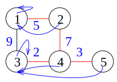

# Parallel Graph Algorithms
1. Points of interest
    - Main interest: sparse, polylogarithmic execution time, efficient
    - Negative Examples
        * DFS, BFS
        * Shortest paths
        * Topological sorting
    - Positive Examples
        * Connected components (not strongly)
        * Minimal spanning trees
        * Graph partitioning


# Minimal Spanning Trees (MST)
1. Problem Definition
    - G = (V, E) = undirected graph
    - V = nodes, n = |V|
    - E = edges, m = |E|, 2-element subset of V
    - c(e) in R+ = weight of edge (wlog, all different)
    - G is connected (there exists a path between any 2 nodes)
    - MST = tree that connects all nodes and has minimum weight
1. Selecting and Discarding Edges
    - Cut property
        * 
        * S = a subset of V
        * C = set of cut edges for S
            + C = {(u,v) in E, u in S, v in V\\S}
            + cut edges = edges between elements in S and elements outside it
        * The lightest edge in C can be used in an MST
    - Cycle property
        * 
        * The heaviest edge in a cycle is NOT needed for an MST
1. Jarnik-Prim Algorithm
    - Idea: grow a tree
    - Famous inherently sequential, similar to Dijkstra
    - Algorithm
    ```
        T = {}
        S = {s} // random start node
        repeat n-1 times:
            // find the lightest cut edge for S (initially - edges between start and another node)
            (u,v) fulfulls the cut property for S
            S += {v}     // add the new node to S
            T += {(u,v)} // add the edge to T
    ```
    - Graph Representation
        * 
        * Adjacency array
        * Node array (V)
            + Index = node ID
            + Value = index in Edge array (start of edges)
        * Edge array (E)
            + Value = node ID
        * Weight array (c)
            + Index = same as Edge array
            + Value = weight of edge
    - Analysis
        * Time outside priority queue = O(m + n)
        * Using Fibonacci Heap = O(m + n\*log(n))
            + n\*deleteMin = O(n\*log(n))
            + O(m)\*decreaseKey (O(1) amortized)
        * Problem: inherently sequential
        * Best bet: use log(n) processors to enable O(1) time PQ access
1. Kruskal's Algorithm
    - Idea: sort edges in ascending weight order and keep adding unless at makes a cycle
    - Algorithm
        ```
            T = {}  // subforest of the MST
            sort E in ascending weight order
            foreach (u,v) in E do
                if does NOT create a cycle then // u and v are in different subtrees of T
                    T += {(u,v)}    // merge the two subtrees of u and v
            return T
        ```
    - Analysis
        * Time = O(sort(m) + m\*inverseAckermann(m, n)) = O(m\*log(n))
        * Problem: still sequential
        * Best bet: parallelize sorting
    - Idea: grow tree more aggressively
1. Boruvka's Algorithm
    - 
    - Idea: create connected components?
    - Algorithm
        * For each node - find the lightest edge
        * Add the edges to the MST (cut property?)
        * Contract the edges
        * Analysis
            + At least halves the number of remaining edges
            + Time = O(m) per iteration => O(m\*log(n))
            + Goal: O(m\*log(n)) work and O(polylog(m)) time parallelization
    - Edge Contraction
        * 
        * Idea: (u,v) = MST edge, remove v
        * Algorithm
        ```
            forall (v,w) in E do:
                // delete v: remove the edge and insert a new one, skipping v
                E = E - (v,w) + (u,w) // remember original
        ```
    - Finding lightest incident edges
        * Assumption: Input is adjacency arrays
        * Algorithm: forall v in V dopar
            + allocate |G(v)|\*(p/(2m)) processors per node v   // prefix sum?
            + find edge (v,w) in G(v) with min weight (c(v,w))  // reduction?
            + output original edge (v,w)
            + pred(v) = w   // change adjacency array?
        * Time = O(m/p + log(p))
        * Prefix sum = figure out which processors take each nodes?
    - Structure of Resulting Components
        * C = Component of the Graph (V, {(v, pred(v)), v in V})
        * out-degree = 1
        * C = pseudotree (tree + 1 edge)
        * lightest edge creates a cycle of 2 elements (u,w)
        * remaining edges lead to u or w
    - Pseudotrees -> Rooted Trees
        * 
        * Idea: Remove the cycle from a pseudotree and have a node which points to itself (root)
        * Algorithm
        ```
            forall v in V dopar // iterate over nodes
                w = pred(v)     // get the node pointing to it
                // if the current node has a smaller ID
                // AND both nodes point to each other
                if v < w and v = pred(w) then
                    pred(v) = v // make the current node the root of the tree
        ```
        * Time = O(n/p)
        * root = node with smallest id
        * root points to itself
        * Properties
            + Edges in path get lighter?
        * sth about tie-breaking to break up symmetrical cases
    - Rooted Trees -> Rooted Stars (by doubling)
        * 
        * Idea: each node should point to the root
        * Algorithm
        ```
            // while there are nodes which don't point to the root
            while exists(v in V where pred(pred(v)) != pred(v)) do
                forall v in V dopar
                    pred(v) = pred(pred(v)) // make the node point one node backwards
        ```
        * Time = O(n/p \* log(n))
    - Contraction
        * 
        * Easier thanks to rooted stars
        * Algorithm
        ```
            k = #components
            V' = [1->k]
            f = star-roots -> [1->k]    // bijective mapping, converts rootIDs to component IDs?
            // (u,v,c,e_old) in E AND pred(u) != pred(v)
            E' = {(f(pred(u)), f(pred(v)), c, e_old)}
            // E' = set of components connected through weights???
        ```
        * Time = O(m/p + log(p))
    - Recursion
        * Convert G' = (V', E') into adjacency array representation (integer sorting)
        * Optional: Replace parallel edges with lightest one
        * Recurse on G'
        * Analysis
            + Expected sorting time = O(m/p \* log(p)) (CRCW PRAM)
            + Practical algorithm for m >> p
    - Analysis
        * Expected time on CRCW PRAM = O((m/p)\*log(n) + log(n)^2)
        * Iterations <= log(n)
        * For root finding: O(n \* log(n))
