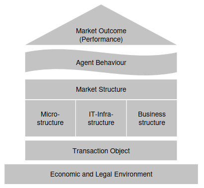
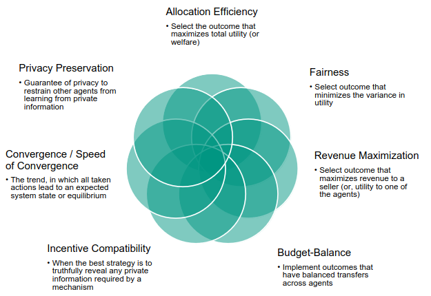
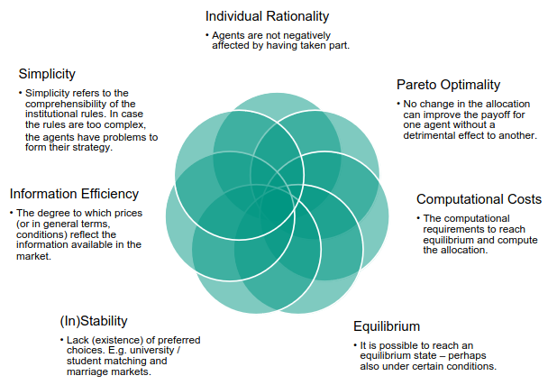

# What is Neo-Classical theory? What are it's assumptions?
1. Neo-Classical theory
    - Theory that the main problem of society is the allocation of a resource.
    - Idea: The market will take care of the allocation if permitted to do so.
1. Assumptions
    - Perfect market:
        * Utility maximization of customers
        * Profit maximization of suppliers
        * Homogeneous goods
        * No personal or time preferences
        * Perfect market transparency
        * No transaction costs
        * Immediate response of market participants

# Equilibria
1. Dominant Strategy Equilibrium
    - Each player's strategy yields the best result for them (regardless of what others do!)
    - Can be weak (at least as good as others) or strong (definitely better than others) dominant strategy
    - No one has incentive to change strategies
1. Nash Equilibrium
    - Each player's choice is the best response given what others are doing
    - No one can improve their payoff by changing their strategy
1. Bayes-Nash Equilibrium
    - Useful for games with incomplete information
    - Players have beliefs about others' types and update them using Bayes' Rule
    - Players choose strategies for max payoff given their beliefs

# Differences between New Institutional Economics (NIE) and Neo-CLassical theory
1. Focus and Emphasis
    - Neo-Classical
        * Emphasis on individual behavior, market equilibrium and efficient resource allocation
        * Assumes rational individuals who maximize utility/profit
        * Assumes perfect competition, analyzes the outcomes of competitive markets
    - NIE
        * Focuses on the impact of institutions on behavior and outcomes
        * Claim that institutions influence behavior, markets and allocation efficiency
        * Interested in how institutions evolve and impact transactions
1. Treatment of institutions
    - Neo-Classical
        * Institutions = background conditions or assumptions
        * More so focus on how to achieve equilibrium (instead of costs)
    - NIE
        * Institutions at the forefront
        * They can affect costs, property rights, the nature of contracts and agreements
        * Tries to understand how different institution arrangements affect behavior and outcomes
1. Transaction costs
    - Neo-Classical
        * Assumes low or no transaction costs & frictionless markets
        * Not interested in the costs of searching for info, negotiating contracts and enforcing agreements
    - NIE
        * Claims transaction costs are key for behavior and market outcomes
        * Explores how institutions affect costs
1. Market Failure and Imperfections
    - Neo-Classical
        * Focus on market efficiency (optimal resource allocation)
        * Market failure = exception (addressed through government intervention)
    - NIE
        * Recognizes that markets can be imperfect and not function efficiently
        * Explores how institutions can address market failures and information asymmetries
1. Methodology
    - Neo-Classical
        * Relies on mathematical models and abstract theories
    - NIE
        * Combines formal modeling, empirical analysis and case studies

# Elements of the Market Engineering Framework

1. Market outcome (Performance)
1. Agent behavior
1. Market Structure
1. Micro-structure
1. IT-Infrastructure
1. Business structure
1. Transaction Object
1. Economic and Legal Environment

# Institutions: Examples, behavior fostered, existing remedies
1. Formal institution
    - Rules and laws of driving a car
    - Prevents crashes, assures efficient travel times
    - If broken - fines
1. Informal institution
    - Waiting in lines
    - Assures order and mutual understanding when buying stuff
    - If broken - people protest and speak up

# What is Market Engineering?
1. The systematic process of designing a market which:
    - invites agents to participate
    - satisfies the needs of its agents
    - achieves its goal in an efficient way

# Market Objectives: Examples, Performance Criteria, Measurements
 
1. Sharing Economy (AirBnB)
    - Objective
        * Allocation of underutilized private goods (apartments)
    - Performance Criteria
        * Allocation Efficiency
        * Revenue Maximization
        * Privacy Conservation
        * Equilibrium
    - Measurements
        * price level, willingness to pay, revenue
        * number of providers/consumers/bookings
1. Predictive Markets (FAZ.NET-Orakel)
    - Objective
        * Accurate forecasts on politics, economics indicators, etc.
    - Performance Criteria
        * Incentive Compatibility
        * Convergence (Speed of)
        * Individual Rationality
        * Simplicity
        * Information Efficiency
    - Measurements
        * accuracy, liquidity
        * user feedback
1. Landau Microgrid Project
    - Objective
        * Local welfare: maximizing allocation of (renewable) energy in a community
    - Performance Criteria
        * Allocation Efficiency
        * Privacy Conservation
        * Computational Costs
        * Simplicity
    - Measurements
        * market liquidity/prices
        * local energy, user feedback

# Elements of "Economic and Legal Environment". How to influence them?
1. Agent Preferences, Cost, Resources, Knowledge, Laws
1. Influenced through various mechanisms?

# Difference between the Microeconomic System (Smith) and the House of Market Engineering
1. Scope and Focus
    - Microeconomic (Smith)
        * Looks at the broader framework of individual agents (consumers and firms)
        * Studies how agents make decisions about allocation, pricing, production, consumption
        * Explores how decisions interact to determine market equilibrium and outcomes
    - House of Market Engineering
        * Specific framework by Weinhardt for making electronic markets
        * Metaphorical representation of the components needed for market design
1. Level of Abstraction
    - Microeconomic (Smith)
        * Theoretical framework for analyzing behavior and interactions
        * May contain mathematical models like supply & demand, utility maximization, equilibrium analysis
    - House of Market Engineering
        * Practical framework for designing and implementing (electronic markets)
        * Emphasizes the technical, informational and institutional aspects of market design and operation
1. Purpose
    - Microeconomic (Smith)
        * Studies how agents make decisions and how these interact to determine market outcomes
        * Tries to explain economic phenomena
        * Tries to understand the mechanisms which drive economic behavior
    - House of Market Engineering
        * More so a tool for design and implementation
        * Provides a structured approach to address technical, economic and operational challenges of creating markets
1. Application
    - Microeconomic (Smith)
        * Very applicable:
            + analyzing consumer choices and firm behavior
            + studying market structures and competition
    - House of Market Engineering
        * Mostly useful for designing and managing electronic markets

# What concepts need to be defined for game theory?
1. Players
    - Participants in the game
1. Actions
    - The actions players can take at each stage in the game
1. Strategy
    - A set of actions that a player will take given a situation
1. Outcome
    - The outcome of the game for every possible set of strategies

# Degrees of information
1. Complete
    - Players' preferences on outcomes
    - Players' action spaces
1. Incomplete
    - At least one player has limited information on the preferences of others
1. Perfect
    - No simultaneous moves
    - All previous moves known
    - All players observe nature's moves
1. Imperfect
    - Some players cannot observe the moves of others

# Describe a Normal Form game
1. A game G consist of
    - A finite set of agents I
    - Sets of strategies Si
    - Payoff functions ui: Si -> R

# Name a Normal Form game and explain the solution
1. Game: Prisoner's dilemma:
    - I = {prisoner1, prisoner2}
    - S = {S1, S2}, S1 = {C(ooperate), D(efect)}, S2 = {Cooperate, Defect}
    - u = (u1, u2)
    - G = (I, S, u)
1. Solution:
    - make square with outcomes
    - if C -> D
    - if D -> D

# Difference between Extensive Form and Normal Form
1. Representation and Structure
    - Extensive
        * Tree = sequence of moves
    - Normal
        * Matrix = simultaneously choose strategies
1. Information Structure
    - Extensive
        * Enables modeling of imperfect information (different information at different points in the game)
        * Can represent situations with uncertainty, private information, hidden actions
    - Normal
        * Assumes complete and perfect information
        * No explicit sequential information
1. Strategy Representation
    - Extensive
        * Complete plan of actions: what to do at each point, taking into account possible actions
    - Normal
        * List of choices or actions, no sequence of moves
1. Examples
    - Extensive
        * Games like chess, poker, anything with sequential decision-making
    - Normal
        * Battle of the Sexes, Prisoner's Dilemma, simultaneous-move games

# Solution concepts of Extensive Form games
1. Complete plat of action at each stage?

# How are Games of Incomplete Information described?
1. First move = nature (each action with a probability)
1. All players have the same beliefs about the probability distribution

# Components and Main goal of a Mechanism.
1. Components
    - Players
    - Specification of messages (information structure)
    - Outcome functions (maps messages to decisions)
1. Main goal
    - Define rules, procedures and incentives to govern how players interact

# Formal definition of a mechanism and players
1. Mechanism
    - Set of agents I
    - Types of agents Theta_i determine their preferences over outcomes o
    - Strategy s_i(Theta_i)
    - Outcome rules o = define the outcome given a set of played strategies
    - Utility functions u_i (o, Theta_i)
    - Agent i prefers o1 over o2 when u_i(o1, Theta_i) > u_i(o2, Theta_i)

# What is a Social Choice Function?
1. A function which selects the best outcome given agent preferences
1. Examples
    - Choose voting candidate given voter preferences
    - Predict candidate most likely to win
    - Decide between a playground and a library given payers' preferences

# Properties of a Social Choice Function
1. Allocation efficiency
    - Outcome should maximize total welfare
1. Budget Balance
    - Outcome has balanced transfers among agents
1. Pareto Optimality
    - No alternative outcome is strongly preferred by 1 or weakly by all
1. Individual Rationality
    - Agents not negatively affected by taking part

# The Revelation Principle
1. Given some conditions: any outcome achieved through direct mechanisms can be achieved using indirect ones
1. No loss of generality when only considering direct mechanisms

# What does "Strategy Proof" mean?
1. Means that when using a mechanism, truth-revelation is a dominant strategy equilibrium

# Incentive Compatibility and Strategy Proofness
1. Similarities
    - Both try to make agents reveal the truth
1. Differences
    - Incentive Compatibility
       * Broader, tries to prevent manipulation
    - Strategy Proofness
       * Stronger, more specific, truth-telling = best strategy
       * Subset of incentive compatibility

# What is enforcement used for?
1. To make agents comply with rules and prevent opportunistic default

# Types of Enforcement
1. Formal vs Informal
    - Contracts vs social pressure
    - Fines, imprisonment vs reputation destruction
1. Informal: Personal vs Community
    - Personal retaliation vs Punishment by society

# Application area of enforcement
1. Fines and imprisonment when breaking traffic laws

# How can enforcement be applied to internet auctions by establishing trust?
1. Achieve anonymity of the buyers and sellers so that nobody can gain an unfair advantage?

# Kinds of enforcement in real life
1. Reputation
1. Ratio of positive to negative feedback

# Entry fees
1. What?
    - Pay a fee to enter the market
    - If breaks the rules - exclude and keep fee
    - Else - can leave and keep the money
1. Why?
    - Tries to avoid social cost
    - Makes people follow the rules
1. Why not used?
    - Some non-economic considerations
    - Users don't trust the platform
    - Creates a hurdle before signing up

# How to improve the quality of reputation mechanisms?
1. eBay: score = positive - negative (or percentage positive)
1. AirBnB: only post when both have written a review

# Single Unit Auctions: properties and differences
1. Vickrey: Second price sealed bid auction
    - Dominant strategy: truth telling
    - Pareto optimal
    - Allocation efficient
    - Budget balanced
    - Individual rationality
1. FPSB: First price sealed bid auction
1. Dutch Auction: first price open-outcry descending
1. English Auction: first price open-outcry ascending

# Difference between IPV and Common Values
1. IPV
    - Each player only knows their personal information
    - The info reflects their taste
    - Valuations come from a common knowledge probability distribution
    - Valuations are statistically independent
1. Common Value
    - Item has an objective value
    - Learning others' guesses helps figure it out
    - Valuations come from a common knowledge probability distribution

# Revenue Equivalence Theory
1. What?
    - Under the assumptions, the expected revenue of the auctions is the same
1. Assumptions of the Benchmark model
    - A1: Risk-neutral bidders
    - A2: IPV
    - A3: Symmetric bidders (values from common distributions)
    - A4: Payment only depends on the bids

# When should each auction type be preferred?
1. Vickrey
    - IPV, seller wants max revenue and truth telling
1. FPSB
1. Dutch
    - Limited info on valuations
    - Want quick sale and flexible on revenue
1. English
    - Want some action among bidders
    - Have some info on valuations

# Why combinatorial auctions?
1. Exposure Problem
    - Inefficient outcome
    - No strategy yields positive payoff for a bidder
    - Auctioneer gets lower revenue
1. Solution
    - Multiple goods sold simultaneously
    - Each bid can claim a number of items

# Types of valuation functions
1. Super-additive
    - v(A) + v(B) < v(A + B)
1. Sub-additive
    - v(A) + v(B) > v(A + B)

# Combinatorial Allocation Problem
1. Find the optimal allocation of goods given the bids

# Generalized Vickrey Auction
1. Direct mechanism
1. Sealed bids on items or bundles
1. Auctioneer calculates the allocation with the highest value
1. Agents pay bid - discount 
    - Discount = max value if they didn't participate
