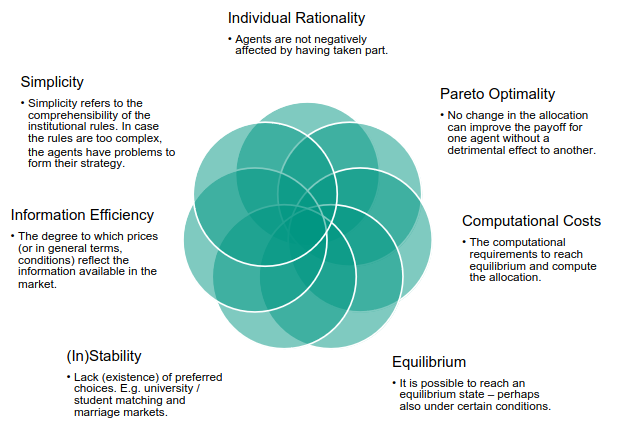

# Market Outcome and Performance
1. The objective of a Market Engineer
    - achieve a given market outcome or performance
    - does this by designing the transaction object & the market structure
    - Market Structure = market microstructure, IT infrastructure & business structure
1. Performance criteria
    -  
1. Market outcome and performance
    - 
    - How do you measure the market performance?
    - In a financial market the outcome is the allocation of orders
    - The market is performant if it reaches the goal with high allocation efficiency
    - allocation efficiency is traditionally measured using liquidity
    - Liquidity
        * Trade off between the price at which an asset is sold and how quickly it is sold
        * Liquid = mild trade off, illiquid = big trade off
        * money/cash = most liquid asset (directly exchanged at face value)

# Principles of Markets
1. Economic Environment
    - Circumstances that impact institution performance, but out of control of the mechanism designer
1. Microeconomic System

1. Institutions

    - as Mechanisms
        * Give order to social life (see definition of order)
        * Observation of Friedrich August von Hayek
            + If we want to understand the real function of a price system - look at it as a mechanism for communicating information
                - Private information exchanged in the market process
                - The market process is governed by the institutional rules
    - Market Institution Trading Rules comprise of:
        * Messages (e.g. offers, acceptance notifications)
        * Allocation rules
        * Payment rules (e.x. first-price, all-pay)
        * Control rules (opening/transition/stop rules)
1. Agent Behavior

    - Connects motivation in the environment with the institution to yield decisions and outcomes
    - Influenced by the microeconomic system
    - Consists of observable responses
    - Is expressed via messages
    - Example: Who wants to be a millionaire
    - 
