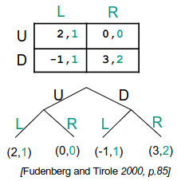
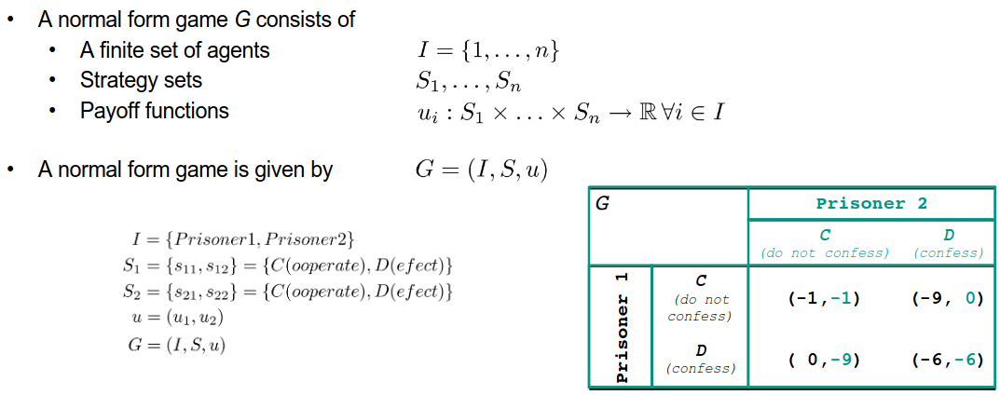
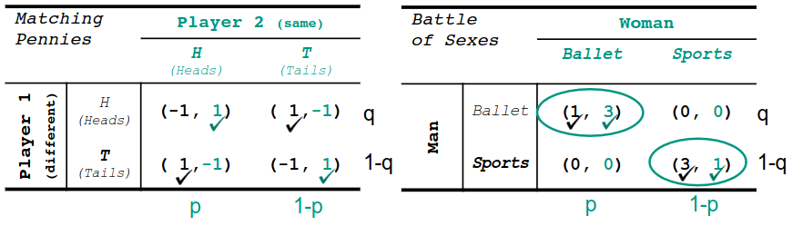
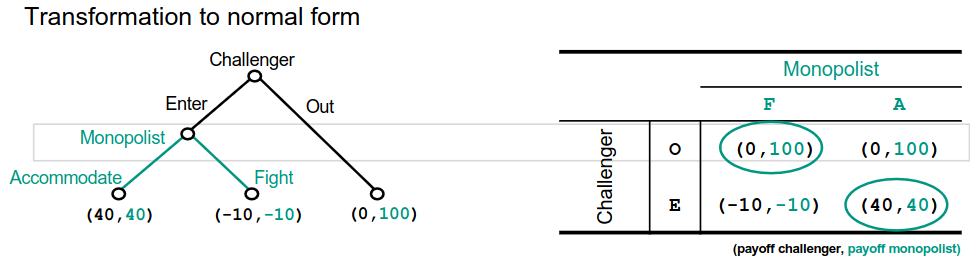
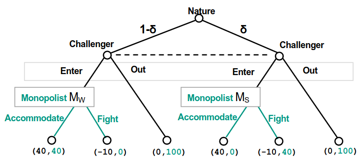

# Motivation
1. Why... ?
    - Game Theory: Understanding how competing agents react in scenarios where they have to make decisions
    - Mechanism Design: Finding a mechanism which lets agents react in a certain way and achieves a desired goal
    - Auctions: Using and creating auctions which implement certain mechanisms
1. Numbers game
    - My decisions depend on other people
1. Why game theory?
    - Determines the outcome of strategies where 2+ players are involved
    - A formal way to analyze interactions between a group of agents who are rational and behave strategically
    - Does not guarantee winning, just a framework for analyzing strategic interaction
    - We focus on non-cooperative game theory

# Terms and Definitions
1. Players
    - Rationality
    - Self-interest (max utility)
    - Common Knowledge
1. Actions
    - The actions a player can choose from at each stage of the game
1. Strategy
    - A set of actions for each stage of the game
    - Specifies an action that a given player i will take in a given situation
1. Outcome and Payoff
    - Outcome of the game for every possible set of strategies
    - Players' preferences regarding the possible strategies
1. Rules
    - Nature of the conflict (cooperative vs non-cooperative)
    - Nature of interaction (sequential vs simultaneous)
    - Time-frame (repeated game vs one-shot interaction)
    - Available information
        * Complete
            + Players' preferences on outcomes are common knowledge
            + Players' action spaces are common knowledge
        * Incomplete
            + At least 1 player has limited information about the preferences of another player (payoff specification incomplete)
        * Perfect
            + All previous moves observed
            + No simultaneous moves
            + All players observe Nature's moves (WHAT???)
        * Imperfect
            + Some players cannot observe the decisions of other players
            + A game of incomplete or asymmetric information is also imperfect
        * Incomplete information = complete, but imperfect
        * Complete != Perfect (people can choose simultaneously if complete => not knowing the actions of others)
1. Decision theory
    - Single decision maker
    - Game player against Nature
    - No strategic interaction
1. Game theory
    - Multiple decision makers
    - Strategic interaction and interdependencies among the agents
1. Forms of interaction

    - Normal form game
        * aka strategic form
        * Players choose their action simultaneously (Prisoner's Dilemma)
        * Pure strategy: Any action possible in a conflict situation (non-randomized strategy)
        * Mixed strategy: Probability distribution over the set of pure strategies (randomized choice of pure strategy)
    - Extensive form game
        * Players choose their action sequentially (New Market Entrant)

# Normal Form Games
1. Prisoner's dilemma

    - 2 innocent people caught and accused
    - if neither confesses - 1 year for both
    - if both confess - 6 years for both
    - if only 1 confesses - 9 years for non-confesser
1. Solution space of Game Theory
    - Dominant strategy
        * The best strategy for an agent which provides better or at least as good results as any other
    - Dominant strategy equilibrium
        * Strategy profile where each agent picks their dominant strategy
        * Does not always exist
        * Each player's best response is independent of the others' strategies
        * For prisoner's dilemma:
            + both confess is dominant (else someone is f*cked)
            + Not Pareto efficient!
            + Dilemma arises due to conflict between efficiency and rational solution
    - Nash Equilibrium
        * Not all games have dominant strategy equilibria => need new concept
        * Best result for everyone comes when they do what's best for them **AND** for the group
            + Find row and col with best responses
        * Strategy = Nash equilibrium if best response to the other players' strategies
        * No player has incentive to unilaterally deviate if everyone else's strategies remain the same
        * Dominant strategy equilibrium => Nash-equilibrium
        * Mixed Strategy Nash Equilibria
            + 
            + Sometimes no Nash in pure strategies (left) or more than one Nash (right)
            + => At least one player plays their pure strategy with a given probability

# Extensive Form Games
1. Complete description of
    - The set of players
    - The order of moves - who moves when (game tree)
    - The players' payoffs as a function of their moves
    - Players' choices when they move
    - Players' knowledge when they move
    - The Probability distributions over any exogenous events (moves by Nature)
1. Extensive form
    - Models sequential (dynamic) situations
    - Tree with splits at decisions
    - Specifies the complete order of moves over time
    - Any normal form game can be inflated to extensive form
        * Equilibrium concepts generally relate to extensive form games
    - 
        * Two Nash Equilibria (OF and EA)
        * F would not be played when decision is reached (cos -10)
        * OF not reasonable, because not subgame-perfect (not equilibrium in all subgames)
1. Backwards Induction
    - Find optimal choice in the last state of the game (leaves)
    - Go up the tree and find best choice given optimal choices below
    - Constructs a strategy profile where each player's strategy is optimal at each stage
    - Always finds a Nash equilibrium in a game of perfect and complete information
1. Games of incomplete information
    - Harsanyi Transformation
        * First move = Nature (chooses player 1's type)
        * All players have same belief of the probability distribution of nature's moves
        * 
            + Nature chooses player 2's type (with probability d)
            + Player 1 has to decide what to do without knowing the choice
    - Harsanyi Bayesian equilibrium = the Nash equilibrium of games with imperfect information
