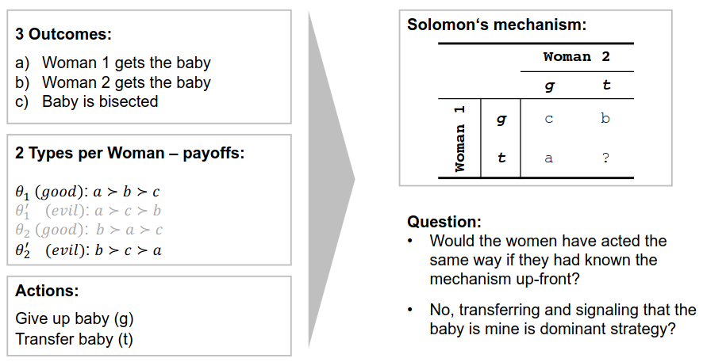
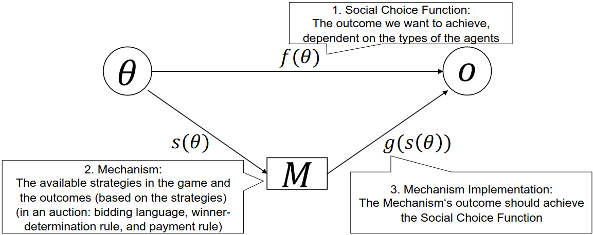

# Motivation
1. Terminology
    - Game Theory: understanding how agents act in scenarios where they need to make decisions
    - Mechanism Design: Finding a mechanism which lets / makes agents act in a certain way and achieves a desired goal
    - Auctions: Tools which implement mechanisms
    - Judgement of Solomon
        * 2 women argue about a baby. He tells them to cut it in half
        * Solomon's mechanism
        * 
1. Why Mechanism Design?

    - Obtain some outcome (function of agent preferences)
    - Agents may lie
    - Define rules which achieve the goal in case of an equilibrium

# Terms and Definitions
1. Mechanism Theory
    - Mechanism
        * A specification of a message space for each individual
        * and an outcome function that maps vectors of messages
        * into social decisions and transfers
        * Example: Second price seal bid auction
            + Bidding language (Sealed bid that the agents submit)
            + Winner determination rule (Highest price gets the good)
            + Payment rule (Second highest bid is payed)
    - Mechanism Design
        * Sub-field of microeconomics and game theory
        * Goal: finding mechanisms compatible with individual incentives, which simultaneously result in
            + Efficient decisions (max total welfare)
            + Voluntary participation of the individuals
            + Balanced transfers (taxes and subsidies which net to 0 across individuals)
        * Parkes 2001: "The mechanism design problem is to implement an optimal system-wide solution to
        * a decentralized optimization problem with self-interested agents with private
        * information about their preferences for different outcomes."
            + Fully rational self-interested agents
            + Each agent holds an input to an optimization problem
            + System-wide goal: solve the optimization problem
            + Approach: provide incentives to promote truth-revelation
1. Fundamentals (formalization)
1. Social Choice and Mechanisms

1. Solution Concepts
    - Nash Equilibrium (NE): common knowledge assumption, rationality, multiple equilibria
    - Bayes-Nash Equilibrium (BNE): information asymmetry (common prior), rationality, multiple equilibria
    - Dominant Strategy Equilibrium (DS): no assumptions on available info or rationality
    - Ideal mechanism
        * Provides agents with dominant strategies
        * Implements a solution to the multi-agent distributed optimization problem
        * DS > BNE > (NE)

# Social Choice Function
1. Selects the optimal outcome given agents' types
1. Voting
    - Choose a candidate among a group
    - Types of agents: voter preferences
    - Mechanism: voting system
    - Outcome: electoral college / majority vote
1. Prediction
    - Predict the candidate who is most likely to win
    - Actual voting: real data after voting
    - Classic Predictions: ask each agents who they're voting for
    - Market Predictions: ask each agent about each party's outcome
1. Public Project
    - Decide whether to build a playground or a library (funded by agents)
    - Participatory Budgeting
        * Involves citizens in budget decisions
        * Possible system-wide goals:
            + Information of fiscal policy
            + Awareness of budget restrictions
            + Increased sense of belonging to the city
            + Increase of overall welfare of the society
        * Approach:
            + Hand out budget to citizens
            + Citizens invest in projects via a crowdfunding mechanism
1. Allocation
    - Allocate items among a group of participants
    - English auction
        * Price increases with bids
        * Highest price wins
    - Dutch auction
        * Price decreases over time
        * Fist bid wins
1. Desired properties of social choice functions
    - Allocation efficiency
        * The outcome maximizes the total welfare (utility)
    - Budget-Balance
        * The outcome has balanced transfers among agents
    - Pareto optimality
        * No alternative outcome is strongly preferred by at least one agent
        * or weakly preferred by all agents
        * = Allocation efficiency + Budget-Balance
    - Individual Rationality (IR)
        * Voluntary participation?
        * Individuals aren't negatively affected by taking part
        * Ex-post IR:
            + Agents can always withdraw
            + After knowing the allocation the agent can still withdraw
        * Ex-ante IR:
            + Agents can only withdraw prior to learning their type
            + Agent has to decide before taking part and accept the allocation

# Revelation Principle
1. Indirect mechanisms
    - Payoffs for agents determined indirectly through the strategy
    - Can be transformed into a direct one by using a Revelation Principle
        * Only action for the agents is: reveal your preference
1. Direct mechanisms
    - Agents directly report their types and the mechanism determines the strategy and calculates the payoff

# Strategy Proofness

1. How to prevent agents from lying?
    - Need a mechanism where truth telling is equilibrium (dominant strategy at best)
1. Types of revelation
    - Direct: any type needed (not strategy)
    - Truth: true type needed
    - Incentive-Compatibility: true type = equilibrium
1. Why?
    - Robust to assumptions about agents (e.g. types, rationality)
    - Computationally tractable for the agent (no need to model others' strategies or preferences)

# Vickery-Clarke-Groves (VCG) Mechanisms
1. Uniqueness
    - VCG mechanisms are the only allocation-efficient and strategy-proof ones
    - for agents with quasi-linear preferences and general valuation functions
    - among all direct-revelation mechanisms
1. Revelation Principle
    - Any mechanism which achieves allocation efficiency in dominant-strategy implementation must implement VCG outcome
1. Incentive-Compatibility
    - Comes for free (encouraging truth-revelation not easy)
1. Example: Second-price sealed-bid auction (Vickrey auction)
    * TODO: image
