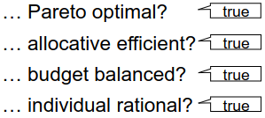

# Motivation
1. Auctions are used for serious things
    - Business contracts (Network Providers)
    - Selling Partings
1. Classification
    - Part of the Micro-structure
    - Can be
        * single or multi-dimensional
        * one or two sided
        * open-cry or sealed bid
        * first or k-th price
        * single or multi-unit
        * single or multi-item
    - 

# Single Unit Auctions
1. Introduction
    - What is an Auction?
        * Comes from Latin "augere" = "to increase"
        * Market institution with explicit set of rules
        * Determines resource allocation and price based on bids from the market participants
        * Used to sell: random items/materials, even people
    - Motivation Scenario
        * Need to pay student loans by selling a painting
        * 
1. Types of Auctions
    - 
    - Independent Private Values (IPV)
        * Each bidder only knows **their** exact value for the item
        * Differences in bidder valuations reflect their tastes
        * Bidder valuations are statistically independent
        * Personal valuations (private knowledge) come from a common knowledge probability distribution
        * Examples:
            + Antique bought for consumption instead of resale
            + Government contract where each company knows their own cost of production
    - Common Values (CV)
        * Sold item has a single objective value
        * Nobody knows the value, but they all have a guess
        * Learning other people's valuation is helpful when figuring out the actual value
        * Personal valuations (private knowledge) come from a common knowledge probability distribution
        * Examples:
            + Antique bought by dealers for resale
            + Stocks
    - Benchmark Auction Model
        * A1: Bidders are risk-neutral (don't consider risk as a factor)
        * A2: Independent-private values (IPV)
        * A3: Bidders are symmetric
        * A4: Payment is only a function of the bids
        * Bidders know:
            + The auction's rules
            + Their own valuation
            + Number of bidders, their risk attitudes, the distribution of valuations
    - Most common: English auction
        * Price increases, ends when only one bidder

# Seller's expected revenue (SER) and Bidder's expected rent (BER)
1. Notations

1. Order statistics
    - n bidders where use = (value - price)k, k in {0, 1}
    - v_i are independently drawn from a distribution function F
    - Order statistics = ordered sample values of valuation distribution
        * Ordered sample = all drawn samples, but ordered by size, descending
    - F_k_n(v) = probability that the k^th highest value out of n draws is not bigger than v
    - First order statistic
        * Probability that the highest of n draws is <= v
        * Continuous distribution function (cdf) = F^n(v)
        * Probability density function (pdf)
            + 
    - We are looking at an English auction (winner pays second price) => need second order statistic
    - Second order statistic
        * Probability that the second highest of n draws is <= v
        * = max one value is higher than v
        * 2 cases:
            + v > v' (v is highest value)
            + v' > v >= v" (only v' is higher than v)
        * Probability
            + F_2_n(v) = P(max one value > v) = P(v is highest) + P(v'>v + (n-1)values <= v)
1. SER (Seller's expected revenue)
    - English auction
    - Assumption: seller has value 0 for the item
    - Expected revenue = expected value of the second highest bid
    - 
1. BER (Bidder's expected rent)
    - Common value
        * Expected rent = P(winning) * winner's expected rent
        * 
    - IPV
        * Expected rent = rent if highest bidder * P(all others are lower)
        * 
    - What happens when there are more bidders?
        * SER increases
        * BER decreases

# Traditional Auction Mechanisms
1. Vickrey Auction
    - Second price sealed bid auction
    - (weakly) dominant strategy = truth telling (bid = signal)
    - Intuition: a bid influences the probability of winning, but not the price
    - Good in theory, but irrelevant in practice (Fear of a cheating auctioneer)
    - Properties
        * 
1. First-price sealed bid auction (FPSB)
    - Same as above, but pay = bid
    - Bidder only has to decide on their bid
    - Revenue
        * Valuations drawn from uniform distribution [0, 1]
        * Unique Nash Equilibrium: bid = ((n-1)/n) * valuation
            + n = number of bidders
        * SER = E(b(v1)) = ((n-1)/n) * E(v1) = ... = (n - 1) / (n + 1)
1. Dutch auction
    - Price decreases, first bid wins
    - Bidder decides on how long to wait
1. FPSB & Dutch auction
    - Strategically equivalent
    - Don't reveal information about the other bidders
    - Find a lowest bid which maximizes the chance of winning
1. SER is the same for all of the above + English

# Revenue Equivalence Theorem
1. Based on the assumptions of the Benchmark Model
1. Remarks
    - Even though all four auctions yield the same price on average, the outcomes are not always exactly the same
    - Finding the dominant strategy in an English/Vickrey auction is easy
    - Finding the Nash equilibrium in a first-price or a Dutch auction is a nontrivial computational problem
1. Reserve prices
    - Assumption: seller has value for the item >= 0
    - Maximizing expected revenue then means:
        * if expected price < seller's value - refuse to sell
        * else - sell to bidder with highest valuation
    - If a reserve price is set -> possibility of inefficient outcomes
1. Relaxing A1 (bidders not necessarily risk neutral)
    - Seller is still risk neutral
    - English auction
        * same as with risk neutral bidders
    - FPSB
        * if agent loses - they get nothing
        * else - they have a positive profit
        * marginally increasing the bid lowers the profit, but increases the chance of winning
            + => SER increases with the bid
    - Remarks
        * FPSB not optimal
        * Risk averse bidders need an incentive to bid higher (they are afraid of paying too much)
        * => seller should:
            + subsidize high bidders who lose
            + penalize low bidders
1. Relaxing A2 (common or correlated/affiliated values)
    - Each bidder estimates the true value of the item
    - Bidder with highest estimate wins
        * Winner's Curse: overestimating ???
    - Sophisticated bidders take that into account and bid more cautiously
    - Remark:
        * Iterative (non-direct) mechanisms can aggregate the dispersed information
            + Example: Bids in English auctions reveal part of private information
1. Relaxing A3 (asymmetric bidders)
    - Bidders belong to recognizably different classes with different distributions of their valuations
    - English auction
        * Same as with symmetric bidders
    - FPSB
        * Bidders of different classes face different degree of competition
        * Yields different (possibly inefficient) outcome
1. Theoretical predictions (TODO: image)
1. Practical experiments
    - contradicting results
    - not yet proved empirically

# Auction formats
1. Single Unit Auctions
    - Sell one thing (picture, car, phone, service)
1. What if more than one?

# Combinatorial Auctions
1. Example Problem:
    - 2 Parking spots
    - 2 bidders
        * 
        * Bidder 1 = car with trailer, needs both spots, values at 100
        * Bidder 2 = car, needs one spot, values at 75
    - Efficient solution: Bidder 1 gets both
    - Have to bid on spots separately (English auction)
    - If Bidder 1 gets a spot in the first auction
        * Risk of not getting the second one
        * Risk of paying more than they are worth it (because Bidder 2 values it at 75)
    - Bidder 2 strategy
        * Bid up to 25 in first auction
        * If got a spot - enough
        * else - bid up to 75 in second auction
    - Exposure problem
        * Inefficient outcome, due to no information about other bidders' valuations
        * No strategy with positive payoff for Bidder 1
        * Very low revenue for the auctioneer
1. Solution: Combinatorial Auctions
    - Definition:
        * Multiple heterogenic goods auctioned simultaneously
        * Bid on any combination of goods
    - Environment:
        * Goods can be complementary or substitutes
        * Valuation of goods depends on which other goods are there
        * Example: v(A) = 10, v(B) = 15, v(A + B) = 30
    - Complementary goods
        * Super-additive valuation function: v(A) + v(B) < v(A + B)
        * Special case: still true for 0 = v(A) = v(B)
        * Agents can generate synergy effects
        * Example: Frankfurt -> New York
            + A: Frankfurt -> London = 100
            + B: London -> New York = 0
            + A + B: 400
    - Substitute goods
        * Sub-additive valuation function: v(A) + v(B) > v(A + B)
        * Example:
            + A: red shirt = 10
            + B: blue shirt = 10
            + A + B: both shirts = 12
    - Requirements
        * Combinatorial Allocation Problem (CAP)
            + Find optimal allocation of all goods for max value
            + NP-complete: Equivalent to the Set Packing Problem (SPP) on hypergraphs
            + => formulate to use standard algorithms (Integer/Linear Problem)
1. Generalized Vickrey Auction
    - One-Shot Auction
        * Sealed bids on single goods or bundles
    - Instance of a Vickrey-Clarke-Groves mechanism
    - Properties
        * Sealed bid
        * Socially optimal allocation
        * Optimal strategy = truth telling
    - CAP Model:
        * G = items, I = agents
        * vi = valuation function of agent i (>= 0)
        * B = allocation, Bi = bundle received by agent i
        * Goal: find max value without giving same item to multiple agents
        * 
        * Auction
            + All agents submit their valuations
            + Auctioneer find the allocation with the highest value
            + Agent pays: max value - discount
            + Discount for agent i = max value - max value if they weren't there
            + 
        * Advantages:
            + Dominant Strategy = tell the truth
            + Proven best process: from an economical point of view
    - Theorem
        * Strategy-proof: best option = tell truth
        * No strategy yields a higher payoff, regardless of others' strategies
            + => weakly dominant strategy
1. Excursus: Computational Mechanism Design
