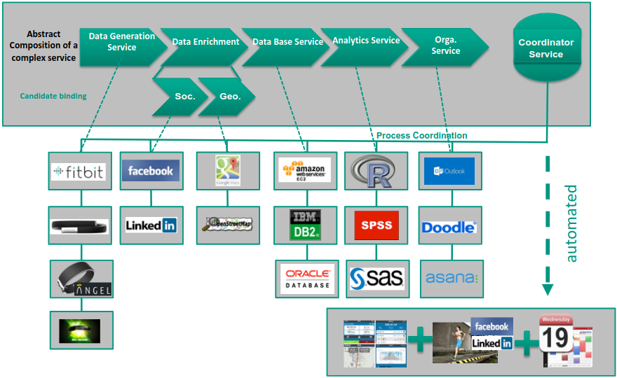
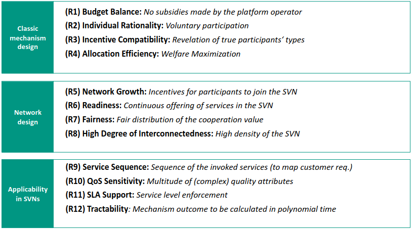

# Service Value Networks (SVNs)
1. Service mashups
    - 
    - Combine existing services
    - Reduce transaction cost for users
    - Allow Combinatorial Innovation = Rapid and flexible development of new complex services
    - Rely on the APIs of the subservices
    - SVN for Data Management
        * 
1. Definition
    - Smart business networks which provide automated on-demand composition of complex services from a steady, but open pool
    - Automation
        * Meaning
            + ad-hoc and on customer request
            + automated recognition of the optimal combination of services
        * Requirements
            + goal function (e.g. efficiency)
            + optimization algorithm
            + a coordination platform with interfaces for customers and service providers
            + standardization
        * Requirements for meaningful
            + openness of the service pool
            + ubiquitous accessibility of the coordination platform
            + modularization of services
    - Complex Services: assembly and invocation of many pre-existing services
    - Steady, but open pool:
        * Services must be registered with the SVN
        * Registration must be open to all services which meet publicly known minimal requirements
    - Standardized Service Modules:
        * plug-and-play => need standardized interfaces for exchanging machine-readable parameters
    - Universally accessible IT:
        * Must be run on and by a ubiquitously accessible information technology (e.g. the internet)
    - Agile and market-based composition
        * ad hoc and demand-driven orchestration of complex services
        * market-based approaches => efficient solution
1. Requirements in SVN
    - 

# Complex Service Auction (CSA)
1. What is it?
    - Performing a complex service through different tasks or components which are performed by service providers
    - Auctioneer defines the requirements and specifications of the service
1. Mechanism Design
    - Multiple rounds => allows iterative bidding and negotiation
    - Auctioneer evaluates the bids based on criteria (cost, quality, reputation, etc.)
    - Evaluation may include checking the coordination and compatibility of different services
    - May use different auction formats
1. The Interoperability Transfer Function (ITF)

# Networked Mechanism Design
1. Blah blah, Cooperation Mechanism
