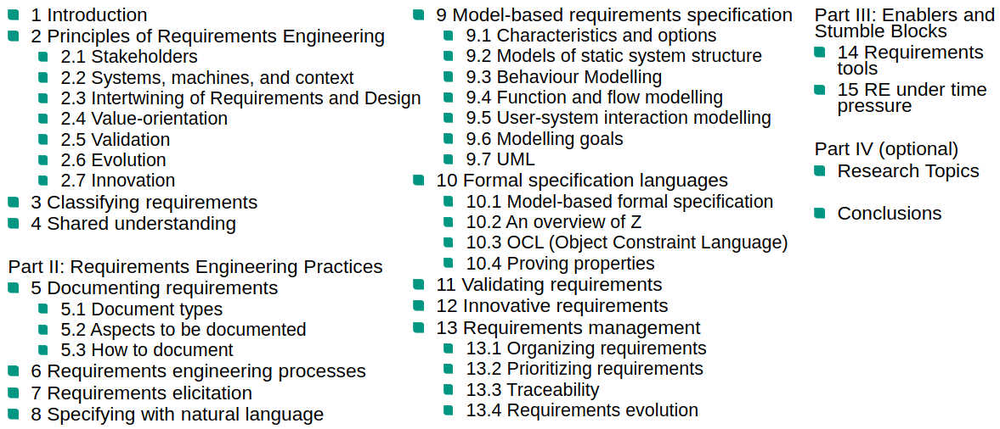

# Outline

# Definitions
1. Requirement
    - A need perceived by a stakeholder
    - A capability or property that a system shall have
    - A documented representation of of a need, capability or property

1. Requirements Specification
    - A systematically represented collection of requirements, typically for a system or component,
          that satisfies given criteria

1. Customer/Stakeholder Requirements Specification (Lastenheft)
    - written by customer

1. System/Software Requirements Specification (Pflichtenheft)
    - written by supplier

# Sample problem
1. Ski resort with Access control for skiers
1. RFID access cards which let people in through turnstiles

# Requirements Engineering
1. Requirements Engineering (Classic)
    - The application of a systematic, disciplined, quantifiable approach to the specification and management
          of requirements; that is the application of engineering to requirements

    - Boehm's First Law:
        * Errors are more frequent during requirements and design activities and the more expensive the later
              they are removed
        
    - Errors which occur later also cost more to remove
    - RE tries to remove errors as early as possible (maybe at design time)

1. Requirements Engineering (Customer-oriented)
    - Understanding and documenting a customer's desires and needs

    - Reality check:
        * Why not just code what the customer needs?
        * Who is the customer?

1. Requirements Engineering (Risk-oriented)
    - Specifying and managing requirements to minimize the risk of delivering a system that does not meed the
          stakeholders' desires and needs

    - Objections:
        * No time for complete specification
        * It's too expensive
        * Agile => rough stories should suffice

    - Right question:
        * How much RE is needed so that the risk of wrong system is acceptable?
        
    - Rule:
        * The effort put into RE is inversely proportional to the risk willing to take

1. Synoptic definition: All of the above together

